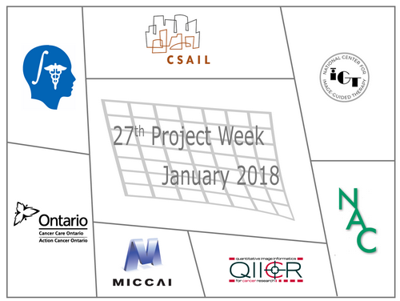

# Welcome to the web page for the 27th Project Week!
The 27th NA-MIC Project Week will be held during the week of January 8-12, 2018 at MIT.

This project week is an event [endorsed](https://www.na-mic.org/wiki/Post-NCBC-2014) by the MICCAI society.

Please make sure that you are signed up to [Slicer forum](https://discourse.slicer.org) and watching [ProjectWeek category](https://discourse.slicer.org/c/community/project-week).

## Logistics

- **Dates:** January 8-12, 2018.
- **Location:** [MIT CSAIL](https://www.google.com/maps/place/MIT:+Computer+Science+and+Artificial+Intelligence+Laboratory/@42.361864,-71.090563,16z/data=!4m2!3m1!1s0x0:0x303ada1e9664dfed?hl=en), Cambridge, MA. (Rooms: R&D)
- **Transportation:** Please plan to use public transportation. No parking permits are available by MIT. For a list of local garages, please see [here](http://web.mit.edu/facilities/transportation/parking/visitors/public_parking.html).

- **REGISTRATION:** [Register here](http://regonline.com/projectweek2018). Registration Fee: $330.
- **Hotel:** Similar to previous years, no rooms have been blocked in a particular hotel.

# Introduction
The National Alliance for Medical Image Computing (NAMIC), chartered with building a computational infrastructure to support biomedical research, was seeded in 2005 and funded through 2015 by the [NIH NCBC](http://www.ncbcs.org/) program. The work of this alliance has resulted in important progress in algorithmic research, an open source medical image computing platform [3D Slicer](http://www.slicer.org), enhancements to the underlying building blocks [VTK](http://www.vtk.org), [ITK](http://www.itk.org), [CMake](http://www.cmake.org), and [CDash](http://www.cdash.org), and the creation of a community of algorithm researchers, biomedical scientists and software engineers who are committed to open science. This community meets twice a year in an open source hackathon event called Project Week.

[Project Week](https://www.na-mic.org/wiki/Engineering:Programming_Events) is a semi-annual open source hackathon which draws 60-120 researchers. As of August 2014, it is a [MICCAI](http://www.miccai.org/organization) endorsed event. The participants work collaboratively on open-science solutions for problems that lie on the interfaces of the fields of computer science, mechanical engineering, biomedical engineering, and medicine. In contrast to conventional conferences and workshops the primary focus of the Project Weeks is to make progress in projects (as opposed to reporting about progress). The objective of the Project Weeks is to provide a venue for this community of medical open source software creators. Project Weeks are open to all, are publicly advertised, and are funded through fees paid by the attendees. Participants are encouraged to stay for the entire event. 

Project Week activities: Everyone shows up with a project. Some people are working on the platform. Some people are developing algorithms. Some people are applying the tools to their research problems. We begin the week by introducing projects and connecting teams. We end the week by reporting progress. In addition to the ongoing working sessions, breakout sessions are organized ad-hoc on a variety of special topics. These topics include: discussions of software architecture, presentations of new features and approaches and topics such as Image-Guided Therapy.

Several funded projects use the Project Week as a place to convene and collaborate. These include [NAC](http://nac.spl.harvard.edu/), [NCIGT](http://www.ncigt.org/), [QIICR](http://qiicr.org/), and [CANARIE](https://www.canarie.ca/). 

Please make sure that you are signed up to [Slicer forum](https://discourse.slicer.org) and watching [ProjectWeek category](https://discourse.slicer.org/c/community/project-week).

# Conference Calls for Preparation <a name="prep-calls"/>

- Google Hangouts Link: (https://meet.google.com/wzh-syuy-otj)
- See [Calendar](https://calendar.google.com/calendar/embed?src=kitware.com_sb07i171olac9aavh46ir495c4%40group.calendar.google.com&ctz=America/Toronto)) for meeting dates and details
- Conference call notes are available [here](HangoutsNotes.md).
- To join the preparation hangout, click on the event above, then "more details" and finally click on the video link under "Joining Info".

# Program

See detailed schedule in this [Google calendar](https://calendar.google.com/calendar/embed?src=kitware.com_sb07i171olac9aavh46ir495c4%40group.calendar.google.com&ctz=America/Toronto). Use this [iCal (.ics) link](https://calendar.google.com/calendar/ical/kitware.com_sb07i171olac9aavh46ir495c4%40group.calendar.google.com/public/basic.ics) to add project week events to a non-Google calendar.

# Projects

## How to add a new project?

1. Join the weekly [preparation call](#prep-calls) to discuss your idea
1. Add a new entry in the category below by creating a new file and copying contents of ProjectTemplate.md file into it.

## Visualization and Interaction

1. [SlicerVR Updates](SlicerVrUpdates.md) (JC Fillon-Robin, Beatriz Paniagua, and others)
1. [Medical Infrared Imaging with Slicer](MedicalInfraredImaging.md) (Jorge Nehrkon, Carlos Luque, Juan Ruiz)
1. [Integration of Medical Imaging Simulators in Slicer](IntegrationOfMedicalImagingSimulators) (Abián Hernández, Carlos Luque, Guillermo Socorro, Juan Ruiz)

## Deep Learning. Radiomics and GPUs

1. [Repeatability of Pyradiomics Features](PyradiomicsRepeatability) (Michael Schwier, Andrey Fedorov)

## Web Technologies

1. [Open Anatomy Browser](OpenAnatomyBrowser) (Abián Hernández, Juan Ruiz Alzola)

## IGT: Navigation, Robotics, Surgical Planning

## dMRI

## Quantitative Imaging Informatics

1. [Refactoring of Pkmodeling and related tools for easier expandability](Pkmodeling.md) (Michael Schwier, Andrey Fedorov)

## Shape Analysis, Segmentation

1. [SlicerSALT Shape Analysis Toolbox Updates](SlicerSALT.md) (Laura Pascal, JC Fillon-Robin, Beatriz Paniagua, Juan Prieto, Loic Michaud)
1. [Segmentation Inverse Challenge Playoff](SegmentationInverseChallenge.md) (Tina Kapur, Csaba Pinter, Steve Pieper, Andras Lasso)
1. [Shape Variation analyzer](ShapeVariationAnalyzer.md) (Juan Prieto, Nina Tubau)
1. [Shape self-learning applications](SelfLearningApplications.md) (Juan Prieto, Loic Michaud)

## Infrastructure
1. [Slicer Custom Application](SlicerCustomApplication.md) (Jc Fillon-Robin, Andras Lasso)
1. [Slicer Documentation @ ReadTheDocs](SlicerDocumentation.md) (Jc Fillon-Robin, Andras Lasso)

## Training and Dissemination

1. [Affordable IGT Simulators with Sicer IGT+PLUS](IgtSimulators.md) (Guillermo Socorro, Carlos Luque, Abián Hernández, Juan Ruiz)
1. [Slicer Ecosystems Education for Newcomers & Developing Countries](SlicerEducationForDevelopingCountries.md) (Marilola Afonso, Nayra Pumar, Juan Ruiz)

# Registrants

Do not add your name to this list - it is maintained by the organizers based on your paid registration. 
