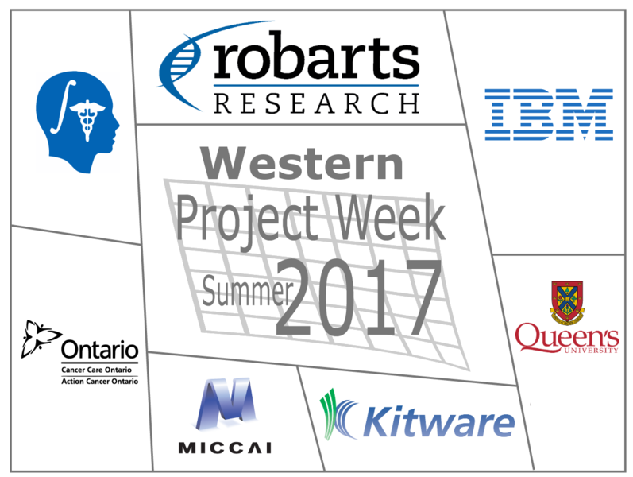
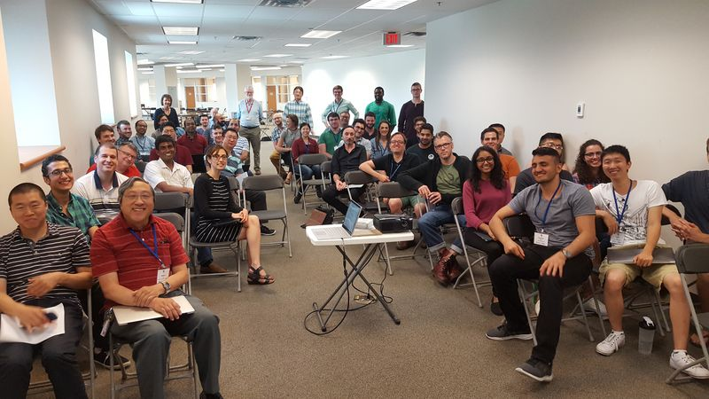

## Welcome to the web page for the 26th Project Week!

It is a pleasure to announce that the Western Slicer Project Week will be held in London, Ontario, Canada on July 17-21, 2017. This is the first extension Slicer project week that grew organically from a proposed visit of Dr. Nobuhiko Hata to Western. Enough interest existed to propose a small Slicer hackfest, which quickly grew into a full blown project week. With the expansion of the hackfest into a full project week, an additional meeting was arranged in conjunction with SPWW to discuss and develop image-guided therapy specific goals. Thus, this is also the inaugural Slicer IGT Project Week. 
This project week is an event endorsed by the MICCAI Society.

## Local Organizing Committee
 
- Host: [Terry Peters](http://www.robarts.ca/terry-peters), Robarts Scientist; Professor Medical Imaging; Medical Biophysics; Biomedical Engineering

- Email Local Organizing Committee:
  - [Adam Rankin, Terry Peters, Jackie Williams](mailto:arankin@robarts.ca,tpeters@robarts.ca,jwilliams@robarts.ca?cc=tkapur@bwh.harvard.edu&subject=ProjectWeek29)

## Resources
This is a collection of resources submitted by attendees 
- Welcome presentation by Andras Lasso
- Historical overview by Nobuhiko Hata
- Python resources (thanks John Drozd!) 
  - http://cscircles.cemc.uwaterloo.ca/5-input/
  - https://www.jetbrains.com/pycharm/
  - http://www.datacarpentry.org/python-ecology-lesson/

## Frequently Asked Questions

+ [What?](../README.md#what)
+ [When, where, how much?](./README.md#logistics)
+ [How does it work?](../README.md#how-does-it-work)
+ [Who can attend?](../README.md#who-can-attend)
+ [Who should attend?](../README.md#who-should-attend)
+ [What else?](../README.md#what-else)
+ [Who to contact?](./README.md#local-organizing-committee)

## Projects

**See projects details at [VASST website](http://wiki.imaging.robarts.ca/index.php/Main_Page2).**

### Virtual/Augmented Reality
+ Enabling virtual reality (OpenVR) for Slicer (Adam Rankin)

### Segmentation and Classification
+ Identifying angiosomes in the lower leg (Michael Schumaker, Andrei Mouraviev, Edward Ntiri)
+ 3D Anatomical Segmentation to Improve Gross Anatomy (Steven Lewis)
Automated Segmentation of the human skull, face and airways from MRI dicom images (John Drozd)
+ Module for computing Laplace field over a volume of interest (Jordan DeKraker)
+ Sigmoid Sinus Segmentation (Daniel Allen, Brad Gare, Clara Tam)
+ Auto-segmentation of the uterus in 3D-slicer and bridge to MATLAB (Nadeem Naim)
+ Vertebral Body Segmentation and Object recognition using Deep Learning Networks (Michael Hardisty)
+ Python Phantom Segmentation Script (Colin McCurdy)
+ Automating semi-automatic ventricle segmentation algorithm (Nuwan Nanayakkara)

### Image Guided Interventions
+ Prostate Imaging Reporting (Nicole Aucoin, Nobuhiko Hata)
+ Integration of 3D Slicer and ROS (Junichi Tokuda)
+ AR-ultrasound module (Goli Ameri, Adam Rankin)

### Registration
+ 4D Registration (Feng Su, Claire Vannelli, Mohamed Moselhy)
+ Hand-Eye Calibration Module (Isabella Morgan, Elvis Chen)
+ Ex-vivo to in-vivo Registration Procedure (Geetika Gupta)

### Clinical
+ Image Quizzer (Carol Johnson)
+ Calculating LVEF (Ben Wilk)
+ sEEG Visuallization (Kristin Ikeda)

### Infrastructure
+ CIFTI File Integration Module (Hossein Rejali)
+ Dataprobe for models in the 3D viewer (Jason Kai)

### Breakout sessions

+ 3D Slicer introduction 
  + 3D Slicer features overview (Andras Lasso)
+ Segmentation 
  + Segment editor tutorials (video tutorial and slides)
  + Segment editor reference manual
+ Slicelets 
  + Customizing 3D Slicer: slicelets/guidelets (Andras Lasso)
  + Slicer programming tutorial
  + VASST Lab Slicelet Template (Thanks Ying Li!)
+ SlicerIGT 
  + PerkLab videos

## Registrants
- Isabella Morgan (Robarts Research Institute)
- Golafsoun Ameri (Robarts Research Institute)
- Uditha Jayarathne (Robarts Research Institute)
- Adam Rankin (Robarts Research Institute)
- Jonathan Lau (Robarts Research Institute)
- Saeed Bakhshmand (CSTAR)
- Serene Abu-Sardanah (Robarts Research Institute)
- Greydon Gilmore (University Hospital)
- John Drozd (Western University)
- Feng Su (Robarts Research Institute)
- Daniel Allen (University of Western Ontario)
- Hossein Rejali (Robarts Research Institute)
- Geetika Gupta (Robarts Research Institute)
- Kristin Ikeda (Western University)
- Kayla Ferko (Western University)
- Jason Kai (Western University)
- Claire Vannelli (Robarts Research Institute)
- Andrew Westcott (Western University)
- Brian Wang (Khan Lab)
- Clara Tam (Western University)
- Loxlan Kasa (Robarts Research Institute)
- Carol Johnson (Baines Imaging Laboratory)
- Benjamin Wilk (Lawson Imaging)
- Andrei Mouraviev (University of Toronto)
- Ali Khan (Western University)
- Colin McCurdy (Western University)
- Reid Vassallo (Robarts Research Institute)
- John Demarco (Robarts Research Institute)
- Michael Schumaker (Sunnybrook Research Institute)
- Erin Iredale (Western University)
- Nobuhiko Hata (Brigham and Women's Hospital and Harvard Medical School)
- Nicole Aucoin (Harmonus Inc)
- Brian Ninni (Surgical Planning Lab)
- Andras Lasso (Queen's PerkLab)
- Franklin King (Brigham and Women's Hospital)
- Brad Gare (Western University)
- Steven Lewis (University at Buffalo)
- YingLi Lu (Robarts Research Institute)
- Nuwan Nanayakkara (Robarts Research Institute)
- Hassan Haddad (The University of Western Ontario)
- Junichi Tokuda (Brigham and Women's Hospital)
- Jordan DeKraker (University of Western Ontario)
- Khalid Abdalla (University of Western Ontario)
- Deepak Toor (Robarts Research Institute)
- Justin Michael (Robarts Research Institute)
- Jessica Rodgers (Robarts Research Institute)
- Terry Peters (Robarts Research Institute)
- Mohamed Moselhy Email (McKenzie Lab)
- Nadeem Naim (Mckenzie Lab)
- Edward Ntiri (Sunnybrook Research Institute)
- Helium Mak (Western University)
- Qi Qi (Lawson Imaging)
- Arefin Shamsil (CSTAR)
- Stewart McLachlin (University of Waterloo)
- Michael Hardisty (Sunnybrook Research Institute)
- Wenyao Xia (Western University)
- John Baxter (Robarts Research Institute)
- Jean-Christophe Fillion-Robin (Kitware Inc.)

 1 Isabella Morgan (Robarts Research Institute)
 2 Golafsoun Ameri (Robarts Research Institute)
 3 Uditha Jayarathne (Robarts Research Institute)
 4 Adam Rankin (Robarts Research Institute)
 5 Jonathan Lau (Robarts Research Institute)
 6 Saeed Bakhshmand (CSTAR)
 7 Serene Abu-Sardanah (Robarts Research Institute)
 8 Greydon Gilmore (University Hospital)
 9 John Drozd (Western University)
10 Feng Su (Robarts Research Institute)
11 Daniel Allen (University of Western Ontario)
12 Hossein Rejali (Robarts Research Institute)
13 Geetika Gupta (Robarts Research Institute)
14 Kristin Ikeda (Western University)
15 Kayla Ferko (Western University)
16 Jason Kai (Western University)
17 Claire Vannelli (Robarts Research Institute)
18 Andrew Westcott (Western University)
19 Brian Wang (Khan Lab)
20 Clara Tam (Western University)
21 Loxlan Kasa (Robarts Research Institute)
22 Carol Johnson (Baines Imaging Laboratory)
23 Benjamin Wilk (Lawson Imaging)
24 Andrei Mouraviev (University of Toronto)
25 Ali Khan (Western University)
26 Colin McCurdy (Western University)
27 Reid Vassallo (Robarts Research Institute)
28 John Demarco (Robarts Research Institute)
29 Michael Schumaker (Sunnybrook Research Institute)
30 Erin Iredale (Western University)
31 Nobuhiko Hata (Brigham and Women's Hospital and Harvard Medical School)
32 Nicole Aucoin (Harmonus Inc)
33 Brian Ninni (Surgical Planning Lab)
34 Andras Lasso (Queen's PerkLab)
35 Franklin King (Brigham and Women's Hospital)
36 Brad Gare (Western University)
37 Steven Lewis (University at Buffalo)
38 YingLi Lu (Robarts Research Institute)
39 Nuwan Nanayakkara (Robarts Research Institute)
40 Hassan Haddad (The University of Western Ontario)
41 Junichi Tokuda (Brigham and Women's Hospital)
42 Jordan DeKraker (University of Western Ontario)
43 Khalid Abdalla (University of Western Ontario)
44 Deepak Toor (Robarts Research Institute)
45 Justin Michael (Robarts Research Institute)
46 Jessica Rodgers (Robarts Research Institute)
47 Terry Peters (Robarts Research Institute)
48 Mohamed Moselhy Email (McKenzie Lab)
49 Nadeem Naim (Mckenzie Lab)
50 Edward Ntiri (Sunnybrook Research Institute)
51 Helium Mak (Western University)
52 Qi Qi (Lawson Imaging)
53 Arefin Shamsil (CSTAR)
54 Stewart McLachlin (University of Waterloo)
55 Michael Hardisty (Sunnybrook Research Institute)
56 Wenyao Xia (Western University)
57 John Baxter (Robarts Research Institute)
58 Jean-Christophe Fillion-Robin (Kitware, Inc.)
