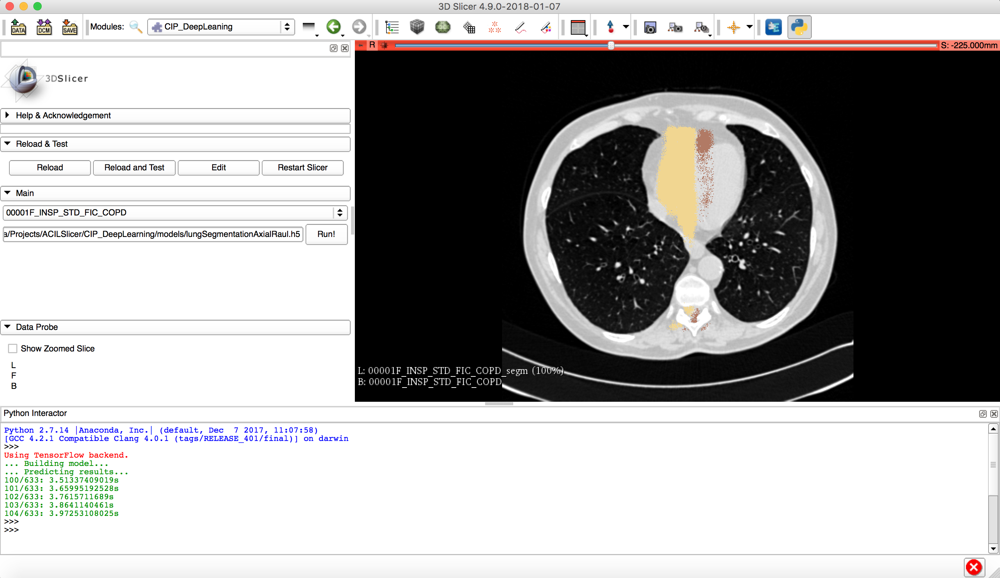

Back to [Projects List](../../README.md#ProjectsList)

# Chest Imaging Platform Deep Learning Lung Segmentation

## Key Investigators

- Jorge Onieva (BWH)
- Raúl San José (BWH)

# Project Description
Integrate a lung segmentation algorithm based on Deep Learning (Keras+Tensorflow) into the Chest Imaging Platform. 
The goal is to make available in Slicer this and other similar tools based on Deep Learning.

## Objective

1. Integrate a Lung Segmentation algorith based on Deep Learning in the Chest Imaging Platform. 
1. Make available these and other similar tools in Slicer

## Approach and Plan

1. Integrate a local python customized distribution in Slicer
1. Run a full deep learning keras-tensorboard based pipeline

## Progress and Next Steps

1. The core infrastructure was integrated in the CIP library
1. Full pipeline of lung segmentation was run successfully in Slicer
1. The model needs more work

# Illustrations

<!--Add pictures and links to videos that demonstrate what has been accomplished.-->

# Background and References

- [Source code](https://github.com/acil-bwh/ChestImagingPlatform)
