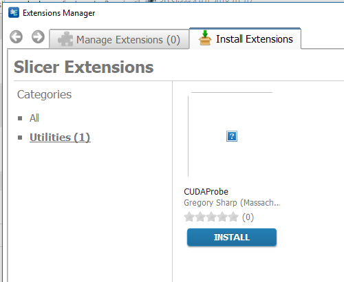
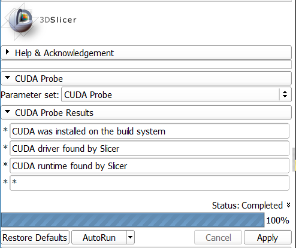

Back to [Projects List](../../README.md#ProjectsList)

# Slicer Extensions with CUDA

## Key Investigators

- Greg Sharp (MGH)
- Adam Rankin (Robarts)
- JC Fillion-Robin (Kitware, Inc.)

# Project Description

Provide an easy path for distributing extensions that use CUDA.

## Objective

1. What work needs done to get CUDA installed on build machine?
1. How can we test the resulting packages?

## Approach and Plan

1. Create sample CUDA extension
   1. Create simple CUDA extension "Slicer CUDA Probe"
   1. Perform manual build, upload, and test
      1. https://www.slicer.org/wiki/Documentation/Nightly/Developers/Tutorials/BuildTestPackageDistributeExtensions
      1. https://www.slicer.org/wiki/Documentation/Nightly/Developers/Build_ExtensionsIndex
1. Set up VM that matches factory, but with CUDA installed
   1. Create VM, install dev tools to match factory
      1. https://www.slicer.org/wiki/Documentation/Nightly/Developers/Factory
   1. Set up factory build of slicer
   1. Create extension index
      1. https://www.slicer.org/wiki/Documentation/Nightly/Developers/Tutorials/Contribute_Extension_Description_File
   1. Set up dashboard-driven compile
      1. https://www.slicer.org/wiki/Documentation/Nightly/Developers/Tutorials/DashboardSetup
   1. Do I need a separate extension server?
   1. How do CUDA extensions get displayed in extension manager?
1. Options for distribution
   1. Option A - End user must install CUDA SDK of same version
   1. Option B - Extension must statically link CUDA libraries
   1. Option C - Extension bundles shared libraries

## Progress

1. Engineering plan created
1. Sample extension created
   1. https://github.com/gregsharp/Slicer-CUDAProbe
1. Manual upload of extension

# Illustrations

