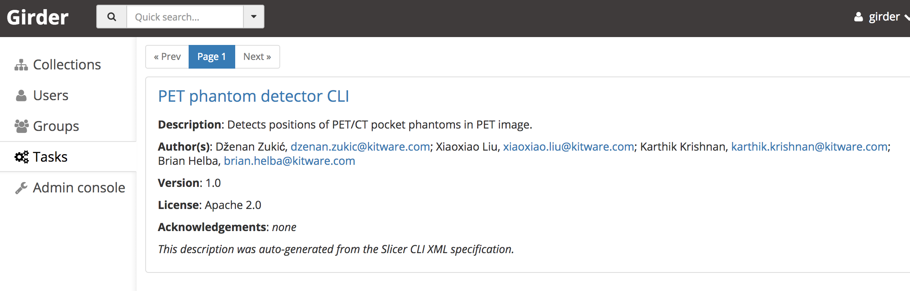
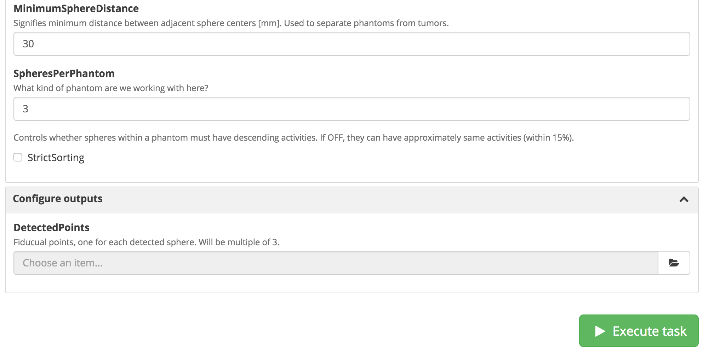
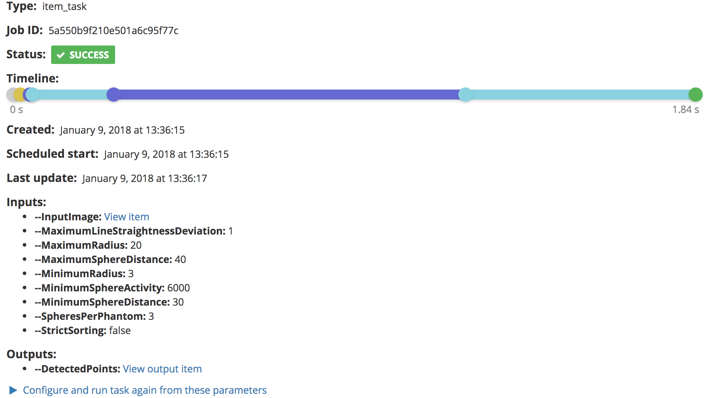

Back to [Projects List](../../README.md#ProjectsList)

# Girder and SlicerCLIs in the Cloud

Girder is a web based data management platform, capable of running SlicerCLIs. I'll demonstrate
this along with some info about deployment as part of the Medical and Scientific software in the cloud breakout session, Tuesday Jan 9, 1-2 pm.

## Key Investigators

- Michael Grauer (Kitware)

# Project Description

My expertise is in Girder and scalable cloud based processing. I will give a ~15 min talk on web/cloud tech, where I'll demo Girder in AWS on Tuesday Jan 9, 1-2 pm. I am going to be at Project Week on Monday and Tuesday. Please reach out if you want to chat!

# Discussion Topics

## Using commercial cloud services in scientific research projects

### General thoughts

Commercial cloud services are good for experimentation without long term commitment, and are useful when you need to have dynamic and elastic scaling. The providers are constantly rolling out new services, and there is a large amount of expertise encoded into these services (e.g. compare the cost of using AWS Elastic Load Balancer versus the time to gain the expertise of knowing how to run a load balancer), but the accounting model may have a mismatch with grant funded research (e.g. it may be easier to pay for an hour of someone's time to build a service versus paying for an hour of a cloud based service, even though the cloud based service is much cheaper in this comparison).

To realize the full power of the cloud, a different mindset is in order compared to purchased hardware and software. Think about using extremely powerful and expensive cloud resources for a very short period of time, or using many more resources in the short term than you would otherwise.

* Use a new and expensive GPU instance, but only for an hour.
* Use a powerful instance for a day to do all of your memory intensive processing.
* Temporarily run twice as many instances so you can have a staging instance as part of a production service migration.
* Use spot markets to access cheap processing if you have time flexibility.
* Throw away instances when they get into a bad state, create a new instance from scratch.

### Advantages

 * API driven
 * Dynamic and elastic scale
 * Only pay for what you use
 * Good for experimentation
 * They are always rolling out new services
 * There are specialized providers in addition to the large players
 * Great bandwidth and unlimited data storage are both just an API call away
 * Because you don't own anything, there is no cost to trying out new HW when it becomes available, and you haven't paid for HW that is now obsolete

### Disadvantages

 * Can be expensive, especially for a predictable, stable usage of resources
 * Can be tricky to pay for
 * You don't own anything, so how do you run the service when your grant runs out?
 * A new kind of expertise is demanded
 * Institutional pushback
 * PHI concerns
 * Noisy neighbors, security concerns (e.g. recent CPU exploits)
 * New services to constantly learn about
 * You might have to adapt your entire process to live inside a walled garden of services
 * Expensive bandwidth and data storage

### Related approaches

Using a private cloud based on OpenStack gives you many advantages of commercial cloud services (elasticity, APIs) without some of the drawbacks, but it does require specialized expertise and HW purchases. Where does an approach like Massachusets Open Cloud fit in?

Use a hybrid approach, where most of your resources are on premises, but you use cloud services for marginal needs. E.g., have an expensive GPU in your lab, and add in additional cloud based GPUs for load spikes. This also lets you try new and expensive HW without paying the full purchase price.

## DevOps and Infrastructure as Code (IaC)

Using IaC is key to achieving scale in the cloud (of machine resources and to scale the number of projects you can take on with a fixed number of people) and for repeatable development.

The IaC approach relies on keeping your infrastructure in source control so there is a shared document and understanding between development and operations (sys admin teams). When a problem is discovered in one instance, the fix is encoded into IaC. This also depends on having API access to scale the number of projects -- it doesn't work nearly as well when every site you interact with has a different process and setup, and your API is email. Another example of time vs money tradeoff with cloud infrastructure.

Kitware has had good luck with

* [Terraform](https://www.packer.io/intro/index.html) - creates infrastructure, can target AWS, GCP, OpenStack
* [Ansible](https://www.ansible.com/) - configures and provisions software, as long as you have SSH and root access
* [Packer](https://www.packer.io/intro/index.html) - package provisioned compute resources into VMs, Vagrant files, Docker images, AMIs
* [Docker](https://www.docker.com/) - package executables and dependencies into a self-contained and portable container

We use these technologies for our project deployments, and have built reusable tooling on top of them for Girder and Resonant tools.

## Girder and SlicerCLIs

### Resonant tools and what problems they solve

#### Girder

* data management: data storage from most places where your data lives
* data sharing with permissions and integration with external authentication systems
* ability to integrate visualizations and analyses
* extension in various dimensions through plugins (storage, analysis, visualization, authentication)
* deals with large scale
* interact through many clients: web or python client, RESTful APIs mean any client can talk to it, SFTP clients for read

#### Girder Worker

At the end of a large [refactor](https://github.com/girder/girder_worker/milestone/1) as of January 2018. Documentation is the last step to completing the refactor!

* separate algorithmic development from the infrastructure plumbing
* work on your algorithm as a python function, CLI, Docker image, in Jupyter, and test it locally
* then integrate it with Girder Worker through a lightweight wrapping, tie it in with Girder's data, parameter and execution management
* provides a lot of the boilerplate to make algorithmic integration with Girder easy
* use the full power of Python Celery to allow for simple linear scaling or arbitrary DAG workflows

#### SlicerCLIs and Docker (item_tasks)

* form full web applications based on existing Dockerized algorithms or SlicerCLIs
* Docker containers must self describe using JSON or Slicer XML
* ingest automatically forms a UI, execution framework to consume Girder data, and manages shipping and handling of data and params and outputs
* this is a basic starting point, but many apps would need customized UI or optimized computation

### Screenshots

Listing a SlicerCLI as a task after ingestion.

Task execution UI.

Task Job record after execution.

### References

- [Girder source code](https://github.com/girder/girder)
- [Girder documentation](http://girder.readthedocs.io/en/latest/)
- [Girder devops](https://github.com/girder/girder/tree/master/devops)
- [Girder item_tasks source code](https://github.com/girder/girder/tree/master/plugins/item_tasks)
- [Girder Worker source code](https://github.com/girder/girder_worker)
- [Girder Ansible Galaxy role](https://galaxy.ansible.com/girder/girder/)
- [Girder Worker Ansible Galaxy role](https://galaxy.ansible.com/girder/girder-worker/)
