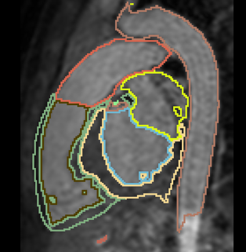

Back to [Projects List](../../README.md#ProjectsList)

# Interactive Deep Learning for Congenital Heart Disease Segmentation

## Key Investigators

- Danielle Pace (MIT)
- Adrian Dalca (MIT)
- Polina Golland (MIT)
- Mehdi Hedjazi Moghari (Boston Children's Hospital)

# Project Description

## Objective

1. Aim: segment all cardiac chambers and great vessels from cardiac MRI, for children with congenital heart disease.
2. 20 training cases + large anatomical variability - remains a challenge for automatic segmentation.
3. Approach: Integrate some interaction from the user, e.g. scribbles or landmarks.

## Approach and Plan

1. Already have framework for interactive segmentation. Currently testing using scribbles for aorta segmentation.
2. Investigate data augmentation to prevent overfitting - noise / slight intensity changes / small deformations.
3. Parameter tuning.

## Progress and Next Steps

1. Implemented on-the-fly data augmentation, including (1) random affine transformations constrained by a user-specified maximum rotation, translation, scale and shear, and (2) random elastic deformation.
2. Currently running trials to measure impact and tune parameters.

# Illustrations

# Background and References

<!--Use this space for information that may help people better understand your project, like links to papers, source code, or data.-->

- HVSMR Challenge Data: (http://segchd.csail.mit.edu)
