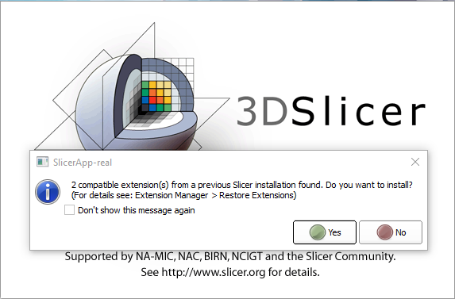
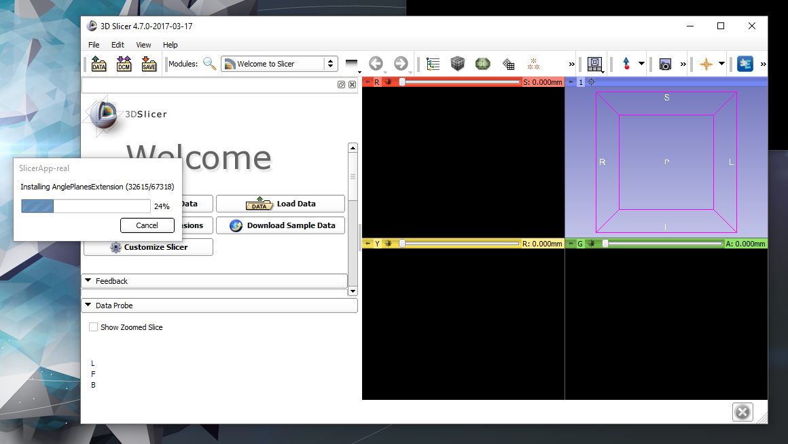
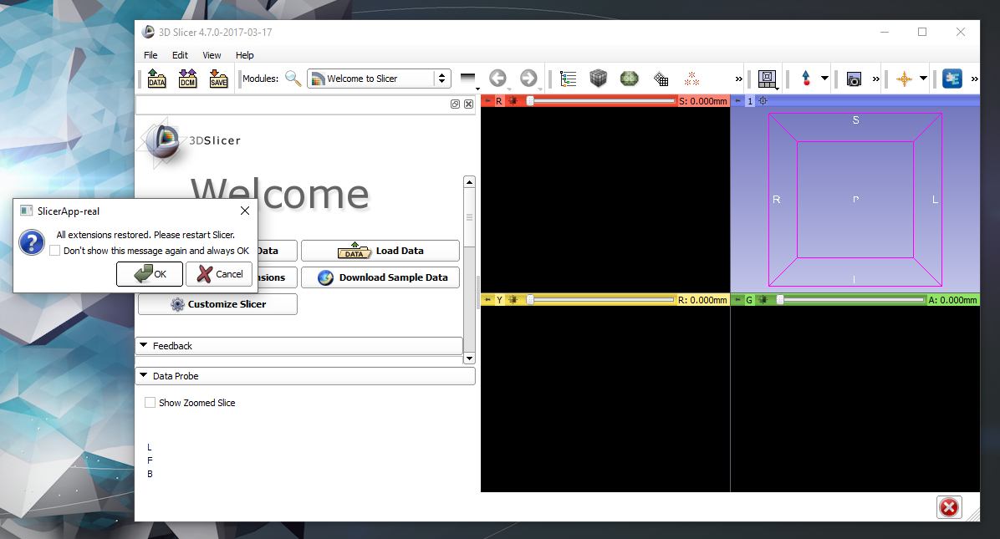

Back to [Projects List](../../README.md#ProjectsList)

# Keep Track of the Installed Extensions Across Version

## Key Investigators

- Hans Meine (Fraunhofer)
- Jean-Christophe Fillion-Robin (Kitware)
- Mathias Neugebauer (Fraunhofer)
- Andras Lasso (Queens)
- Ron Kikinis (Fraunhofer,SPL)

# Project Description

## Objective

1. After installing a new version of Slicer, the user can select from all previously installed extensions
   and batch-install them
1. Extensions installed in the last (previous) Slicer versions are marked and preselected
   (one click-solution for getting the previous setup)
1. Extensions that where previously installed but are not compatible for some reason, are shown but not selectable
1. UI: a third tab ("Restore Extensions") should be added to the Extension Manager and provide at least a list
   view for selection / a button for installing the selected extensions

## Approach and Plan

1. Mathias already created a Slicer pull request [PR#698](https://github.com/Slicer/Slicer/pull/698). During the project week
   we will complete the review process, apply required changes and integrate into Slicer.

## Progress and Next Steps

<!--Describe progress and next steps in a few bullet points as you are making progress.-->

# Illustrations

<!--Add pictures and links to videos that demonstrate what has been accomplished.-->

# Background and References

<!--Use this space for information that may help people better understand your project, like links to papers, source code, or data.-->

- [Source Code](https://github.com/Slicer/Slicer/pull/698)
- [Documentation](https://www.slicer.org/wiki/Documentation/Labs/AutomaticUpdateAndInstallationFramework)
