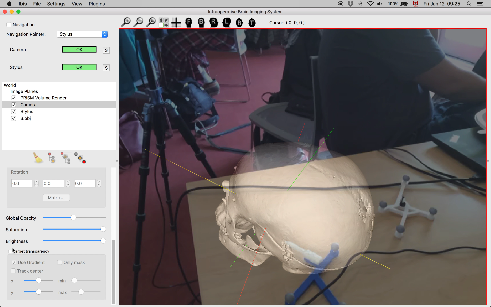

Back to [Projects List](../../README.md#ProjectsList)

# OpenIGTLinkIO Development

## Key Investigators

- [Simon Drouin](http://nist.mni.mcgill.ca/?page_id=369) (Montreal Neurological Institute, Canada)
- [Andras Lasso](http://perk.cs.queensu.ca/users/lasso) (Queen's University, Canada)
- [Csaba Pinter](http://perk.cs.queensu.ca/users/pinter) (Queen's University, Canada)
- [Adam Rankin](http://www.imaging.robarts.ca/petergrp/node/113) (Robarts Research Institute, Canada)
- [Mark Asselin](http://perk.cs.queensu.ca/users/asselin) (Queen's University, Canada)
- Étienne Léger (Concordia University)
- [Longquan Chen](https://www.linkedin.com/in/longquan-chen-68672340/) (Brigham and Women's Hospital)
- [Tamas Ungi](http://perk.cs.queensu.ca/users/ungi) (Perk Lab)

# Project Description

## Objective

* [Plus Toolkit](http://www.plustoolkit.org) provides access to numerous hardware devices (imaging devices, tracking devices, navigations systems, sensors, etc.) and makes it available through [OpenIGTLink](http://www.openigtlink.org) protocol
* This group has created a common library, [OpenIGTLinkIO](http://igsio.github.io) that simplifies the integration of Plus (and OpenIGTLink-compatible devices or software) into different programs and :
  * Ensure software interoperability between [Slicer](https://www.slicer.org/), [MITK](http://mitk.org/), [CustusX](https://www.custusx.org/), [Ibis Neuronav](http://ibisneuronav.org/) and potentially other imaging platforms.
  * Share software maintenance workload
  * Make it easy to share new features
  * Add specific features for tracked ultrasound and and augmented reality in surgical navigation

## Approach and Plan

* Improve support for video compression in OpenIGTLink and OpenIGTLinkIO
* Add support for the [Attracsys tracking system](https://www.atracsys.com/web/eng/measurement/products_2) to the Plus Toolkit
* Add more options to remotely control US machine parameters
* Implement a Plus server launcher class that can be used in Plus server launcher, Slicer, Ibis, MITK and CustusX.
* Discuss incentives/oportunities that could convince US machine vendors to open up more components of their machines for real-time acquisition and control for research.

## Progress and Next Steps
* Support for compressed video in OpenIGTLinkIO has been improved to better handle keyframes through smarter buffering (Longquan).
* The code for launching a Plus Server has been extracted from PlusServerLauncher to a standalone class that is used in Ibis Neuronav. Next step: add the class to OpenIGTLinkIO. The code can then be used by Slicer and other applications to automatically launch a Plus server on the local machine, monitor its execution and parse the output.
* A recently developed tablet application for surgical AR (Described in [this article](http://digital-library.theiet.org/content/journals/10.1049/htl.2017.0062?crawler=true&mimetype=application/pdf&tags=noindex) ) has been adapted to easily connect to any OpenIGTLinkIO-powered application. The application has been tested to transmit video to Slicer and IbisNeuronav.
* The tablet application has also been setup to produce augmented reality images on Ibis Neuronav (see video) using tracking data from a Plus Server connected to a OptiTrack tracking system.
* TODO: summarize the conclusions of the discussion about opening up US machines' SDK.

<!--Describe progress and next steps in a few bullet points as you are making progress.-->

# Illustrations

<!--Add pictures and links to videos that demonstrate what has been accomplished.-->

# Background and References

<!--Use this space for information that may help people better understand your project, like links to papers, source code, or data.-->

- [Source code](https://github.com/IGSIO/OpenIGTLinkIO)
- [IGSIO web page](http://igsio.github.io/)
