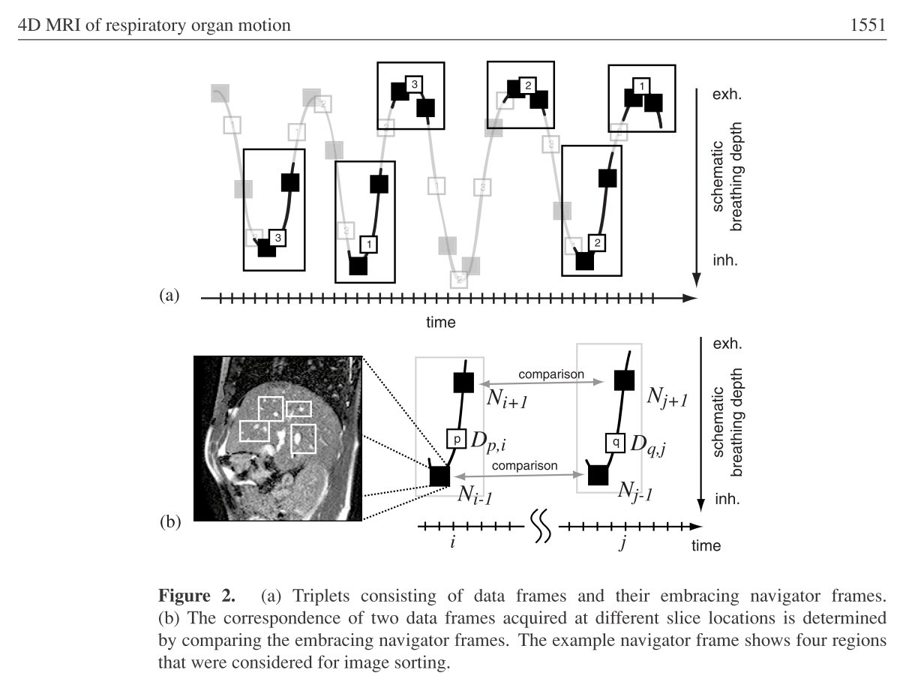
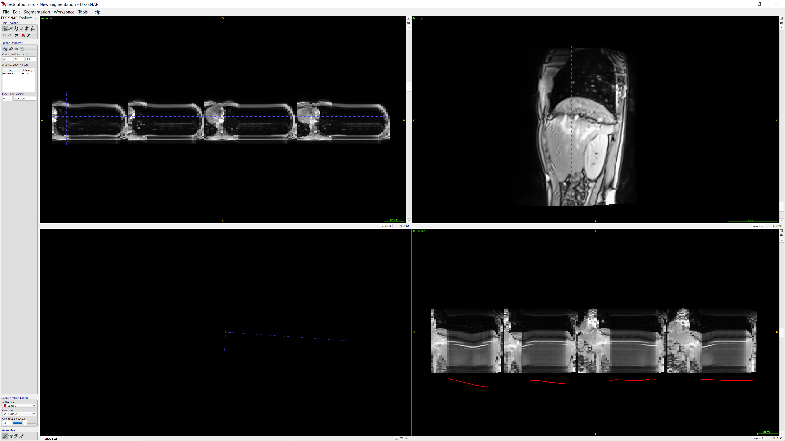

Back to [Projects List](../../README.md#ProjectsList)

# Organ Motion Compensation in MR

## Key Investigators

- Gino Gulamhussene (University of Magdeburg)
- Joost van Griethuysen (BWH)

# Project Description
Creating a program to generate 4D MRI sequences applying the retrospectiv stacking method on 2D MR slices.
The available data is comprised of an time resolved alternating sequence of navigator and data slices and a pure sequence of time resolved navigator slices. All navigator slices being acquired at the exact same location and the data slices "scanning" the complete liver in a cyclic manner. To generate a 4D MR sequence from that the program has to collect all data frames that were acquired during the same breating phase, i.e. not at the same time but at different times during the same breathing phase. To find these, the navigator slices are utilized. Finding correspondences between the navigator slices of the pure navigator sequence and the once of the alternating sequence means to find similar or same breathing phases. Thus we find all corresponding data slices giving the 3D liver at the specific breathing phase using the correspondence of its encompassing navigator slices.

## Objective

1. Creating a program to generat sequences of 3D MR images

## Approach and Plan

1. Using reference implementation

## Progress and Next Steps

<!--Describe progress and next steps in a few bullet points as you are making progress.-->
- got insight in available and relevant DICOM tags (big thanks to Joost for the DICOM Explorer)
- hit a roadblock when data appeared to be faulty
- wrote a python script sorting the data by acquisition time, turns out data is faulty after all (thanks to Joost again)

**next steps**
- figure out how to tell the MR scanner to acquire slices in the right order

# Illustrations

<!--Add pictures and links to videos that demonstrate what has been accomplished.-->

# Background and References

<!--Use this space for information that may help people better understand your project, like links to papers, source code, or data.-->

- Source code: https://github.com/YourUser/YourRepository
- Documentation: https://link.to.docs
- Test data: https://link.to.test.data
