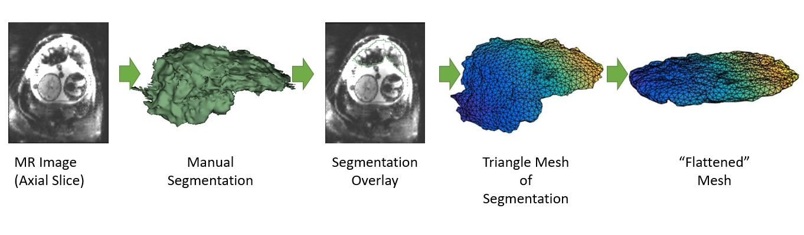

Back to [Projects List](../../README.md#ProjectsList)

# Mapping and Visualizing a Segmented Placenta to a Canonical Template

## Key Investigators

- Mazdak Abulnaga (MIT)
- Danielle Pace (MIT)
- Steve Pieper (Isomics)
- Justin Solomon (MIT)
- Polina Golland (MIT)

# Project Description
The project seeks to flattened images of the placenta for visualization. Segemented placenta are mapped to a canonical template such as an ellipsoid for visualization of anatomy and function.
We aim to build a module in Slicer to establish correspondence between the original volume and the flattened one.
## Objective

- 1. Map the segmented placenta with minimal distortion.
- 2. Map the grayscale intensity from the original volume to the flattened volume.
- 3. Build the visualization module in Slicer. Objective is to be able to click on a location in the original volume and automatically move the cursor on the flattened volume.

## Approach and Plan

## Progress and Next Steps
- Created a few test transformations and generated the appropriate displacement fields.
- Saved the displacement fields as NRRD files and successfully loaded them into Slicer.
- Identified bugs in the transformation, it seems there is an inherent rotation that Slicer is unaware of so the field does not apply correctly.

Next Steps:
- Rotation on simple test cases
- Rotation on transformed volumes
- Develop visualization module

# Illustrations

# Background and References
