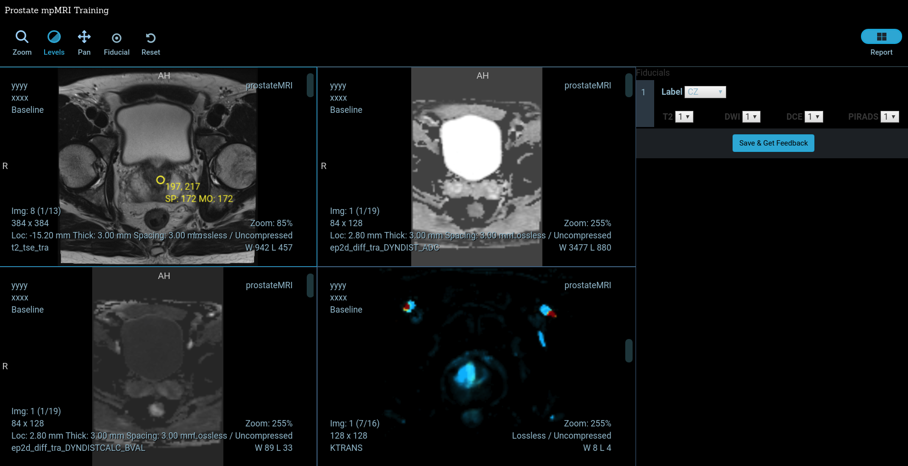

Back to [Projects List](../../README.md#ProjectsList)

# Prostate Multiparametric MRI Web Viewer

## Key Investigators

- [Alireza Sedghi](https://github.com/sedghi) (BWH/Queen's University)
- [Alireza Mehrtash](https://github.com/mehrtash) (BWH/UBC)
- [Steve Pieper](https://github.com/pieper) (Isomics)
- [Erik Ziegler](https://github.com/swederik) (OHIF)

# Project Description
## Objective

1. Building a web application for reviewing and scoring multi-parametric MRI of prostate
1. Add support for reading and writing DICOM objects
1. Creating user interaction capabilities for the viewer (placing fiducial, measurements)
1. Add support for saving the PIRADS reporting

## Approach and Plan

1. Brainstorming the useful utilities for mpMRI reading of prostate
1. Exploring dcmjs library

## Progress and Next Steps

### Progress
1. Built PIRADS trainer using OHIF Standalone Viewer packages
1. Added the tools (zoom, levels, pan, fiducials) and hanging protocol for the prostate study
1. Added reporting UI for PIRADS reporting
1. Tested on a sample of ProstateX dataset

### Next Steps
1. Hosting on virtual machine
1. Organize more cases, and determine how to host the data
1. Enabling slice synchronization between MR modalities
1. Adding a fiducial which can be displayed and synchronized across view ports
1. Enhancing the reporting UI, SVG for clicking prostate zones
1. Enhancing the feedback to give more detailed message(e.g., how close the distance is)
1. Adding support for 4D DCE images (prefetching across time and scrolling between volumes)
1. Improve Ktrans colormap

# Illustrations

<!--Add pictures and links to videos that demonstrate what has been accomplished.-->

Click on the image below for the video demo:

# Background and References

<!--Use this space for information that may help people better understand your project, like links to papers, source code, or data.-->
1. [Github project](https://github.com/ProstateWebViewer/PI-RADS-Trainer)

# Similar Projects
1. http://rsnacrowdquant.cloudapp.net/
1. https://github.com/pieper/dcmjs
1. https://github.com/OHIF
1. https://github.com/cornerstonejs/cornerstoneTools
