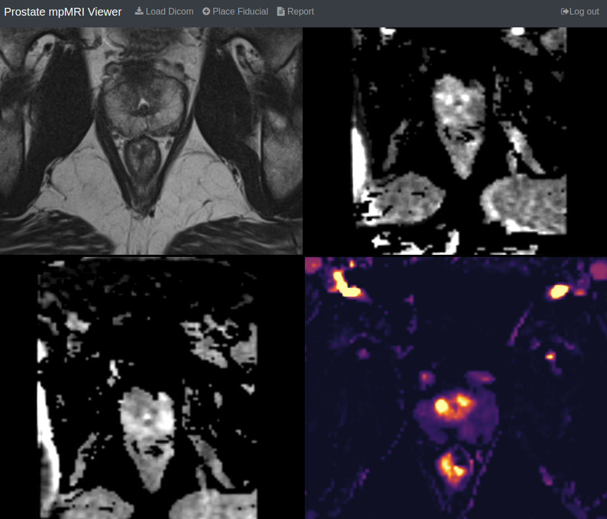

Back to [Projects List](../../README.md#ProjectsList)

# Prostate Multiparametric MRI Web Viewer

## Key Investigators

- Alireza Sedghi (BWH/Queen's University)
- Alireza Mehrtash (BWH/UBC)
- Steve Pieper (Isomics)
- Erik Ziegler (OHIF)

# Project Description

## Objective

1. Add support for reading and writing DICOM objects
1. Creating user interaction capabilities for the viewer (placing fiducial, measurements) 
1. Add support for saving the PI-RADS reporting

## Approach and Plan

1. Brainstorming the usefull utilities for mpMRI reading of prostate
1. Exploring dcmjs library

## Progress and Next Steps

<!--Describe progress and next steps in a few bullet points as you are making progress.-->

# Illustrations

<!--Add pictures and links to videos that demonstrate what has been accomplished.-->

# Background and References

<!--Use this space for information that may help people better understand your project, like links to papers, source code, or data.-->
1. [github project](https://github.com/mehrtash/ProstateWebViewer)

# Similar Projects
1. http://rsnacrowdquant.cloudapp.net/
1. https://github.com/pieper/dcmjs
1. https://github.com/OHIF
1. https://github.com/cornerstonejs/cornerstoneTools

