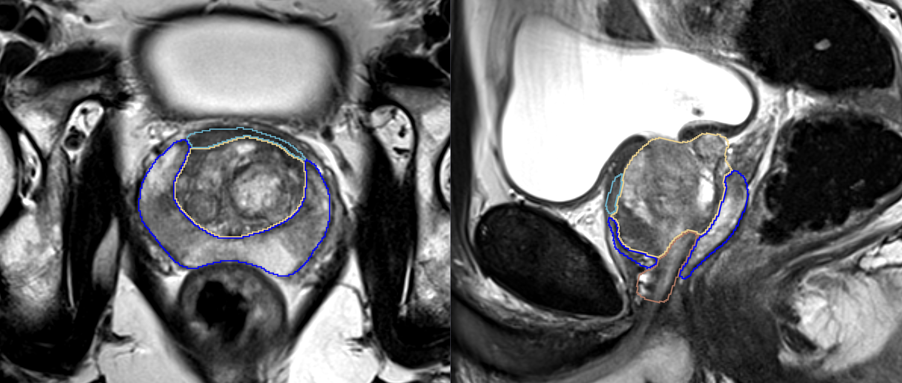

Back to [Projects List](../../README.md#ProjectsList)

# Multi-Label Segmentation of Prostate Zones with Volumetric CNN

## Key Investigators

- Anneke Meyer (University of Magdeburg, Germany)
- Alireza Mehrtash (BWH/HMS)
- Andrey Fedorov (BWH, HMS)
- Christian Hansen (University of Magdeburg, Germany)
- Nicole Wake (NYU School of Medicine)

# Project Description

The goal of this project is to create and evaluate variants of a CNN for multi-label segmentation of prostate zones in MR images. The prostate zones are essential for lesion classification and therapy planning.
After successful segmentation, a sector map could be extracted that is used for PI-RADS reporting. This has the potential to automate and better standardize prostate lesion location reporting.

## Objective

1. Overlap-free segmentations of prostate zones.
1. Gap-free segmentations of prostate zones.
1. Improvement of current segmentation result, especially for the anterior fibromuscular stroma (AFS)

## Approach and Plan

1. Apply variants of volumentric CNN architectures.
1. Discuss ways to obtain overlap- and gap-free segmentations.
1. Discuss methods to create sector map. Which landmarks should be used?

## Progress and Next Steps
1. first results on more training data and with different models look promising
1. Obtained meaningful results for the AFS .
1. disucussions with people how to further improve the outcome.
<!--Describe progress and next steps in a few bullet points as you are making progress.-->

# Illustrations

<!--Add pictures and links to videos that demonstrate what has been accomplished.-->

# Background and References

<!--Use this space for information that may help people better understand your project, like links to papers, source code, or data.-->

- Source code: https://github.com/YourUser/YourRepository
- Documentation: https://link.to.docs
- Test data: https://link.to.test.data
