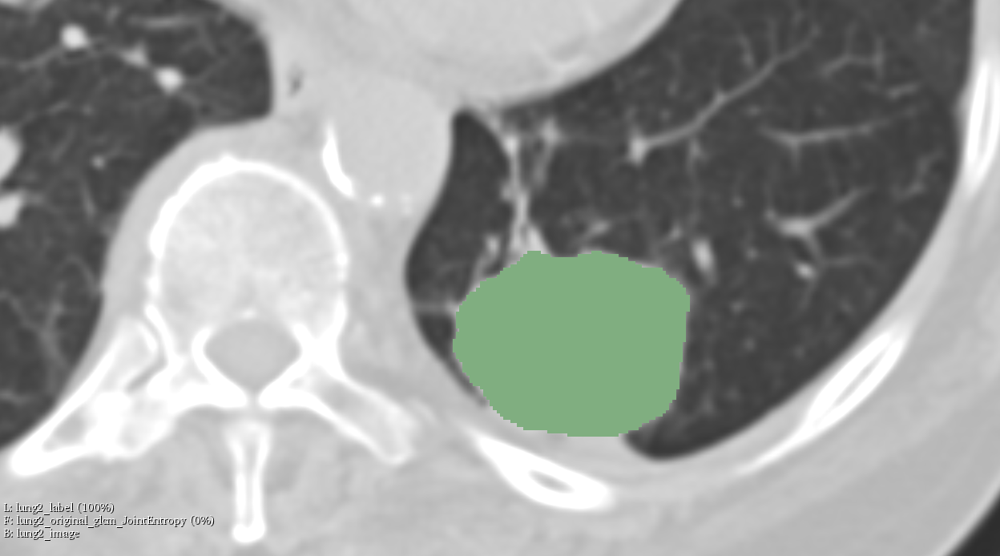
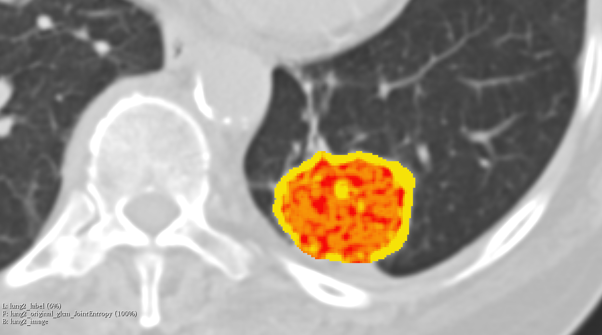
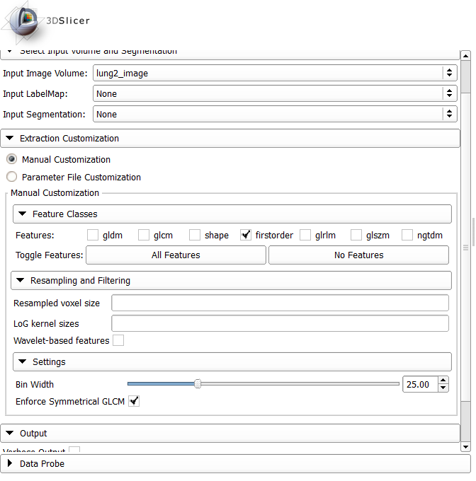
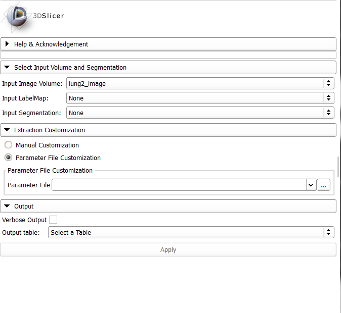

Back to [Projects List](../../README.md#ProjectsList)

# PyRadiomics Models

## Key Investigators

 - [Joost van Griethuysen](https://github.com/JoostJM) 1, 3, 4
 - [Andriy Fedorov](https://github.com/fedorov) 2
 - [Jean-Christophe Fillion-Robin](https://github.com/jcfr) 5
 - [Ahmed Hosny](https://github.com/ahmedhosny) 1
 - [Steve Pieper](https://github.com/pieper) 6
 - [Hugo Aerts (PI)](https://github.com/hugoaerts) 1, 2

1 Department of Radiation Oncology, Dana-Farber Cancer Institute, Brigham and Women's Hospital, Harvard Medical School, Boston, MA, USA. 
2 Department of Radiology, Brigham and Women's Hospital, Harvard Medical School, Boston, MA, USA. 
3 Department of Radiology, Netherlands Cancer Institute, Amsterdam, The Netherlands. 
4GROW-School for Oncology and Developmental Biology, Maastricht University Medical Center, Maastricht, The Netherlands. 
5 Kitware, Inc. 
6 Isomics, Inc.

## Project Description

## Objective

1. Develop framework to easily apply and share radiomic models using PyRadiomics and it's 3D slicer extension SlicerRadiomics.
1. In addition to the current lesion-based extraction, add a voxel-based extraction.
1. Update the SlicerRadiomics extension to accept the PyRadiomics parameter files.

## Approach and Plan

### Objective #1

1. Develop configuration file to store a radiomic model.
1. Add a pyradiomics module or a separate github python repository that can read/write the config file and use radiomics to apply it.
1. Add commandline interface to use new functionality.
1. Develop new Slicer module to interface with this new pyradiomics module to make this new functionality directly available in slicer.

### Objective #2

1. Update radiomics base module to allow voxel-based extraction
1. Add new feature extractor module to provide interface for voxel-based extraction
1. Add Commandline interface for voxel based extraction
1. Add examples (settings, usage) to show new functionality

### Objective #3

1. Update the SlicerRadiomics widget to have a toggle button for manual customization (UI elements in Slicer) or parameter file customization (path line edit to select file)
1. Update the SlicerRadiomics logic to allow an extraction using the parameter file customization
1. Add a test to SlicerRadiomicsTest to test this new functionality

## Progress and Next Steps

<!--Describe progress and next steps in a few bullet points as you are making progress.-->

### Objective #1
[Related PR](https://github.com/Radiomics/pyradiomics/pull/338)
- Designed a model definition configuration file and validation schemas

TODO:
- Implement functionality to apply models
- Add several model types (e.g. linear regression, logistic regression)

### Objective #2
[Related PR](https://github.com/Radiomics/pyradiomics/pull/337)
- Added voxel based extraction functionality
- Updated current feature extractor module to optionally allow voxel based extraction
- Added examples to show new functionality

TODO:
- Add commandline interface

### Objective #3
[Related PR](https://github.com/Radiomics/SlicerRadiomics/pull/36)
- Update widget
- Update Logic
- Update Test

## Illustrations

<!--Add pictures and links to videos that demonstrate what has been accomplished.-->

### Objective #2

### Objective #3

## Background and References

<!--Use this space for information that may help people better understand your project, like links to papers, source code, or data.-->

- [PyRadiomics Source Code](https://github.com/Radiomics/pyradiomics)
- [SlicerRadiomics Source Code](https://github.com/Radiomics/SlicerRadiomics)
- [Documentation](http://pyradiomics.readthedocs.io)
- PyRadiomics Article: [Computational Radiomics System to Decode the Radiographic Phenotype](http://cancerres.aacrjournals.org/content/77/21/e104)

Other related references:
* Image biomarker standardisation initiative: https://arxiv.org/abs/1612.07003
* Radiomics Ontology: http://www.radiomics.org/RO/01000, http://bioportal.bioontology.org/ontologies/RO
