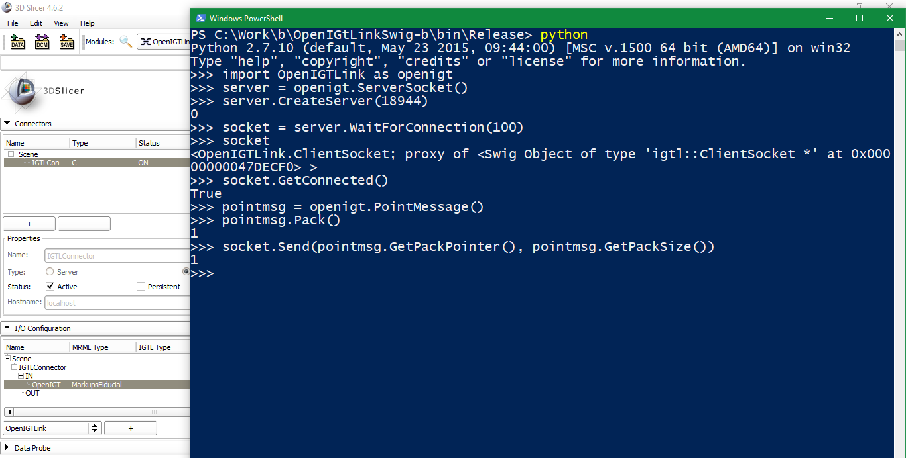

Back to [Projects List](../../README.md#ProjectsList)

# Python Wrapping OpenIGTLink

## Key Investigators

- Franklin King (Brigham and Women's Hospital)
- Longquan Chen (Brigham and Women's Hospital)
- Junichi Tokuda (Brigham and Women's Hospital)

# Project Description

## Objective

1. Python wrap OpenIGTLink to provide a Python interface for standalone OpenIGTLink application (motivation being the development of a robot control server as a midpoint between robot and 3D Slicer interface).

## Approach and Plan

1. Making use of SWIG (http://www.swig.org/)
2. Added as a cmake option to OpenIGTLink build

## Progress

<!--Describe progress and next steps in a few bullet points as you are making progress.-->
1. Server/client socket creation is functional and wrapping integrated in cmake
2. Almost all Message types also functional
3. Implementation still messy (and still need to figure out SWIG's deal with OpenIGTLink smartpointers)
4. (Also had discussions regarding protocol design for the motivating project)

## Next Step
1. Merge branch with OpenIGTLink

# Illustrations

<!--Add pictures and links to videos that demonstrate what has been accomplished.-->

https://github.com/franklinwk/OpenIGTLink/tree/Swig-Python
