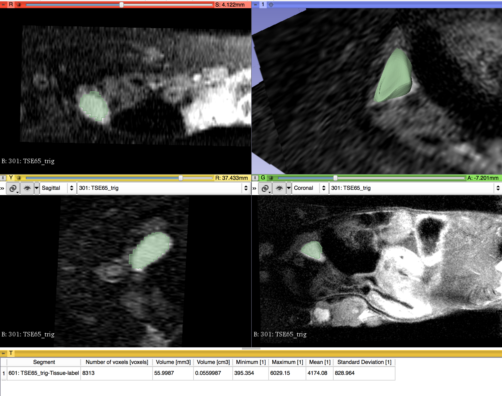

Back to [Projects List](../../README.md#ProjectsList)

# Small Animal Quantitative Imaging

## Key Investigators

- Curtis Lisle (KnowledgeVis, LLC)
- Andrey Fedorov (BWH)
- Yanling Liu (Frederick National Lab for Cancer Research)

# Project Description

For this project, we aim to bring small animal MR datasets in DICOM format and repeat the process developed for the
QIICR program to segment a lesion (a Neuroendocrine Tumor in this case), convert the segmentation to a DICOM segmentation
using the DCMQI slicer extension, and finally measure the segmentation using the Quantitative Reporting module.  Our aim
is to develop a set of repeatable analysis steps we can put into place to analyze additional datasets in our lab.

## Objective

1. Develop a set of processing steps for lesion analysis that are repeatable for other small animal datasets.  Access if
clinical tools from the QIICR program will apply to small animal MR datasets as well.

## Approach and Plan

1. Test DCMQI tools on a Small Animal MR dataset.  Access if small animal DICOM headers are similar enough
to clinical scanners.
2. Use Slicer segmentation tools to generate a label map of the lesion.
3. Create a DICOM segmentation object form the segmented label using DCMQI
4. Investigate DeepInfer models for automatic segmentation of later lesions

## Progress and Next Steps

<!--Describe progress and next steps in a few bullet points as you are making progress.-->
- Segment lesion using Slicer Segmentation Wizard
- Follow excellent QIICR tutorial instructions
- DCMQI conversion to DICOM segmentation object failed during the first attempt. Consulted Andrey.
- One of slices from the Phillips small animal scanner was identified with inconsistent header contents compared to other slices.
- Change made to DCMQI to accommodate this dataset.
- Reprocessed successfully and measured DICOM segmentation object using Quantitative Reporting module
- Build and trained a CNN using Keras. Consulted with Alireza about how to connect with DeepInfer.
- Planning to complete DeepInfer integration of our new model over the coming weeks.

# Illustrations

<!--Add pictures and links to videos that demonstrate what has been accomplished.-->

# Background and References

<!--Use this space for information that may help people better understand your project, like links to papers, source code, or data.-->

- Documentation: http://qiicr.org/dcmqi-guide/tutorials/intro.html
- Documentation: https://qiicr.gitbooks.io/dicom4qi/
