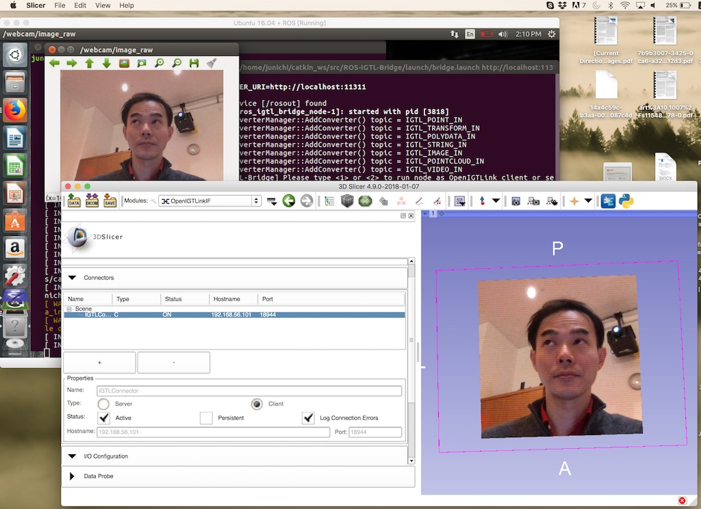

Back to [Projects List](../../README.md#ProjectsList)

# ROS-IGTL-Bridge Video Streaming

## Key Investigators

- Junichi Tokuda (BWH)
- Longquan Chen (BWH)

# Project Description

## Objective

1. Integrate compressed video streaming in ROS-IGTL-Bridge

## Approach and Plan

1. Define ROS topic for video streaming
2. Compile ROS-IGTL-Bridge with the latest OpenIGTLink with compressed video streaming feature.

## Progress and Next Steps

### Progress
1. Solved a build error for OpenIGTLink in the Linux environment. See [GitHub Issue Tracker](https://github.com/openigtlink/OpenIGTLink/issues/162).
2. Tested OpenIGTLink with VP9 support on Linux.
3. Added VP9 support in ROS-IGTL-Bridge
4. Install [video_stream_opencv module](http://wiki.ros.org/video_stream_opencv)
5. Install [new OpenIGTLinkIF module with IGSIO integration](https://github.com/openigtlink/OpenIGTLinkIF/tree/IGTLIOFullIntegration). This adds compressed video streaming support in 3D Slicer.
5. Tested video streaming from ROS-IGTL-Bridge to 3D Slicer using Virtual Box.

### Next Steps
1. Support more video formats (only BGR8 is supported currently) and codecs (e.g. AV1, H.265)
2. ROS topic to subscribe should be configurable. Currently it is hard-coded in the C++ source file.

# Illustrations

<!--Add pictures and links to videos that demonstrate what has been accomplished.-->

##Instructions:
1. Download ROS-IGTL-Bridge from [the CompressedVideoStreaming branch](https://github.com/openigtlink/ROS-IGTL-Bridge/tree/CompressedVideoStreaming).
2. Install [video_stream_opencv module](http://wiki.ros.org/video_stream_opencv) in ROS.
3. Edit line 55 in ROS-IGTL-Bridge/src/ros_igtl_bridge.cpp and replace "IGTL_VIDEO_OUT" with "/webcom/image_raw".
4. Start video_stream_opencv module by calling "roslaunch video_stream_opencv webcam.launch"
5. Start ROS-IGTL-Bridge by calling "roslaunch ros_igtl_bridge bridge.launch". Configure it as a server.
6. Start 3D Slicer, open OpenIGTLinkIF module, and connect to the ROS-IGTL-Bridge as a client.

# Background and References

<!--Use this space for information that may help people better understand your project, like links to papers, source code, or data.-->

- [ROS-IGTL-Bridge GitHub Repository](https://github.com/openigtlink/ROS-IGTL-Bridge)
- [Frank T, Krieger A, Leonard S, Patel NA, Tokuda J. ROS-IGTL-Bridge: an open
network interface for image-guided therapy using the ROS environment. Int J
Comput Assist Radiol Surg. 2017 Aug;12(8):1451-1460.](https://www.ncbi.nlm.nih.gov/pubmed/?term=28567563)
- [OpenIGTLink Library](https://github.com/openigtlink/OpenIGTLink)
