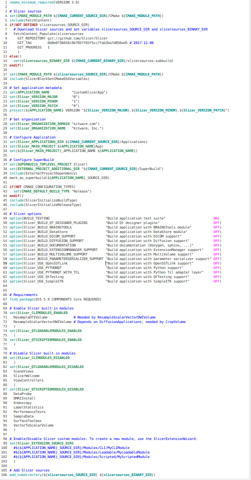

Back to [Projects List](../../README.md#ProjectsList)

# Slicer Custom Application

## Key Investigators

- Jean-Christophe Fillion-Robin (Kitware)
- Andras Lasso (PerkLab)
- Johan Andruejol (Kitware)

# Project Description

## Objective

1. Publish code on https://github.com/KitwareMedical/SlicerCustomAppTemplate
1. Setup readthedocs documentation
1. Setup continuous integration

<!--
## Approach and Plan
-->

## Progress and Next Steps

<!--Describe progress and next steps in a few bullet points as you are making progress.-->

- Organized [3d-Slicer-Solutions](../../BreakoutSessions/3D-Slicer-Solutions.md) breakout session to:
  - discuss what define a Slicer solution
  - learn about existing solutions
  - present the new project allowing to create custom applications. **Only ~100 lines**. It will be available and documented on https://github.com/KitwareMedical/CustomSlicerAppTemplate

# Illustrations

<!--Add pictures and links to videos that demonstrate what has been accomplished.-->

# Background and References

<!--Use this space for information that may help people better understand your project, like links to papers, source code, or data.-->
- [3d-Slicer-Solutions](../../BreakoutSessions/3D-Slicer-Solutions.md) breakout session.
<!--
- Source code: https://github.com/YourUser/YourRepository
- Documentation: https://link.to.docs
- Test data: https://link.to.test.data
-->
