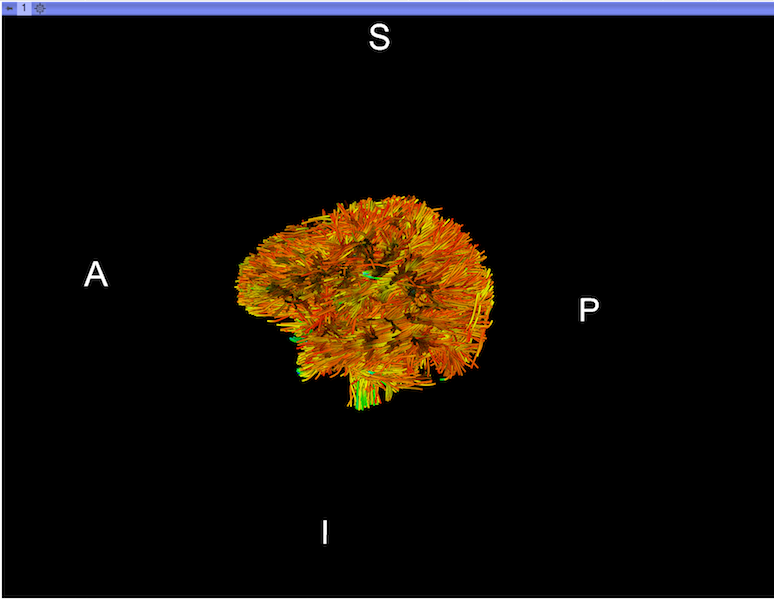

Back to [Projects List](../../README.md#ProjectsList)

# SlicerDMRI internals modernization: display and i/o refactoring

## Key Investigators

- Isaiah Norton (BWH)
- Lauren O'Donnell (BWH)
- Tamas Ungi (Queen's)

# Project Description

## Objective

1. Eliminate remaining dependencies in Slicer core for fiberbundle and DTI volume rendering, to simplify both Slicer core
   and SlicerDMRI maintenance and refactorability.

## Approach and Plan

- Objective 1:
  - Remove remaining DMRI display-related code from Slicer core
  - Remove remaining DMRI i/o code from Slicer core
- Objective 2:
  - Test pip installation of dependency list in Qt5/VS2015 Slicer on Windows and Mac
  - Discuss with Jc and other contributors

## Progress and Next Steps

<!--Describe progress and next steps in a few bullet points as you are making progress.-->
- [x] Initial FiberBundleNode refactoring: https://github.com/SlicerDMRI/SlicerDMRI/pull/94
  - Abstract display pipeline so that renderer can have a consistent
    input connection for the life of the display node.
- [x] New displayable manager for fiberbundle 3D
  - Allows to replace slow part of the render pipeline:
    - selection and sub-sampling: set cell visibility per line instead of doing polydata
      extraction round-trip to CPU
  - [ ] 2D view/slice intersection
- [ ] Move volume visualization code

# Illustrations

<!--Add pictures and links to videos that demonstrate what has been accomplished.-->

# Background and References

<!--Use this space for information that may help people better understand your project, like links to papers, source code, or data.-->

- Source code: <https://github.com/SlicerDMRI/SlicerDMRI>
- Documentation: <https://dmri.slicer.org>

<!--Link for editing page when displayed in GitHub pages-->
<a href="{{site.github.repository_url}}/edit/master/{{page.path}}">Edit this page on GitHub</a>
