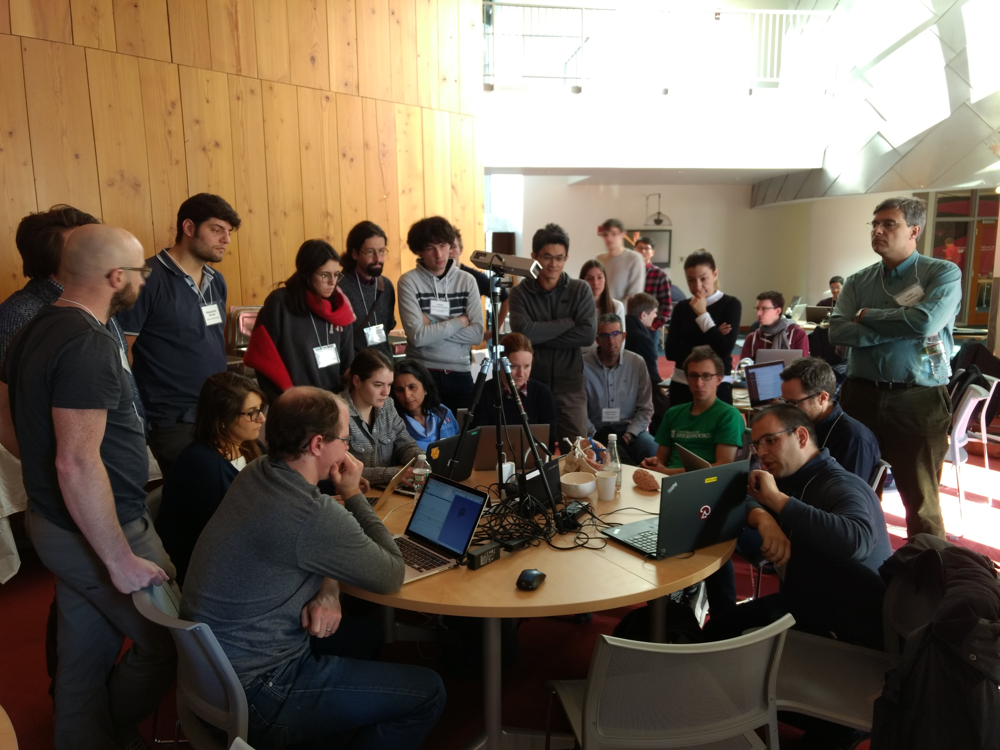

Back to [Projects List](../../README.md#ProjectsList)

# SlicerIGT Extension Development and Tutorial

## Key Investigators

- Tamas Ungi (Perk Lab)
- Longquan Chen (Brigham and Women's Hospital)
- Junichi	Tokuda (Brigham and Women's Hospital)

# Project Description

## Objective

1. Housekeeping and further development of the existing SlicerIGT extension.
2. Extend the current tutorial regarding the new features in SlicerIGT.

## Approach and Plan

1. Share the latest tutorial in a breakout session
2. Meetings about current IGT applications and prioritize future tutorials
3. Extend tutorial documents

## Progress and Next Steps

1. Live tutorial (see picture)
2. Online version of tutorial available on the [SlicerIGT website](http://www.slicerigt.org/wp/user-tutorial/), see U-37
3. Plans for future: developer tutorial, robot control

# Illustrations

<!--  -->
<!--  -->

# Background and References

<!--Use this space for information that may help people better understand your project, like links to papers, source code, or data.-->

- [Source Code](https://github.com/SlicerIGT/SlicerIGT)
- [SlicerIGT website](http://www.slicerigt.org/wp/)
<!-- Test data: https://link.to.test.data -->
