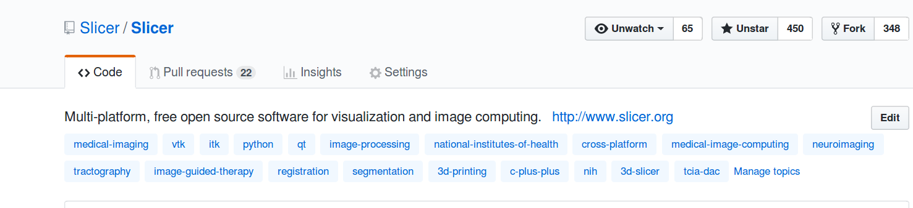
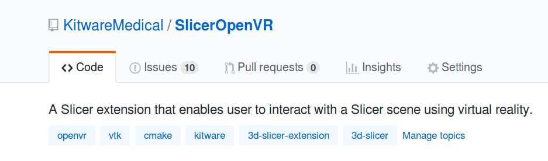

Back to [Projects List](../../README.md#ProjectsList)

# Slicer documentation on ReadTheDocs

## Key Investigators

- Jean-Christophe Fillion-Robin (Kitware)
- Andras Lasso (PerkLab)

# Project Description

## Objective

1. Finalize migration of user documentation from the wiki to ReadTheDocs. See https://github.com/Slicer/Slicer/pull/686 and http://slicer.readthedocs.io
1. Discuss and work on migration of developer documentation.
1. Setup api.slicer.org portal providing access to C++ classes documentation (generated using doxygen) and Python classes (generated using sphinx). See See https://www.slicer.org/wiki/Documentation/Labs/DocumentationImprovments#Documenting_Slicer_APIs
1. Update [Rons Rules For Tools](https://www.slicer.org/wiki/Documentation-Rons-Rules-For-Tools) to  include testing and documentation.

## Approach and Plan

1. Review, discuss and implement proposed objectives

## Progress and Next Steps

<!--Describe progress and next steps in a few bullet points as you are making progress.-->

- Discuss with Andras and agreed on:
  - migrating user documentation to readthedocs under a single directory
  - creating api.slicer.org with two set of pages: C++ and Python
  - using sphinx-api to automatically [document wrapped classes](https://www.slicer.org/wiki/Documentation/Labs/DocumentationImprovments#Documenting_Slicer_APIs)
- Talked about associating Slicer extension with a `3d-slicer-extension` [GitHub topic](https://github.com/blog/2309-introducing-topics).
- Sent an email to Ron for updating the [Rons Rules For Tools](https://www.slicer.org/wiki/Documentation-Rons-Rules-For-Tools).

### Additional notes

- Slicer is now part of the [awesome-healthcare](https://github.com/kakoni/awesome-healthcare#imaging) list.
- See also [What is an awesome list ?](https://github.com/sindresorhus/awesome/blob/master/awesome.md)
- Should we create an `awesome-medical-data` list ?

# Illustrations

<!--Add pictures and links to videos that demonstrate what has been accomplished.-->

* Associating Slicer extension with a `3d-slicer` and `3d-slicer-extension` topic:

# Background and References

<!--Use this space for information that may help people better understand your project, like links to papers, source code, or data.-->

- Source code: https://github.com/Slicer/Slicer/pull/686
