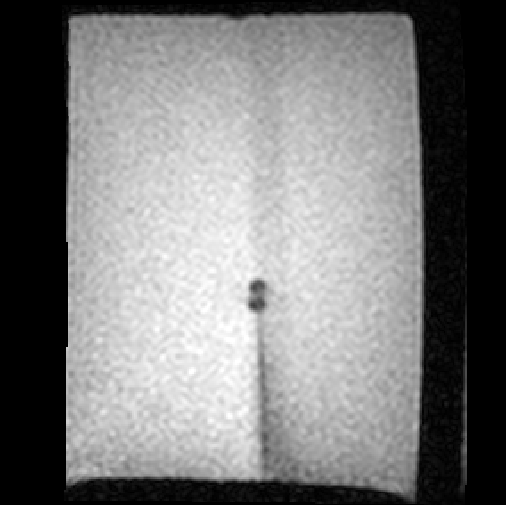

Back to [Projects List](../../README.md#ProjectsList)

# Model-Based Needle Tip Localization and MR Scan Plane Planning

## Key Investigators

- Joe Schornak (Worcester Polytechnic Institute, Automation and Interventional Medicine Lab)
- Guillaume Pernelle (@gpernelle)
- Longquan Chen (Brigham and Women's Hospital)
- Junichi Tokuda (Brigham and Women's Hospital)
- Tina Kapur (@tkapur)

# Project Description

## Objective

An ongoing effort in the WPI AIM Lab is to use our MRI-compatible 6-DOF needle insertion robot to perform closed-loop image-guided insertions using bevel-tipped clinical biopsy needles. Our focus has been on compensating for target shift and unmodelled needle tip deflection during nominally straight insertions, since the stiffness of clinical-style needles precludes drastic changes in heading during insertions.

A key part of this project is needle tip localization. I am developing a Slicer module that uses actively-updated MR images to detect the pose of a moving needle tip and determine the next best scan plane to capture the tip. The measured tip pose will be an input to the robot control algorithm, which will assess the error relative to the desired trajectory and the remaining insertion depth to the target and adjust the insertion velocity and needle rotation speed accordingly.

## Approach and Plan

1. Implement a kinematic1 or dynamic2 model suitable for bevel-tipped biopsy needles. In conjunction with kinematics from the insertion robot, this will provide a close estimate of the needle tip position.
2. Analyze the needle tip artifact in each scan to find the actual pose of the needle tip.
3. Use OpenIGTLink to receive MR data and robot kinematics and publish the measured tip pose and the next best scan plane.

## Progress

- Send simulated needle base transforms between ROS and Slicer over OpenIGTLink. The transform marker poses match in real time between Slicer 3D view and Rviz.
- When Slicer receives an update to the world-to-needle-base transform, update the needle-base-to-tip transform. Right now this is a simple rigid offset, but the needle model would slot in here once it's implemented.
- Learned about other approaches to needle detection and modeling and re-evaluated my approach to needle localization.
- Learned to work with DICOM data both in Slicer and in standalone Python.
- Much more familiarity with how Slicer expects me to approach development.

## Challenges
- My original needle simulation used Python packages that aren't bundled with Slicer (scipy.linalg.expm).
- Feature-based needle tip artifact localization is a little weirder than expected. VTK/ITK has a somewhat different focus on image processing than OpenCV, which is more familiar to me.

## Next Steps

- Implement a _Slicer-compatible_ FEA-style4 needle model
- Add outgoing OpenIGTLink communication to needle insertion robot
- Collect a new MRI dataset that's compatible with new tracking strategy

# Background and References

<!--Use this space for information that may help people better understand your project, like links to papers, source code, or data.-->

See [Closed-loop Autonomous Needle Steering during Cooperatively Controlled Needle Insertionsfor MRI-guided Pelvic Interventions](http://hamlyn.doc.ic.ac.uk/hsmr/sites/default/files//HSMR17_proceedings.pdf) for a similar approach to this problem, albeit using cameras and a transparent phantom.

[1] R. J. Webster, J. S. Kim, N. J. Cowan, G. S. Chirikjian, and A. M. Okamura, “Nonholonomic Modeling of Needle Steering,” The International Journal of Robotics Research. 2006 May;25(5-6):509-25.

[2] J. P. Swensen, M. Lin, A. M. Okamura, and N. J. Cowan, “Torsional Dynamics of Steerable Needles: Modeling and Fluoroscopic Guidance,” IEEE Trans Biomed Eng. 2014 Nov;61(11):2707-17.

[3] F. Zijlstra, J. G. Bouwman, I. Braškutė, M. A. Viergever, and P. R. Seevinck, “Fast Fourier-based simulation of off-resonance artifacts in steady-state gradient echo MRI applied to metal object localization,” Magn Reson Med. 2017 Nov;78(5):2035-41.

[4] A. Mastmeyer, G. Pernelle, R. Ma, L. Barber, and T. Kapur, “Accurate Model-based Segmentation of Gynecologic Brachytherapy Catheter Collections in MRI-images,” Med Image Anal. 2017 Dec;42:173-88
