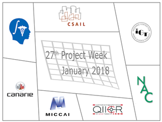
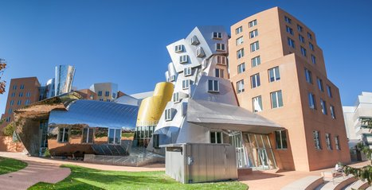
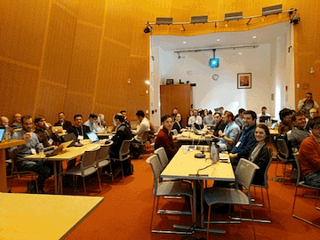
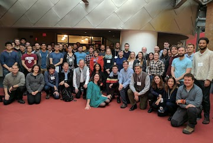

 

## Welcome to the web page for the 27th Project Week!
The 27th NA-MIC Project Week was held during the week of January 8-12, 2018 at the Stata Center at MIT.

It recorded 72 registered attendees, who worked on 53 projects. These attendees represented 25 academic sites: Boston Children's Hospital, Harvard Medical School (USA), Brigham and Women's Hospital, Harvard Medical School (USA), Children's Hospital of Philadelphia (USA), Concordia University (Canada), Fraunhofer Institute for Medical Image Computing MEVIS (Germany), Geneva University Hospital (Switzerland), Imperial College (UK), Instituto de Astrofísica de Canarias (Spain), Massachusetts General Hospital, Harvard Medical School (USA), Massachusetts Institute of Technology (USA), Montreal Neurological Institute (Canada), Netherlands Cancer Institute (The Netherlands), NYU School of Medicine (USA), Oslo University Hospital (Norway), Otto von Guericke University (Germany), Queen's University (Canada), Robarts Research Institute (Canada), University of Bremen (Germany), University of British Columbia (Canada), University of Las Palmas de Gran Canaria (Spain), University of Magdeburg (Germany), University of Michigan (USA),  University of Strasbourg (France), Western University (Canada), Worcester Polytechnic Institute (USA). 8 companies attended the event: Augmented Intelligence Inc. (USA), Fraunhofer MEVIS (Germany), GE Research (USA), Harmonus Inc. (USA), Isomics, Inc.  (USA), Kitware Inc.  (USA), KnowledgeVis, LLC (USA) Radical Imaging, LLC (USA).

  

See more pictures in this [Events Album](https://photos.app.goo.gl/qDoLvL52eR1VysLF3).

Please read about our experience in running these events since 2005: [Increasing the Impact of Medical Image Computing Using
Community-Based Open-Access Hackathons: the NA-MIC and 3D Slicer Experience](http://www.sciencedirect.com/science/article/pii/S1361841516301128).

## Logistics

To receive information about this and future events please join the [Project Week mailing list](https://public.kitware.com/mailman/listinfo/na-mic-project-week) (for continuity and permanence across Project Weeks) AND participate in the [Project Week forum](https://discourse.slicer.org/c/community/project-week), our new dissemination mechanism as of PW27 (for questions dedicated to this event).

- **Dates:** January 8-12, 2018.
- **Location:** [MIT CSAIL, Stata Center, 32 Vassar St, Cambridge, MA](https://www.google.com/maps/place/MIT:+Computer+Science+and+Artificial+Intelligence+Laboratory/@42.361864,-71.090563,16z/data=!4m2!3m1!1s0x0:0x303ada1e9664dfed?hl=en), 4th Floor, R&D Lounge.

- **REGISTRATION:** [Register here](http://regonline.com/projectweek2018). Registration Fee: $330.

- **Hotel:** Similar to previous years, no rooms have been blocked in any hotels.

- **Transportation:** Please use public transportation or park at a [local garage](http://web.mit.edu/facilities/transportation/parking/visitors/public_parking.html). There will be no parking permits from MIT.

## Frequently Asked Questions

* [What?](../README.md#what)
* [When, where, how much?](../README.md#when-where-how-much)
* [How does it work?](../README.md#how-does-it-work)
* [Who can attend?](../README.md#who-can-attend)
* [Who should attend?](../README.md#who-should-attend)
* [What else?](../README.md#what-else)
* [Who to contact?](../README.md#who-to-contact)

## Preparatory Videoconferences

- Google Hangouts Link: [Tuesdays 10am Boston time](https://meet.google.com/wzh-syuy-otj)
- Conference call notes are available [here](PreparatoryMeetingNotes.md).

## Program

<iframe src="https://calendar.google.com/calendar/embed?src=kitware.com_sb07i171olac9aavh46ir495c4%40group.calendar.google.com&ctz=America%2FNew_York&dates=20180108%2F20180112&hours=0800%2F2000&mode=WEEK" style="border: 0" width="800" height="600" frameborder="0" scrolling="no"></iframe>

[How to add this calendar to your own?](../common/Calendar.md)

## Projects [(How to add a new project?)](Projects/README.md)

<a name="ProjectsList"/>

### Visualization and Interaction

1. [SlicerVR Extension](Projects/SlicerVR/README.md) (JC Fillion-Robin, Beatriz Paniagua, and others)
1. [SlicerVR Interaction Design](Projects/SlicerVRInteractions/README.md) (JC Fillion-Robin, Andras Lasso, Csaba Pinter, and others)
1. [Medical Infrared Imaging with Slicer](Projects/MedicalInfraredImagingwithSlicer/README.md) (Jorge Quintero-Nehrkorn, Jose Carlos Ruiz-Luque, Yolanda Martin-Hernando, Juan Ruiz-Alzola, Andras Lasso)
1. [Integration of Medical Imaging Simulators in Slicer](Projects/IntegrationOfMedicalImagingSimulatorsInSlicer/README.md) (Abián Hernández-Guedes, Jose Carlos Ruiz-Luque, Guillermo Valentín Socorro-Marrero, Juan Ruiz-Alzola, Andras Lasso, Tamas Ungi)
1. [Segment Editor VR](Projects/SegmentEditorVR/README.md) (Csaba Pinter, Andras Lasso)
1. [SlicerAR](Projects/SlicerAR/README.md) (Adam Rankin)
1. [SlicerHeartVR](Projects/SlicerHeartVR/README.md) (Andras Lasso, Matthew Jolley, Steve Pieper, Mark Asselin)

### Web Technologies

1. [Open Anatomy Browser](Projects/OpenAnatomyBrowser/README.md) (Michael Halle, Ben Ball, Abián Hernández-Guedes, María Dolores Afonso-Suárez, Jose Carlos Ruiz-Luque, Juan Ruiz-Alzola)
1. [DCMJS+Cornerstone Utilities](Projects/dcmjs-cornerstone/README.md) (Steve Pieper, Erik Ziegler)
1. [Prostate mpMRI Web Viewer](Projects/ProstateMpMRIWebViewer/README.md) (Alireza Sedghi, Alireza Mehrtash, Steve Pieper, Erik Ziegler)
1. [Girder and SlicerCLIs in the Cloud](Projects/GirderWebCloud/README.md) (Michael Grauer)
1. [Upload Slicer Scene to Girder](Projects/GirderSlicerScene/README.md) (Michael Grauer, Tamas Ungi, JC Fillion-Robin, Pierre Assemat, Curtis Lisle)
1. [Slicer (and other) Apps on the Cloud Using a System Called CHRIS](Projects/CHRIS-slicer/README.md) (Rudolph Pienaar, Jorge Bernal, Nicolas Rannou, Anneke Meyer)

### IGT: Navigation, Robotics, Surgical Planning

1. [Harmonus IGT Project](Projects/HarmonusIGT/README.md) (Nicole Aucoin)
1. [OpenIGTLinkIO Development](Projects/OpenIGTLinkIODevelopment/README.md) (Simon Drouin, Adam Rankin, Csaba Pinter, Andras Lasso, Mark Asselin, Étienne Léger, Tamas Ungi, Longquan Chen)
1. [Compressed Video Saving and Loading for Sequences](Projects/CompressedVideoSaving/README.md) (Longquan Chen, Kyle Sunderland, Tamas Ungi, Andras Lasso, Étienne Léger, Junichi Tokuda)
1. [NorMIT-Plan: Liver Resection Planning](Projects/NorMIT-Plan/README.md) (Rafael Palomar)
1. [Model-Based Needle Tip Localization and MR Scan Plane Planning](Projects/dynamic-needle-tracking/README.md) (Joe Schornak)
1. [SlicerIGT Extension Development and Tutorial](Projects/SlicerIGT_Tutorial/README.md) (Tamas Ungi, Longquan Chen, Junichi Tokuda)
1. [EM Tracker Magnetics and Algorithms](Projects/EM_trackers_magnetics_and_algorithms/README.md) (Peter Traneus Anderson)
1. [Slicer Guided Ultrasound Calibration Module](Projects/SlicerGuidedUltraSoundCalibration/README.md) (Leah Groves, Adam Rankin)
1. [Trajectory Planning](Projects/TrajectoryPlanning/README.md) (Caroline Essert, JC Fillon-Robin, Nicole Aucoin)
1. [Remote Control for Plus Server Launcher](Projects/PlusServerLauncherRemoteControl/README.md) (Kyle Sunderland, Andras Lasso)
1. [ROS-IGTL-Bridge Video Streaming](Projects/ROSIGTLVideoStreaming/README.md) (Junichi Tokuda, Longquan Chen)
1. [Python Wrapping OpenIGTLink](Projects/PythonWrapOpenIGTLink/README.md) (Franklin King, Junichi Tokuda, Longquan Chen)

### dMRI

1. [SlicerDMRI Core Modernization](Projects/SlicerDMRICore/README.md) (Isaiah Norton, Lauren O'Donnell, Tamas Ungi)
1. [SlicerDMRI Docfest](Projects/SlicerDMRIDocs/README.md) (Fan Zhang, Isaiah Norton, Lauren O'Donnell)
1. [Anatomically Curated Fiber Clustering White Matter Parcellation Atlas](Projects/FiberClusteringAtlas/README.md) (Fan Zhang, Isaiah Norton, Lauren J. O'Donnell)

### Quantitative Imaging Informatics

1. [Refactoring of Model Fitting Tools into Extension Suite](Projects/ModelFittingTools/README.md) (Michael Schwier, Sharon Peled, Andrey Fedorov, Andrew Beers)
2. [Decision Support for End-Stage Liver Disease Transplants](Projects/ESLD_DSS/README.md) (Mike Halle, Ben Ball, April Wall, Jennifer Nitsch, Hans Meine)
3. [DICOM for Quantitative Imaging](Projects/DICOMforQuantitativeImaging/README.md) (Andrey Fedorov, Christian Herz)
4. [DICOM Volume Reconstruction Tools](Projects/DICOMVolumeReconstruction/README.md) (Andrey Fedorov, Andrew Beers, Joost van Griethuysen, Steve Pieper)
5. [Quantitative Small Animal Imaging](Projects/QuantitativeSmallAnimalImaging/README.md) (Curtis Lisle, Andrey Fedorov, Yanling Liu)

### Shape Analysis, Segmentation, Deep Learning, Radiomics, Organ Motion Compensation

1. [SlicerSALT Shape Analysis Toolbox Updates](Projects/SlicerSALT/README.md) (Laura Pascal, JC Fillon-Robin, Beatriz Paniagua, Juan Prieto, Loic Michoud)
1. [Using SegmentEditor for Deep Learning Data Annotation](Projects/SegmentEditorUsecaseNeedles/README.md) (Guillaume Pernelle, Tina Kapur, Steve Pieper, Csaba Pinter, Andras Lasso, Roya Khajavi)
1. [Shape Variation Analyzer](Projects/ShapeVariationAnalyzer/README.md) (Juan Prieto, Nina Tubau)
1. [Multivariate Functional Shape Data Analysis & Distributed learning](Projects/Multivariate_Functional_Shape_Data_Analysis_and_Distributed_learning/README.md) (Juan Prieto, Loic Michoud)
1. [Multi Label Segmentation of Prostate Zones with Volumetric CNN](Projects/ProstateZoneSegmentation/README.md) (Anneke Meyer, Alireza Mehrtash, Andrey Fedorov, Nicole Wake, Christian Hansen)
1. [Repeatability of Pyradiomics Features](Projects/RadiomicsRepeatability/README.md) (Michael Schwier, Joost van Griethuysen, Andrey Fedorov)
1. [Organ Motion Compensation in MR](Projects/OrganmotionCompensationInMR/README.md) (Gino Gulamhussene, Joost van Griethuysen)
1. [3D Printed Prostate Cancer Models](Projects/3DPrintedProstateCancerModels/README.md) (Nicole Wake, Andrey Fedorov, Hersh Chandarana, Andrew Rosenkrantz, William Huang)
1. [PyRadiomics Models](Projects/PyRadiomics/README.md) (Joost van Griethuysen, Andrey Fedorov, Steve Pieper, JC Fillion-Robin, Hugo Aerts)
1. [Interactive Deep Learning for Congenital Heart Disease Segmentation](Projects/InteractiveCHDSegmentation/README.md) (Danielle Pace, Adrian Dalca, Polina Golland, Mehdi Hedjazi Moghari)
1. [Mapping and Visualizing a Segmented Placenta to a Canonical Template](Projects/PlacentaFlattening/README.md) (Mazdak Abulnaga, Danielle Pace, Steve Pieper, Justin Solomon, Polina Golland)

### Chest Imaging Platform
1. [Chest Imaging Platform Deep Learning Lung Segmentation](Projects/CIPDeepLearningLungSegmentation/README.md) (Jorge Onieva, Raúl San José)
1. [Slicer Deep Learning Tools Integration](Projects/SlicerDeepLearningIntegration/README.md) (Jorge Onieva, Raúl San José)

### Infrastructure

1. [Slicer Custom Application](Projects/SlicerCustomApplication/README.md) (JC Fillon-Robin, Andras Lasso)
1. [Slicer Documentation @ ReadTheDocs](Projects/SlicerReadTheDocs/README.md) (JC Fillon-Robin, Andras Lasso)
1. [Keep Track of the Installed Extensions Across Version](Projects/KeepTrackInstalledExtensionsAcrossVersion/README.md) (Hans Meine, JC Fillon-Robin, Mathias Neugebauer, Andras Lasso, Steve Pieper, Johan Andruejol, Christian Herz, Ron Kikinis)
1. [Slicer Extensions with CUDA](Projects/ExtensionsWithCUDA/README.md) (Greg Sharp, Adam Rankin, JC Fillon-Robin)
1. [Qt5 Integration](Projects/Qt5Integration/README.md) (Johan Andruejol)

### Training and Dissemination

1. [Affordable IGT Simulators with Slicer IGT+PLUS](Projects/AffordableIGTSimulatorsWithSlicerIGTAndPLUS/README.md) (Guillermo Valentín Socorro-Marrero, Jose Carlos Ruiz-Luque, Abián Hernández-Guedes, Juan Ruiz-Alzola, Andras Lasso, Mark Asselin)
1. [Slicer Education for Newcomers & Developing Countries](Projects/SlicerTraining/README.md) (Sonia Pujol, María Dolores Afonso-Suárez, Nayra Pumar-Carreras, Juan Ruiz-Alzola)

### Next Project Week
[ProjectWeek 28, June 25-29, 2018, Gran Canaria](https://projectweek.na-mic.org/PW28_2018_GranCanaria/) (Juan Ruiz-Alzola)

<a name="BreakoutSessions"/>

## Breakout Sessions - *New topics this year*

1. [What is new in Slicer ?](https://goo.gl/xFQkdQ) - [[Slides](https://goo.gl/xFQkdQ)]
2. [3D Slicer Solutions Breakout Session](BreakoutSessions/3D-Slicer-Solutions.md) - [[Slides](https://goo.gl/6F29LG)]
3. [Medical&Scientific Software in the Cloud](BreakoutSessions/Medical-and-Scientific-Software-in-the-Cloud.md)
4. [FDA and 3D Slicer](BreakoutSessions/FDA-and-3D-Slicer.md)
5. [Augmented/Virtual Reality](BreakoutSessions/AR-VR.md)

## Registrants

Do not add your name to this list - it is maintained by the organizers based on your paid registration.

<!-- ORGANIZERS: please edit REGISTRANTS.md -->


