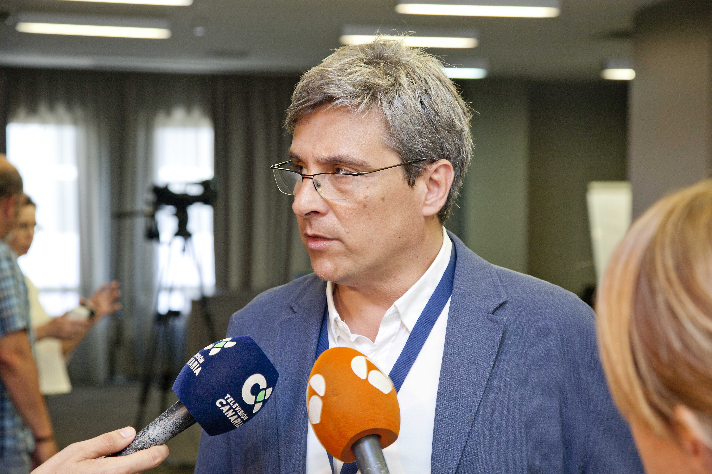

## 28th Summer Project Week in the Media

  

- [Canarias 7](https://www.canarias7.es/sociedad/sanidad/la-tecnologia-libre-en-medicina-ayuda-a-los-paises-en-desarrollo-ML4915284)

- [La Provincia](https://www.laprovincia.es/sociedad/2018/06/27/nikos-makris-llena-club-provincia/1072637.html)

- [Azarplus](http://www.azarplus.com/2018-06-26/la-genetica-es-fundamental-en-el-desarrollo-de-la-ludopatia/16615/noticia/)

- [20180625 RTVC - 21'10''](http://www.rtvc.es/television/multimedia/Telenoticias%201-46/25-06-18-1876.aspx#.WzYOONJKjIV)

- [Casa África](http://www.casafrica.es/agenda_europa_africa.jsp?DS318.PROID=903669)

- [20180628 RTVC - 20'58''](http://www.rtvc.es/television/multimedia/Telenoticias%202-1937/28-06-18-1887.aspx#.WzYUrOFKg5k)

- [A3TV - 13'24''](http://www.antena3.com/canarias/noticias/informativos/noticiasregional/junio-2018_2018062500157.html)
