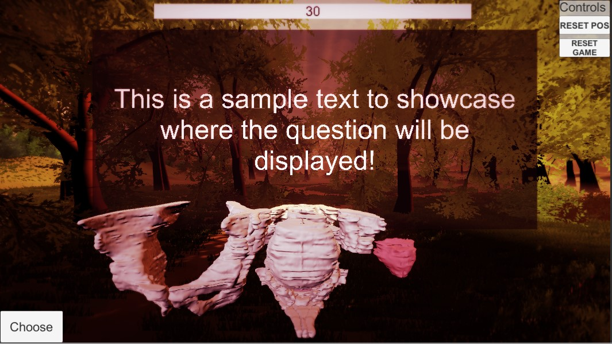
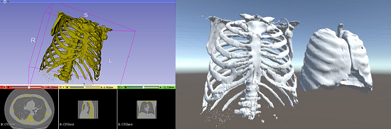
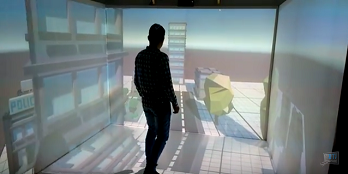
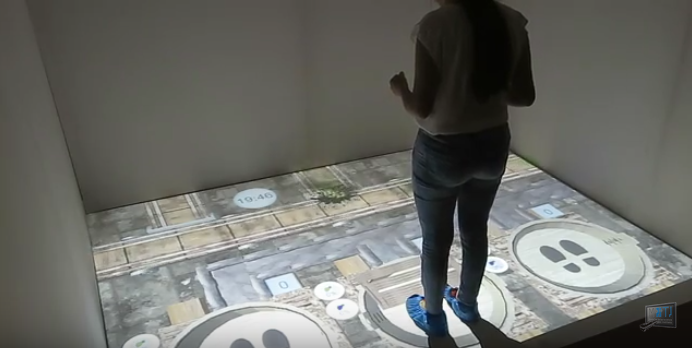

Back to [Projects List](../../README.md#ProjectsList)

# 3DSlicer Models for Serious Games

## Key Investigators

- Sergi Bermudez i Badia (M-ITI - MACbioIDi)
- Yuri Almeida (M-ITI - MACbioIDi)
- Artemisa Moreno (UniCV - MACbioIDi)
- María Dolores Afonso-Suárez (ULPGC - GTMA - MACbioIDi)
- Juan Ruiz-Alzola (ULPGC - GTMA - MACbioIDi)

## Project Description

### Designing scenarios for Serious Games from 3DSlicer models.

Serious games, are designed for a purpose other than pure entertainment. The M-ITI serious games projects -among others- are developed
to exploit specific brain mechanisms that relate to functional recovery to approach motor and cognitive rehabilitation by means of non
-invasive and low-cost technologies. [M-ITI NeuroRehabLab](https://neurorehabilitation.m-iti.org/lab/). In the case of this project,
M-ITI MACbioIDi collaborates with the [ULPGC-IUIBS MACbioIDi](https://mt4sd.ulpgc.es/w/index.php/Proyecto_MACbioIDi) in a joint work proposed for
the areas of education, scientific and medical projects.
The objective of this project is to create applications within the concept of Serious Game, by using scenarios developed in Unity -the
cross platform game engine-.
These scenarios will be using models of images imported from 3DSlicer.

## Objectives

1. Understand the documentation involved in the import/export formats used.
1. Choose the best approach to the solution.
1. Create Unity scenarios to interact with the models.

## Approach and Plan

1. Tests abut how to import/export files and their formats.
1. Study other scenarios previously implemented.
1. Plan the development of new scenarios to create and standardize.

## Progress and Next Steps

1. Implementation of a prototype developed in unity using a 3DSlicer segmentation. PELVIS QUIZ.
1. Study different interaction possibilities with the prototype.
1. Plan the incremental approach to new scenarios with other game.

## Illustrations
Pelvis Quiz.

Export / Import example.

Unity Scenario video examples.

## Background and References

+ [Virtual Reality with Customized Positive Stimuli in a Cognitive-Motor Rehabilitation Task: A feasibility study with subacute stroke patients with mild cognitive impairment
Mónica S. Cameirão, Fábio Pereira, Sergi Bermúdez i Badia](https://neurorehabilitation.m-iti.org/lab/wp-content/plugins/zotpress/lib/request/request.dl.php?api_user_id=161215&key=4ZQMQFB3&content_type=application/pdf)
