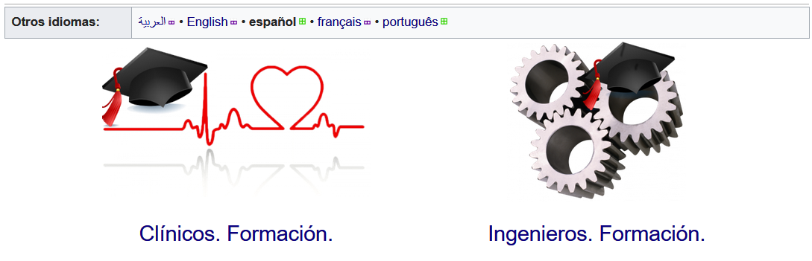
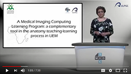
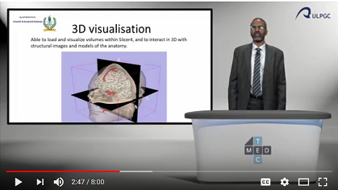
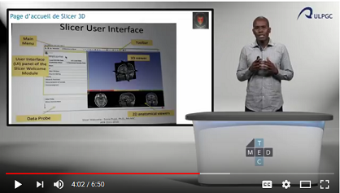
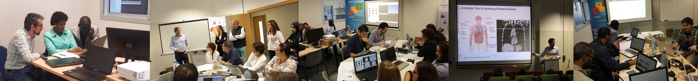
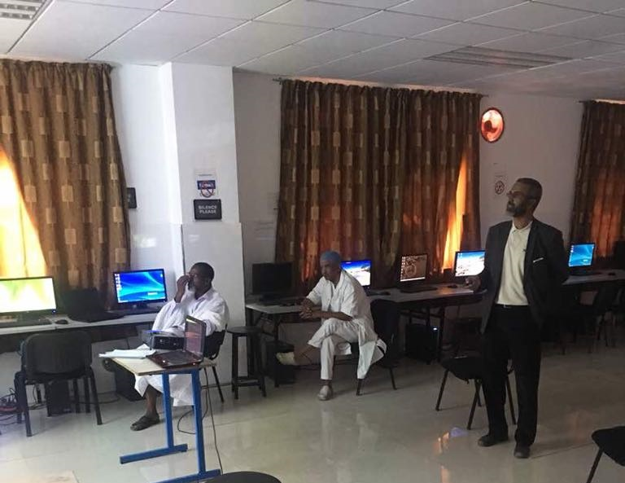
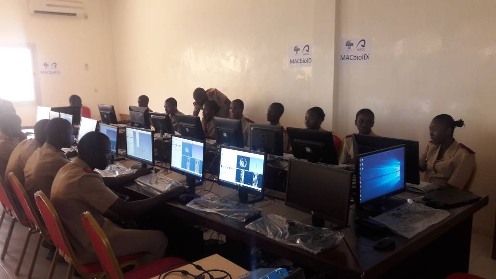

Back to [Projects List](../../README.md#ProjectsList)

# 3DSlicer Training programs. Slicer Ecosystems Education for Newcomers & Developing Countries.

## Key Investigators

- María Dolores Afonso-Suárez (ULPGC - GTMA - MACbioIDi)
- Nayra Pumar Carreras (ULPGC - GTMA - MACbioIDi)
- José Carlos Ruiz-Luque (ULPGC - GTMA - MACbioIDi)
- Guillermo Valentín Socorro-Marrero (ULPGC - GTMA - MACbioIDi)
- Abián Hernández-Guedes (ULPGC - GTMA - MACbioIDi)
- Yolanda Martín-Hernando (ULPGC - GTMA - MACbioIDi)
- Juan Ruiz-Alzola (ULPGC - GTMA - MACbioIDi)

## Participating

- Sonia Pujol (BWH/HMS)
- Raúl San José Estépar (Brigham and Women’s Hospital, Harvard Medical School, USA)
- Jorge Onieva Onieva (Brigham and Women’s Hospital, Harvard Medical School, USA)
- Ahmedou Moulaye Idriss (Centre Hospitalier National Nouackchott)
- Alexandra Fernandes Rodrigues (Universidade Eduardo Mondlane. Facultad de Medicina)
- Babacar Diao (Ecole Militaire de Santé Dakar)
- Mohamed Septy (Université de Nouakchott Al Aasriya - Faculté de Médecine)

## Project Description

### Designing Training Programs.

After the first edition of the training program (Slicer Ecosystems Education for Newcomers & Developing Countries) presented during
27thPW NA-MIC we will be studying results  and prepare a new proposals according to the necessities of the involved countries:
Cape Verde, Senegal, Mauritania, plus Mozambique and Azores.
This plan will consider previous results and feedback from the professionals of these countries. We must not forget that in their
countries some of them have already started with their own training programs. All of this will be considered in new plans, as well
as collaboation in other research projects.

## Objectives

1. Establish a second training plan for clinicians.
1. Advise and help in order to include this new knowledge in the subjects they teach at the university.
1. Help engineers in the development of projects (by their own or with other professionals).
1. Establish a training network of professionals to develop learning objects in different languages.

## Approach and Plan

1. Study the results of the training sessions already completed.

## Progress and Next Steps

1. Plan a new training program for Mauritania.
  - Train the trainers
1. Plan a new training program for Mozambique
  - Train the trainers
    - Students at the university
    - Residents - profiles: General / Images / Surgeons
1. Continue working in the development of training contents - learning objects - in: [English, French, Portuguese, Arabic, Spanish](https://mt4sd.ulpgc.es/slicer-int/index.php/P%C3%A1gina_principal)

## Illustrations

February - March training sessions.

Mauritania training sessions.

Senegal training sessions.

## Background and References

+ [A Medical Imaging Computing Learning Program: Transitioning Towards The Medical Technology In Africa](https://library.iated.org/view/AFONSOSUAREZ2018AME)
