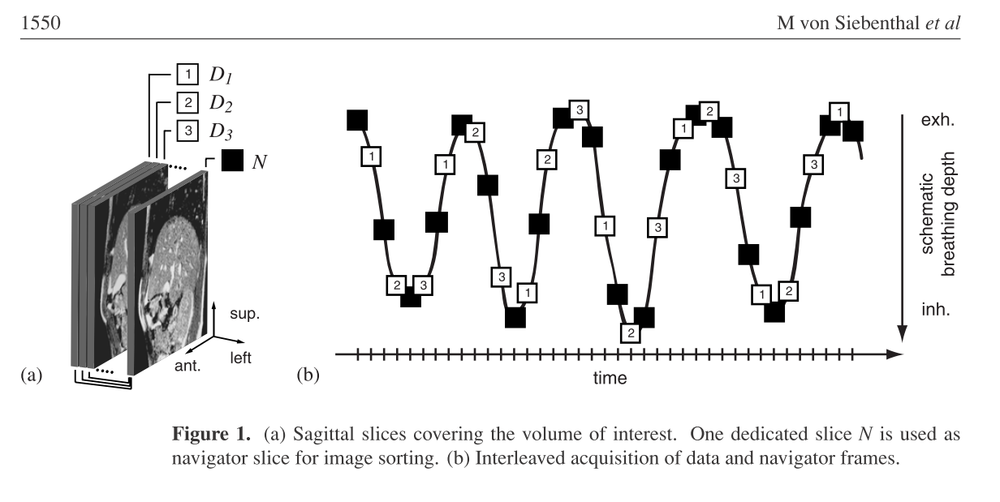
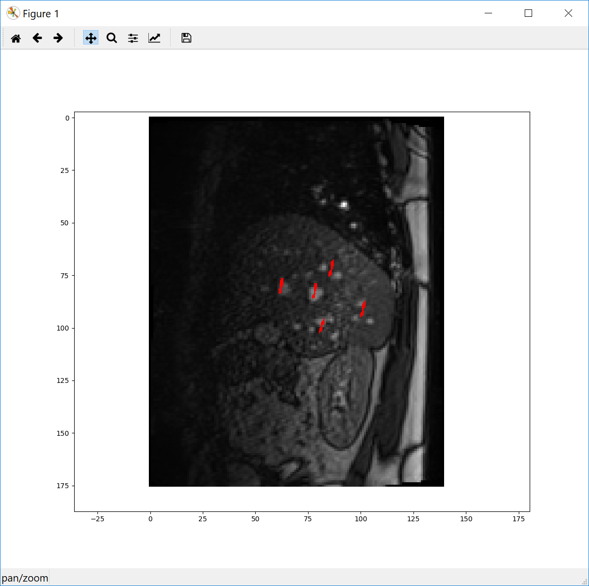

 Back to [Projects List](../../README.md#ProjectsList)

# 4D MRI via retrospectiv stacking of 2D Slices

## Key Investigators
- Gino Gulamhussene (University of Magdeburg)
- Marko Rak (University of Magdeburg)
- Michael Halle (Brigham and Women’s Hospital and Harvard Medical School)
- Michael Kelm (Siemens Healthcare GmbH)
- Anneke Meyer (University of Magdeburg)
- Steve Pieper (Isomics, Inc.)
- Tina Vajsbaher (University of Bremen)

## Remote Investigators
- Christian Hansen (University of Magdeburg)

# Project Description
Creating a program to generate 4D MRI sequences applying the retrospectiv stacking method on 2D MR slices.
The available data is comprised of an time resolved alternating sequence of navigator and data slices and a pure sequence of time resolved navigator slices.
All navigator slices were acquired at the exact same location and the data slices were "scanning" the complete liver in a cyclic manner.
To generate a 4D MR sequence from that the program has to collect all data frames that were acquired during the same breating phase, i.e. not at the same time but at different times during the same breathing phase.
To find these, the navigator slices are utilized. Finding correspondences between the navigator slices of the pure navigator sequence and the once of the alternating sequence means to find similar or same breathing phases.
Thus we find all corresponding data slices giving the 3D liver at the specific breathing phase.

## Objective
1. Creating a program to generat sequences of 3D MR images from described 2D Slices.

## Approach and Plan
1. Using python
2. Handling the Slice Data as one big 3D Data Array

## Progress and Next Steps
<!--Describe progress and next steps in a few bullet points as you are making progress.-->
**previous steps**
- got insight in available and relevant DICOM tags for the data at hand (big thanks to Joost for the DICOM Explorer)
- hit a roadblock when data appeared to be faulty
- wrote a python script sorting the data by acquisition time, turns out data is faulty after all (thanks to Joost again)
- figured out how to change the MRI sequence back in Germany
- acquired lots of data
- started program to stack the volumes

**progress during project week**
- made huge progress on the code front
  - data packing for faster processing
  - config for proband to remember user clicked ROIs, ref. index etc.
  - similarity measure, ROI management, file Management, slice binning
  - bug bashing
- found out, that the MRI did change the acquisition order of the slices which changes some assumption and has to be accounted for

**next steps**
- finish the program
- annotate 3D samples of the 4D Data for ground truth using 3D Slicer
- actually use the data

# Illustrations
<!--Add pictures and links to videos that demonstrate what has been accomplished.-->
Data Acquisition

Data Sorting scheme

vessle tracking

Similarity measure

# Background and References
<!--Use this space for information that may help people better understand your project, like links to papers, source code, or data.-->
[VON SIEBENTHAL, Martin, et al. 4D MR imaging of respiratory organ motion and its variability. Physics in Medicine & Biology, 2007, 52. Jg., Nr. 6, S. 1547.(http://iopscience.iop.org/article/10.1088/0031-9155/52/6/001/meta)
