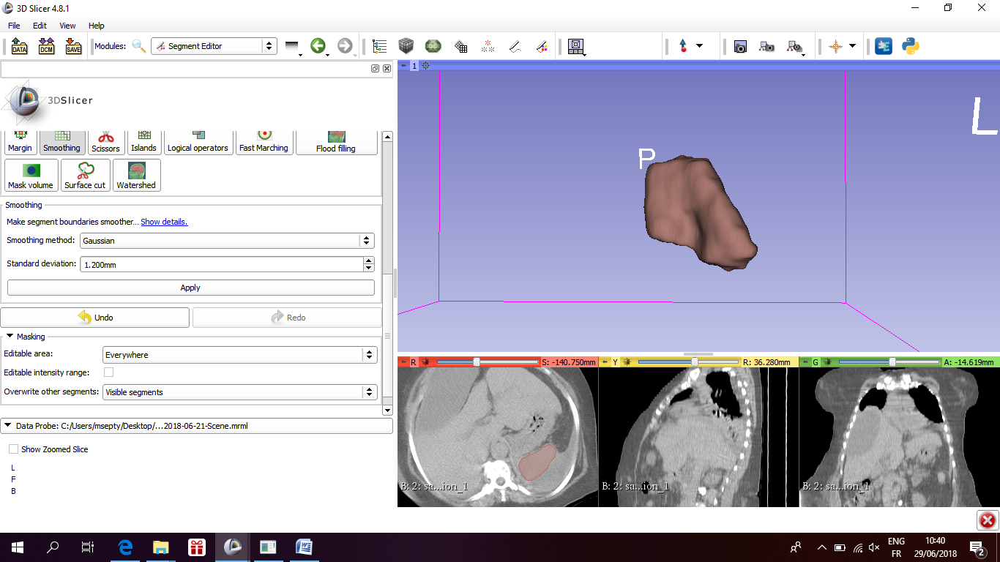
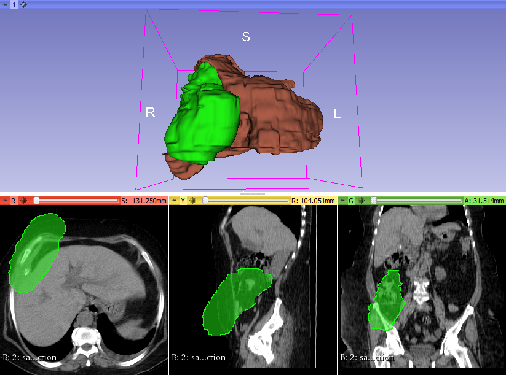
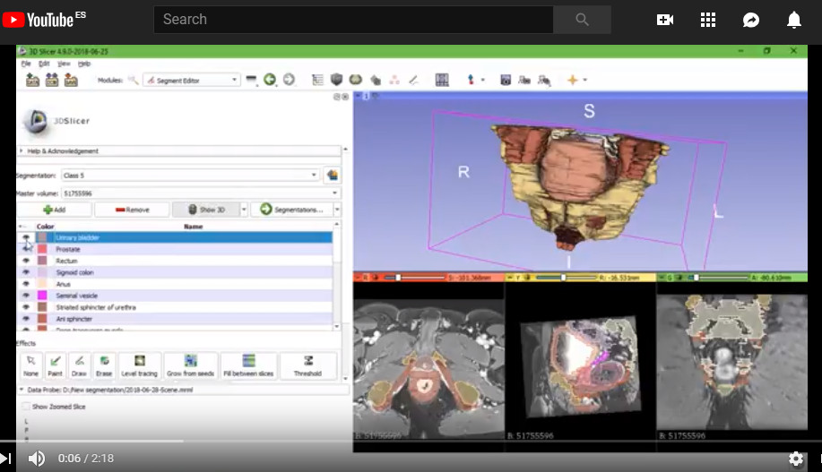
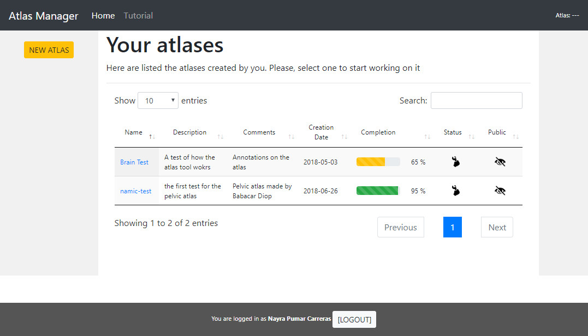
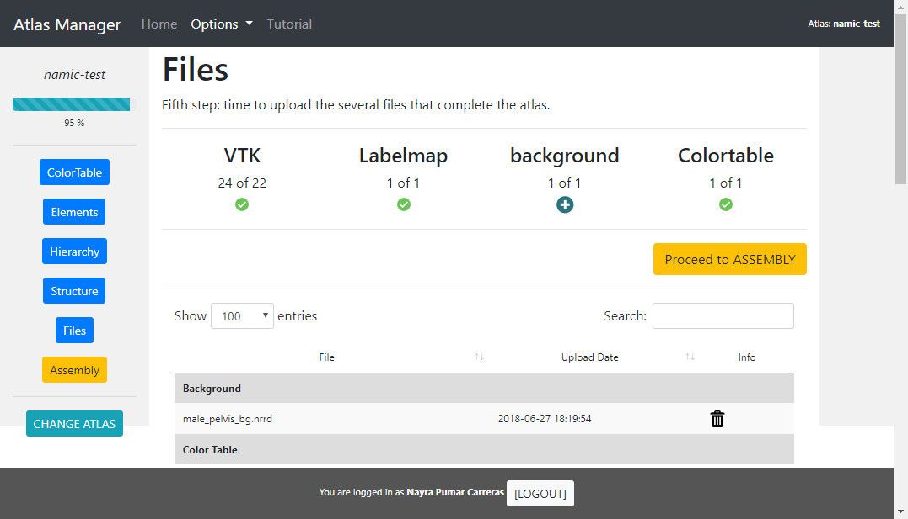
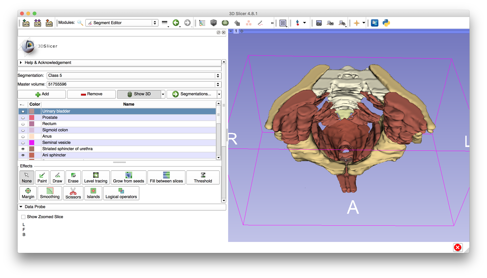
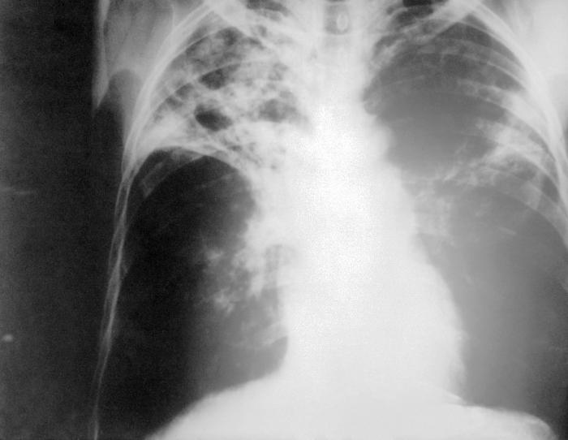
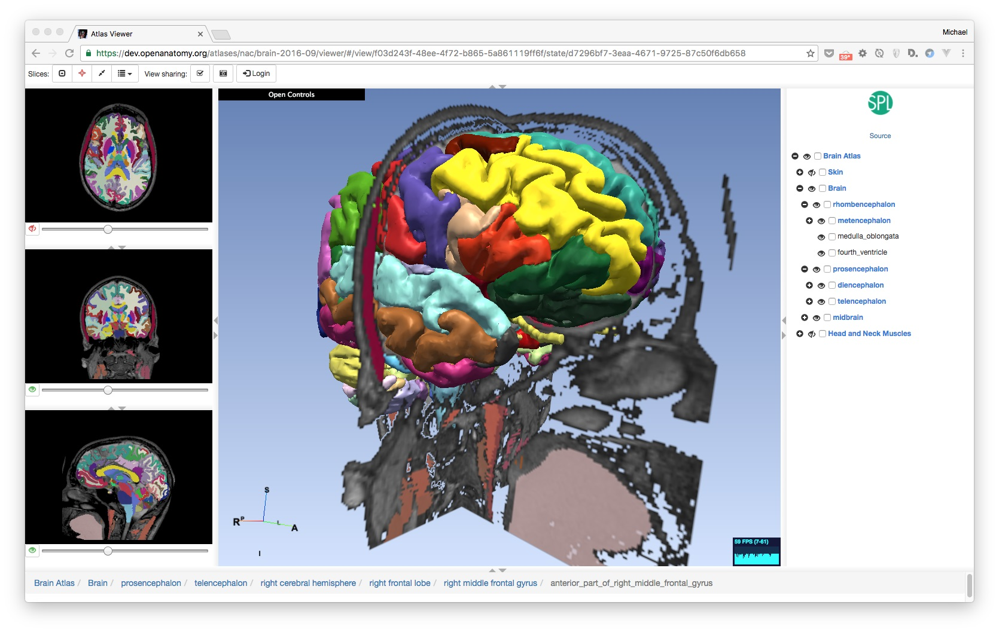
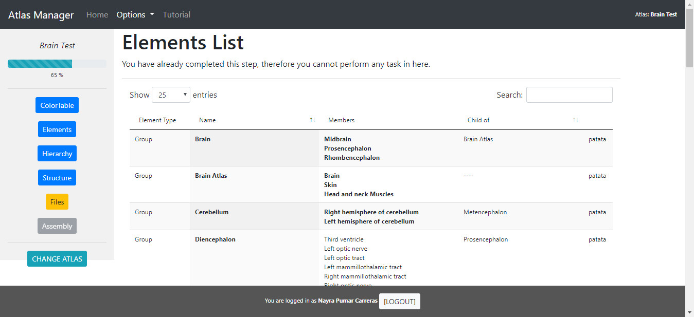

Back to [Projects List](../../README.md#ProjectsList)

# Atlas Development For Education

## Key Investigators

- Babacar Diao (Ecole Militaire de Santé Dakar)
- Ahmedou Moulaye Idriss (Centre Hospitalier National Nouackchott)
-	Mohamed Septy (Université de Nouakchott Al Aasriya - Faculté de Médecine.)
-	Alexandra Fernandes Rodrigues (Universidade Eduardo Mondlane. Facultad de Medicina)
-	Cheick Tidiane (Centre Hospitalier National Fann Dakar)
- Nayra Pumar (ULPGC – GTMA - MACbioIDi)
-	Xerach Suárez (ULPGC – GTMA - MACbioIDi)
- Juan Ruiz-Alzola (ULPGC - GTMA - MACbioIDi)

## Project Description

This project aims to create different anatomical atlas. During this week it is planned the creation
of an anatomic atlas of the pelvis of the human body, and a lung atlas. It will be used the 3DSlicer
segment editor to create the models that later on will be displayed with the Open Anatomy Atlas for
research and training purposes. It will also be evaluated the Chest Imaging Platform to segment lungs with
tuberculosis disease, also for training purposes. (Data: pelvis -CT-, prostate -MRI- and tuberculosis -CT-)

## Objectives

1. To segment the pelvis of the human body of a male subject (Images provided by the African countries).
1. To segment lungs with tuberculosis disease (Images provided by the African countries).
1. To create an anatomical atlas to be exported and use the Open Anatomy Atlas project to visualize the elements.
1. To create a tool that helps putting all the files needed for the web atlas to work, toguether

## Approach and Plan

1. Training using the 3DSlicer segment editor.
1. Images study and selection.

## Progress and Next Steps

1. Male pelvis atlas is already finished, and ready to be uploaded online for public access
1. Abdominal atlas is in the way: lung and liver are already segmented
1. Biloma case segmentation is also in the way: the pre and post intervention state
1. Web tool for atlas assembly is also ready and clinicians will soon get the training to use it so they will be able to create and compile their own atlas by themselves

* Segmentations for the biloma case:

   

* Segmentations for the Male Pelvis Atlas

   

* Atlas assembly web tool

   

## Illustrations

Male pelvis segmentation made in 3D Slicer

Lung - tuberculosis disease.

Anatomical Atlas - Open Anatomy Browser.

Web tool for assembling Anatomical Atlas

## Background and References

+ [3D Slicer](https://www.slicer.org)
+ [Open Antomy Browser](https://www.openanatomy.org/)
