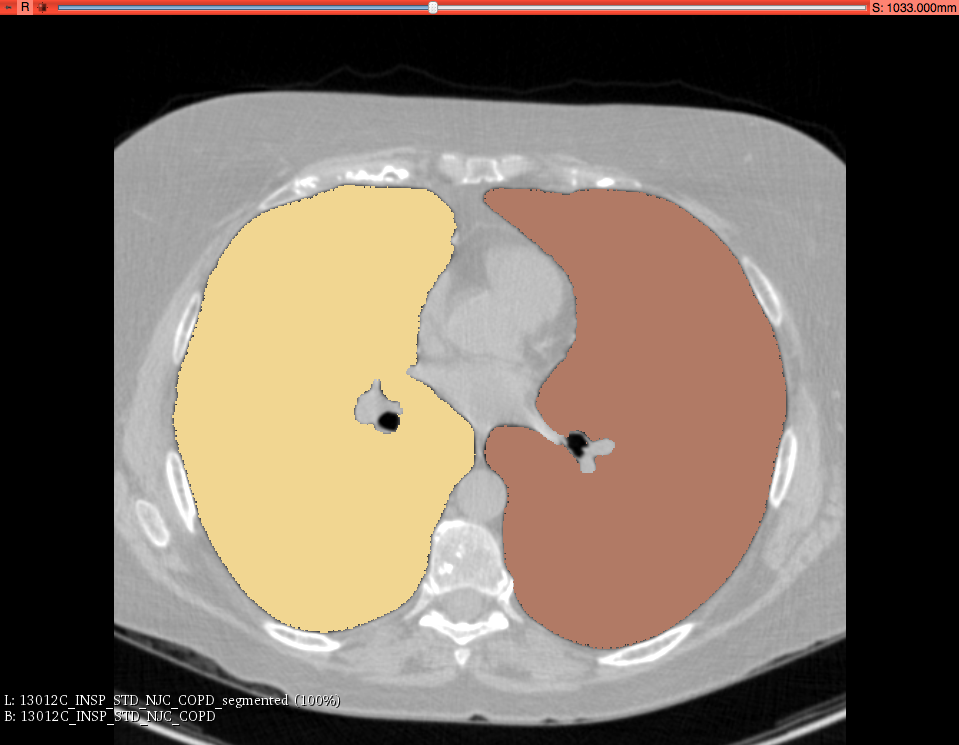

Back to [Projects List](../../README.md#ProjectsList)

# Chest Imaging Platform: segmentation of lungs and pectoralis based on deep learning

## Key Investigators

- Jorge Onieva (BWH)
- Raúl San José (BWH)
- Pietro Nardelli (BWH)

# Project Description

Integration of a deep learning infrastructure that supports future integration of deep learning - based tools.
Two use cases: lung segmentation and pectoralise segmentation

## Objective

1. Integrate all the needed infrastructure components and required external libraries: Keras + tensorflow, etc.
1. Creation of CLIs as a use case

# Illustrations

<!--Add pictures and links to videos that demonstrate what has been accomplished.-->

## Progress and Next Steps

<!--Describe progress and next steps in a few bullet points as you are making progress.-->
1. The integration of Keras and Tensorflow had some issues in some platforms.
1. Nevertheless, we are fixing the last issues and it should be ready next week.
1. We are also working in speeding up the lung segmentation algorithm in order that CPU running is feasible

# Background and References

The Chest Imaging Platform is an open source project that can run as an standalone and it is integrated in Slicer as part of the Slicer solutions. More info in https://chestimagingplatform.org

- Source code: https://chestimagingplatform.org/
- Documentation: https://chestimagingplatform.org/documentation
- Test data: http://cdash.chestimagingplatform.org/index.php?project=CIP
