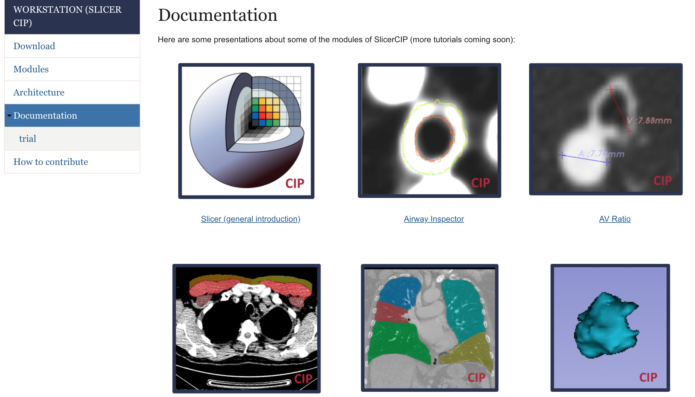

Back to [Projects List](../../README.md#ProjectsList)

# Chest Imaging Platform: Python 3 welcome and next release

## Key Investigators

- Jorge Onieva (BWH)
- Raúl San José (BWH)
- Pietro Nardelli (BWH)

# Project Description

New release of the Chest Imaging Platform (last one supporting Python 2!).

Chest Imaging Platform migration to Python 3.

## Objective

1. Release an updated version of the Chest Imaging Platform (probably the last one that will support Python 2)
1. Slicer nightly/last release compatibility of the new release
1. Migrate the whole platform to Python 3 and check for tests issues

# Illustrations

<!--Add pictures and links to videos that demonstrate what has been accomplished.-->

## Approach and Plan

1. Code, build, test, cry
2. Repeat until all tests are passing or we are out of tears

## Progress and Next Steps

<!--Describe progress and next steps in a few bullet points as you are making progress.-->
1. After some work during the week, integration seems very reasonable, and not many issues have come up so far.
1. The next release will be only Python2 compatible, but next one will support both versions

# Background and References

The Chest Imaging Platform is an open source project that can run as an standalone and it is integrated in Slicer as part of the Slicer solutions. More info in https://chestimagingplatform.org

- Source code: https://chestimagingplatform.org/
- Documentation: https://chestimagingplatform.org/documentation
- Test data: http://cdash.chestimagingplatform.org/index.php?project=CIP
