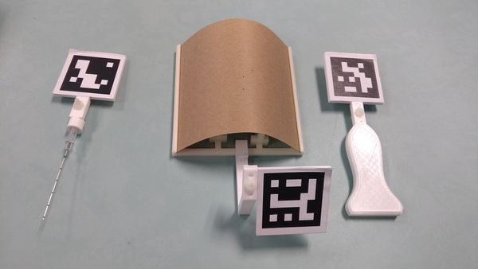
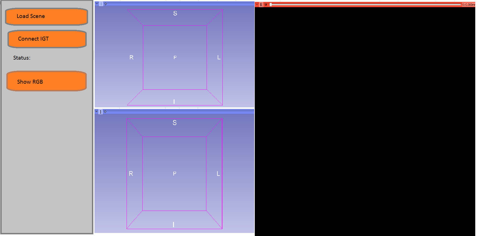
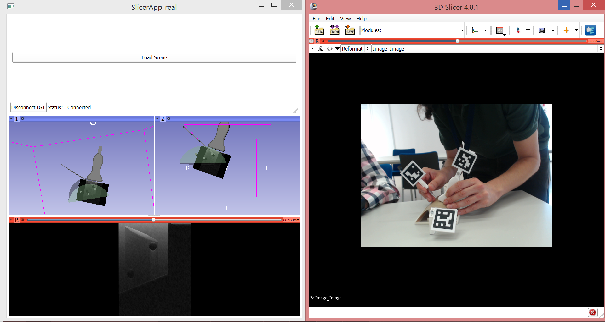
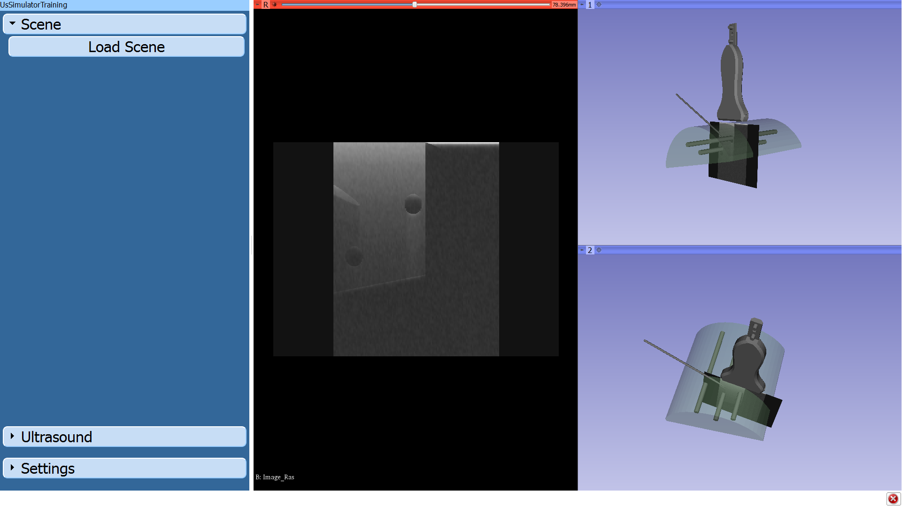

Back to [Projects List](../../README.md#ProjectsList)

# Custom GUI for an US simulator training system

## Key Investigators

- Jose Carlos Ruiz-Luque (ULPGC - GTMA - MACbioIDi)
- Guillermo Valentín Socorro-Marrero (ULPGC - GTMA - MACbioIDi)
- Juan Ruiz-Alzola (ULPGC - GTMA - MACbioIDi)

## Participating

- [Csaba Pinter](http://perk.cs.queensu.ca/users/pinter) (Queen's University, Canada)

# Project Description

The main goal of this project is to develop a custom graphic user interface (GUI) for an US simulation training system. The GUI should be friendly and attractive for clinicians, trainers and students. The US simulation system was proposed in NA-MIC 27th Project Week and developed in collaboration with the Perklab team.

## Objective

1. Defining the user requirements.
2. Designing the GUI using the slicelet.

## Approach and Plan

1. Analysing the GUI functionalities.
2. Sketching the user interface.
3. Implementing the GUI proposal.

## Progress and Next Steps

We defined several sketches and chose the better sketch which satisfied the user requirements:
   - US images in 2D viewer
   - 3D scene for the training system (tools and phantom)
   - IGT connection management (buttons and text)

In first proposal, we implemented the chosen user interface in slicelet module. The slicelet provides a simple way to customize the user interface but our real-time requirement is not fulfilled.

In second proposal, we developed the user interface in Guidelet module after the Perklab team's suggestion. This guidelet is better suited to real-time applications and, hence, we decided to implement this alternative solution. The user interface is based on the template provided by the Guidelet module.

In this week, we developed a fully operational interface that can be used as GUI for our US simulator training system instead of the standard 3D Slicer one. We consider that the new, simpler interface is more suitable to include the simulator in training course for students.  Moreover, we learnt the way to modify sensitive aspects such as viewer layout, buttons, check boxes and other widgets, in anticipation of the changes that clinicians and users may request or suggest in the future.

<!--Describe progress and next steps in a few bullet points as you are making progress.-->

# Illustrations

<!--Add pictures and links to videos that demonstrate what has been accomplished.-->

<!--  -->

Tools and a phantom

<!--  -->

GUI sketch

GUI in Slicelet version

GUI in Guidelet version

<!---->

<!---->

# Background and References

- [3D Slicer Tutorials](http://www.slicer.org/wiki/Documentation/4.8/Training)
- [Slicelet documentation](https://www.slicer.org/wiki/Documentation/Nightly/Developers/Slicelets)
- [Guidelet documentation](http://www.slicerigt.org/wp/developer-tutorial/)
- [NA-MIC PW27 project: Affordable IGT Simulators with Slicer IGT + PLUS](https://projectweek.na-mic.org/PW27_2018_Boston/Projects/AffordableIGTSimulatorsWithSlicerIGTAndPLUS/)
