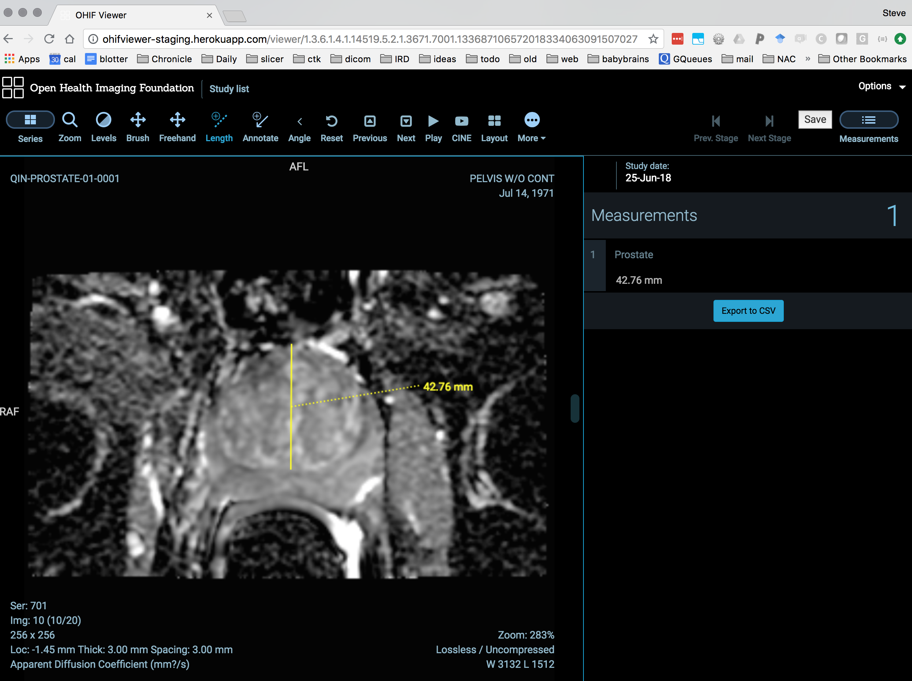
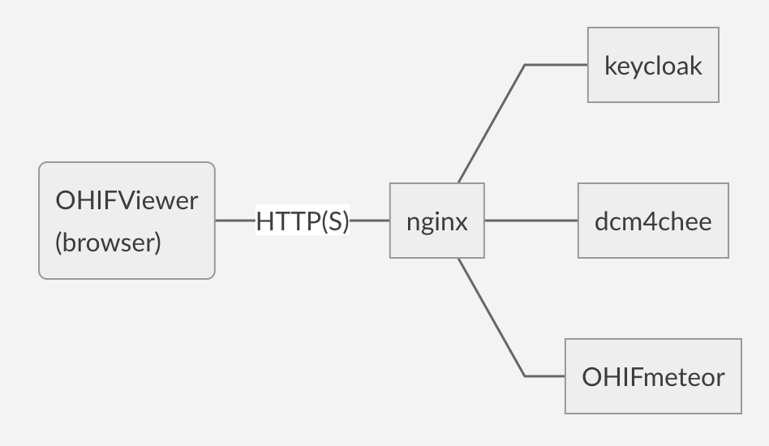
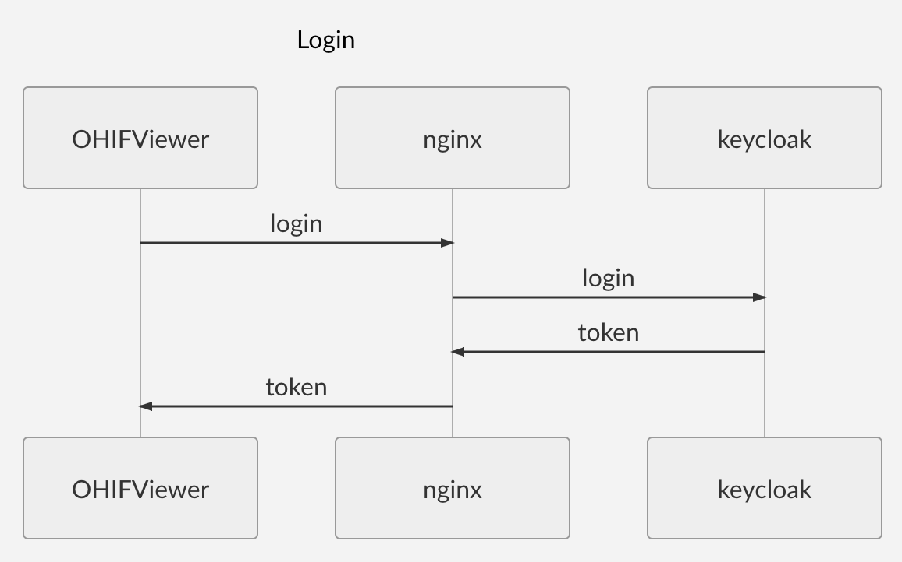
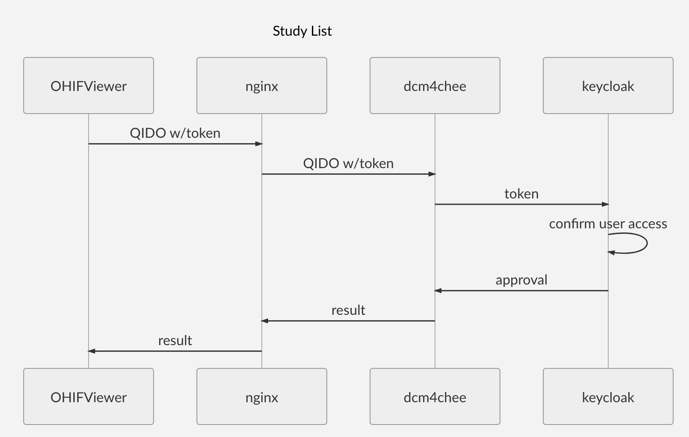

Back to [Projects List](../../README.md#ProjectsList)

# DICOMweb Projects

## Key Investigators

- Michael Kelm (Siemens Healthineers)
- Steve Pieper (Isomics/NAMIC/OHIF)
- Erik Ziegler (OHIF)
- Marco Nolden (DKFZ/MITK)
- Jonas Scherer (DKFZ/MITK)
- Tina Kapur (BWH)

## Participating Remotely
- Andrey Fedorov (BWH)
- Andreas Fieselmann (Siemens Healthineers)

# Project Description


OHIFViewer can currently serialize/deserialize to DICOM SR for length measurements with unsecured dcm4chee back end.


## Objective

* Explore DICOMweb integration with various infrastructures and programming environments
  * OHIF
  * teamplay
  * CTK / MITK / Slicer
* Review existing implementations
  * dcm4chee
  * orthanc
  * teamplay
* Review enabling software / tools
  * dcmjs
  * cornerstone, cornerstoneTools

## Approach and Plan

* Review current implementations
* Review clinical applications and supportable workflows
  * General annotation (segmentation and measurements)
  * Orthopedic workflows
* Try some experimental connections with real data
  * QIDO/WADO of instances
  * STOW of derived instances
* Work on creating correct derived objects
  * SEG
  * SR
  * PR
  * SC


Here's an example endpoint for testing:

```curl quantome.org:8080/dcm4chee-arc/aets/DCM4CHEE/rs/patients```


## Progress and Next Steps

<!--Describe progress and next steps in a few bullet points as you are making progress.-->
* Learned a lot about web security implementations, single sign on, proxies, etc
* Working dicom archive with access managed by keycloak
* Updated docker compose [with archive and viewer](https://github.com/OHIF/integration-examples/tree/master/ohif-dcm4chee-secureUI)
* Able to launch OHIF Viewer on selected studies from secured teamplay login

# Illustrations
<!--Add pictures and links to videos that demonstrate what has been accomplished.-->






# Background and References

<!--Use this space for information that may help people better understand your project, like links to papers, source code, or data.-->

- [DICOMweb offical site](https://www.dicomstandard.org/dicomweb/)
- [OHIF](ohif.org)
- [CTK](commontk.org)
- [Example docker compose for OHIF + dcm4chee](https://github.com/OHIF/integration-examples/tree/master/ohif-dcm4chee-nginx)
- [dcm4chee REST api endpoints](http://petstore.swagger.io/index.html?url=https://raw.githubusercontent.com/dcm4che/dcm4chee-arc-light/master/dcm4chee-arc-ui2/src/swagger/swagger-dicom.json)
- [Example OHIF installation with dcm4chee back end](http://ohifviewer-staging.herokuapp.com/studylist)

# Notes

* [STOW of SR from OHIF in JavaScript](https://github.com/OHIF/Viewers/blob/b296602e8c5c1cfc48806ed33387a91f8f9a44fe/Packages/ohif-measurement-table/client/utils/stowSR.js)

* STOW request bash script "stow.sh"

```
#/bin/bash

if [ "$#" -ne 2 ]; then
    echo "Usage: stow.sh <endpointURL> <instance>"
    exit -1
fi

echo $1 $2

endpointURL=$1
instance=$2

temp=$(mktemp)

echo Using temp dir $temp
echo -ne "\r\n--EOF\r\nContent-Type: application/dicom\r\n\r\n" > $temp
cat $instance >> $temp
echo -ne "\r\n--EOF--" >> $temp

curl -X POST -H "Content-Type: multipart/related; type=application/dicom; boundary=EOF" $endpointURL --data-binary @$temp
```

For example use this script like this from a directory full of DICOM files:

`find . -exec stow.sh http://quantome.org:8080/dcm4chee-arc/aets/DCM4CHEE/rs/studies \{\} \;`
