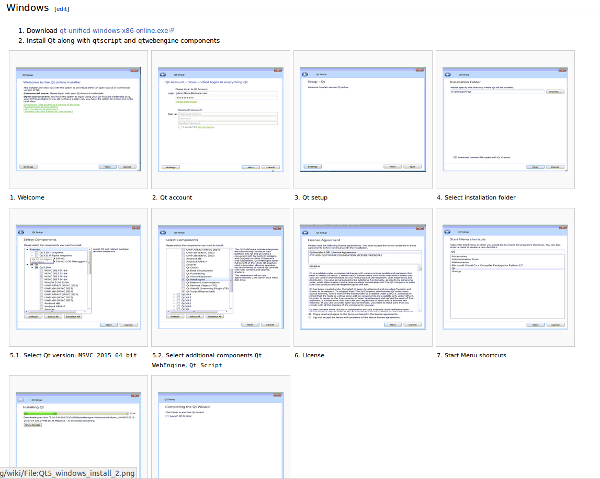

Back to [Projects List](../../README.md#ProjectsList)

# Slicer documentation on ReadTheDocs

## Key Investigators

- [Jean-Christophe Fillion-Robin](https://www.kitware.com/jean-christophe-fillion-robin/) (Kitware Inc., USA)
- [Andras Lasso](http://perk.cs.queensu.ca/users/lasso) (Queen's University, Canada)

# Project Description

We will continue the work initiated during the [27th Project Week](https://github.com/NA-MIC/ProjectWeek/tree/master/PW27_2018_Boston/Projects/SlicerReadTheDocs).

Ultimately, all modules would have their documentation managed along side the Slicer source code. For example, see [Segment Editor](http://slicer.readthedocs.io/en/latest/user_guide/module_segmenteditor.html) documentation.

## Objective

1. Streamline maintenance of Slicer user and developer documentation
1. Ensure Slicer documentation updates are reviewed along side feature integration
1. Document [KitwareMedical/SlicerCustomAppTemplate](https://github.com/KitwareMedical/SlicerCustomAppTemplate)
1. Discuss strategy to manage translation files

<!-- Add a short paragraph describing the project. -->

## Approach and Plan

1. Finalize migration of Slicer user documentation from the wiki to ReadTheDocs. See https://github.com/Slicer/Slicer/pull/686 and http://slicer.readthedocs.io
2. Document process to install Qt5 and build Slicer using it
2. Discuss and work on migration of developer documentation.
3. Setup documentation of [KitwareMedical/SlicerCustomAppTemplate](https://github.com/KitwareMedical/SlicerCustomAppTemplate) on readthedocs
4. Create `sphinx-cmake` python package. A sphinx documentation framework plugin enabling project to easily document their build system.

## Progress and Next Steps

* [Slicer wiki](https://www.slicer.org/wiki/Documentation/Nightly/Developers/Build_Instructions) updated to explain how to install Qt5 and build slicer
 * Instructions for Linux, macOS and Windows updates
 * Added [step-by-step](https://www.slicer.org/wiki/Documentation/Nightly/Developers/Build_Instructions/Prerequisites/Qt5) guide with screenshot explaining how to install Qt on windows
<!--Describe progress and next steps in a few bullet points as you are making progress.-->

# Illustrations

<!--Add pictures and links to videos that demonstrate what has been accomplished.-->

<!---->

<!---->

# Background and References

<!--Use this space for information that may help people better understand your project, like links to papers, source code, or data.-->

- Source code: https://github.com/Slicer/Slicer/pull/686
- 27th Project week page: https://github.com/NA-MIC/ProjectWeek/tree/master/PW27_2018_Boston/Projects/SlicerReadTheDocs
