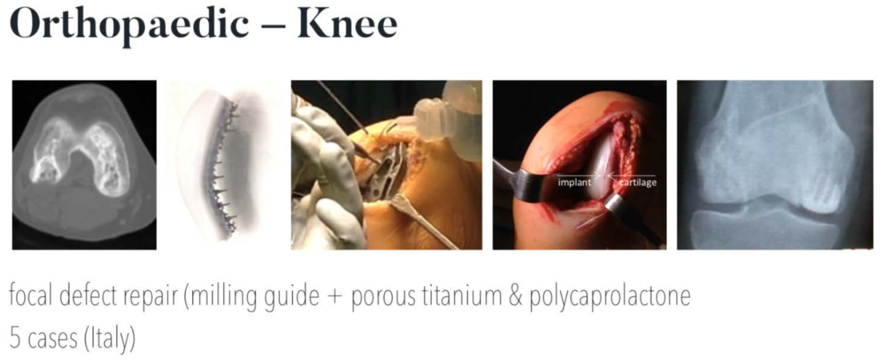

Back to [Projects List](../../README.md#ProjectsList)

# Evaluation of proposed projects

## Key Investigators

- Donato Monopoli (ITC)
- Javier González (ITC)
- Group GTMA (MACbioIDi)
- Juan Ruiz-Alzola (ULPGC - GTMA - MACbioIDi)

## Project Description

### Evaluation of projects: augmented reality system to be used in surgeries, software for orthognatic planning, simulator of bone sliding.

The Canary Islands Institute of Technology [ITC] (http://www.itccanarias.org/web/) is an applied research Institute belonging to the Regional Government of Canary Islands (Spain). The ITC is active in different research fields. In particular, the Biomedical Engineering Department focuses on 3D-printed, custom-made implants for bone loss reconstruction and regeneration. 

During this workshop we plan to explore, together with the GTMA (Group of Medical Thecnology and Audiovisuals), the possibilities of 3DSlicer and its evironment in three possible projects.

Proposals:
+ Software for orthognathic surgical. A piece of software that simulates temporomandibular joint rotation after computer-simulated osteotomies.

+ Augmented reality for patient-specific implant surgery. AR - or VR - to quickly inspect a patient's CT or MRI scan, and confirm the right placement of implants in the course of surgery. It must provide an intuitive way to navigate a 3D model of both the patient's anatomy and implant, and it must be a setup that surgeons can bring into the operating theatre and be quicker to operate than existing commercial navigation systems. To be used in some very difficult custom made surgeries like vertebral body en-block resection with emphasis in sacrum replacement, acetabular reconstruction or some maxillofacial difficult surgeries.

+ A simulator of the humerus and ulna sliding on their articular surfaces with collision and impingement detection.

## Objectives

1. Assess the feasibility of the aforementioned projects.

## Approach and Plan

1. Acquire proficiency in 3DSlicer environment.
2. Evaluate AR o VR for project #2.
2.1. Assess the perfomance of trackers and/or markers.
2.2. Review 3DSlicers' support for AR and VR headsets in the market.

## Progress and Next Steps

## Illustrations

Biomedical Engineering Department Workflow

## Background and References

+ [Osteobionix](https://github.com/NA-MIC/ProjectWeek/blob/master/PW28_2018_GranCanaria/Projects/EvaluationOfProjects/presentation%20letter%20ITC.pdf)

