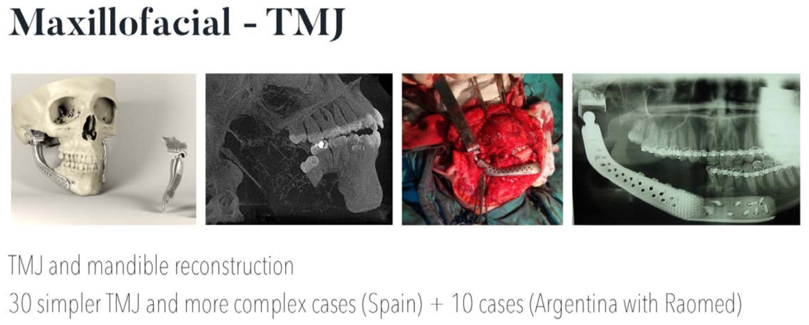
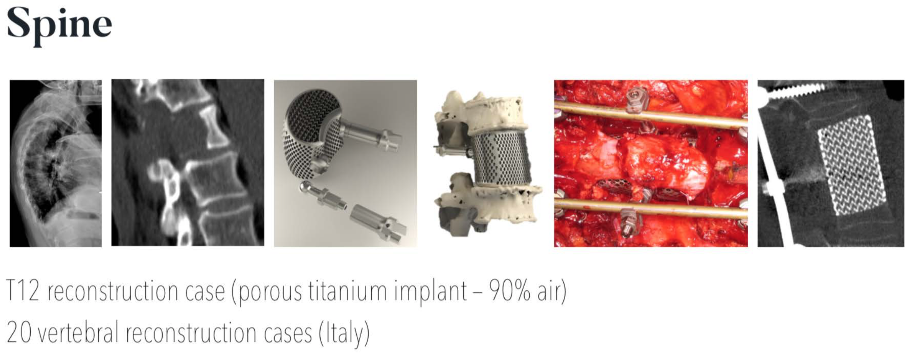
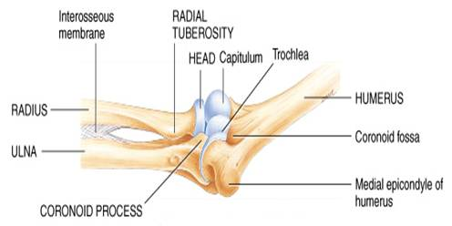
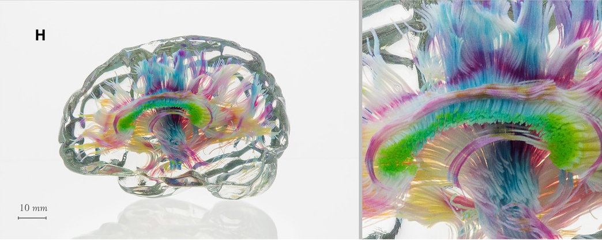
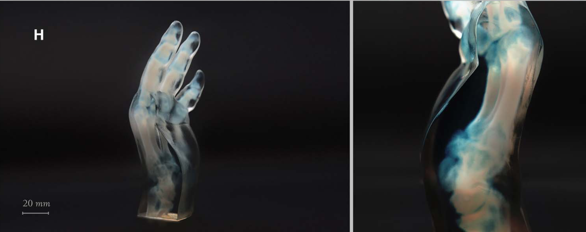

Back to [Projects List](../../README.md#ProjectsList)

# Evaluation of proposed projects

## Key Investigators

- Donato Monopoli (ITC)
- Javier González (ITC)
- Group GTMA (MACbioIDi)
- Juan Ruiz-Alzola (ULPGC - GTMA - MACbioIDi)

## Project Description

### Evaluation of projects: augmented reality system to be used in surgeries, software for orthognatic planning, simulator of bone sliding.

The Canary Islands Institute of Technology (ITC) (http://www.itccanarias.org/web/) is an applied research Institute belonging to the Regional Government of Canary Islands (Spain). The ITC is active in different research fields. In particular, the Biomedical Engineering Department focuses on 3D-printed, custom-made implants for bone loss reconstruction and regeneration.

  
Biomedical Engineering Department Workflow

During this workshop we plan to explore, together with the GTMA (Group of Medical Technology and Audiovisuals), the possibilities of 3DSlicer and its environment in three possible projects.

Proposals:
+ #1 Software for orthognathic surgical planning. A piece of software that simulates temporomandibular joint rotation after computer-simulated osteotomies.

  

+ #2 Augmented reality for patient-specific implant surgery. AR -or VR- to quickly inspect a patient's CT or MRI scan, and confirm the right placement of implants in the course of surgery. It must provide an intuitive way to navigate a 3D model of both the patient's anatomy and implant, and it must be a setup that surgeons can bring into the operating theatre and must be faster to operate than existing commercial navigation systems. To be used in some very difficult custom made surgeries like vertebral body en-block resection with emphasis in sacrum replacement, acetabular reconstruction or some maxillofacial difficult surgeries.

  

+ #3 A simulator for the humerus and ulna sliding on their articular surfaces with collision and impingement detection.

  

## Objectives

Assess the feasibility of the aforementioned projects.

## Approach and Plan

- [x] Acquire proficiency in 3DSlicer environment.
- [x] Evaluate AR o VR for project #2.
- [x] Assess the performance of trackers and/or markers.
- [x] Review 3DSlicers' support for AR and VR headsets in the market.

## Progress and Next Steps

+ Project #1: 'Software for orthognathic surgical planning'

SlicerCMF (CranioMaxiloFacial app) was preliminary evaluated, capabilities and examples look promising (Thanks JC!)

+ Project #2: 'Augmented reality for patient-specific implant surgery'

SlicerVR was considered. Our roadmap:
- [x] Focus on spine surgery (worst-case scenario).
- [ ] Assess intraoperative ultrasound for spine surgery, and perform 3D reconstruction using trackers.
- [ ] Build an ultrasound phantom to validate the setup. It should include the spine and surrounding main vessels (aorta!)
- [ ] Use VR to navigate the model and US-3D volume to locate blood vessels, muscle or cartilage during tumor resection

+ Project #3: 'A simulator for the humerus and ulna articular surfaces'
Postponed for reevaluation.

+ Project #4 (Bonus!):
Slicer has proven to be very useful for "voxel printing" anatomical models, which is a 3D-printing technique that can provide very realistic results - 3D in full color, transparency, various degrees of elasticity - and that does not require segmentation, nor the creation of an STL file. Other multi-color 3D-printing techniques require one STL per color, and the colors are therefore "solid". Slicer can *effortlessly* perform the required 3D interpolation and slicing that is required for this technique.

## Illustrations
The following are real 3d-printed anatomical models - not renders - using "voxel printing"

   

   

Credit: C. Bader, D. Kolb, J. C. Weaver, S. Sharma, A. Hosny, J. Costa, N. Oxman, Making data matter: Voxel printing for the digital fabrication of data across scales and domains. Sci. Adv. 4, eaas8652 (30 May 2018).

## Background and References

+ [Osteobionix](https://github.com/NA-MIC/ProjectWeek/blob/master/PW28_2018_GranCanaria/Projects/EvaluationOfProjects/presentation%20letter%20ITC.pdf)
