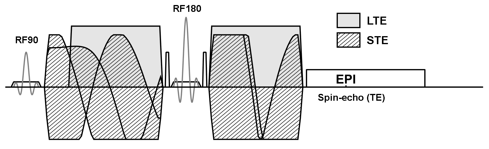
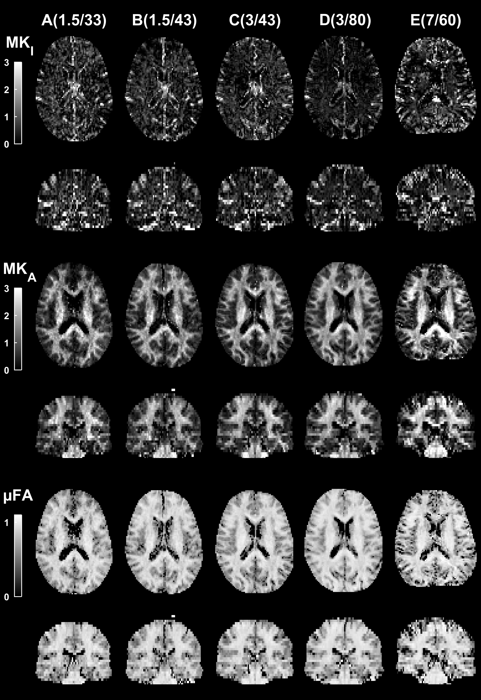

Back to [Projects List](../../README.md#ProjectsList)

### Integration of experimental parameters from the Free WaveForm sequence into DICOM
## Key Investigators

- Filip Szczepankiewicz (BWH, HMS)
- Carl-Fredrik Westin (BWH, HMS)
- Isaiah Norton

# Project Description
Tensor-valued diffusion encoding is an emerging technique within diffusion MRI. The novelty lies in the multidimensional encoding of the diffussion process.
To support such encoding, we must replace the conventional diffusion encoding sequence with arbitrary gradient waveforms that facilitate a large range of encoding strategies.
In doing so, we also need to store new kinds of experimental information to support traceability. In this project, we will extend the MRI pulse sequence to calculate and embed several necessary parameters in the DICOM header.

# Constraints and Challenges
- The project will assume software version VE11C
- no access to ICE
- no access to the standard DICOM header
- limited access to the CSA header (WIP memory)

## Objective

1. Incorporate array-to-character conversion in pulse sequence (Prepared by IN)
1. Subsample/rotate waveform and store in the WIP memory block
1. Complete waveform parameterization (moments, concomitant fields, etc)
1. Validate sequence functionality in simulator
1. Validate sequence functionality on hardware (Boston)
1. Write Matlab script to extract and validate waveform from DICOM header
1. Validate waveform integrity (Boston)

## Approach and Plan

1. Objectives 1-4 and 6 will be approached during the project week, in that order.

## Progress and Next Steps

Objective 1 was prepared during Hackathon in Sweden by Isaiah Norton, and is almost complete.

Next step:
Introduce C-code into pulse sequence, and test compilation conflicts.
Translate "Load" type waveform, without rotations, into the WIP parameter space
Complement waveform parameters (motion, acceleration, k0 nulling with maxwell terms, etc) and store in header

# Illustrations

# Background and References

<!--Use this space for information that may help people better understand your project, like links to papers, source code, or data.-->

- Source code analysis: https://github.com/filip-szczepankiewicz/md-dmri
- Source code wavefrom optimization: https://github.com/filip-szczepankiewicz/NOW
- Source code transform: https://github.com/ihnorton/mdmr_vec_block
