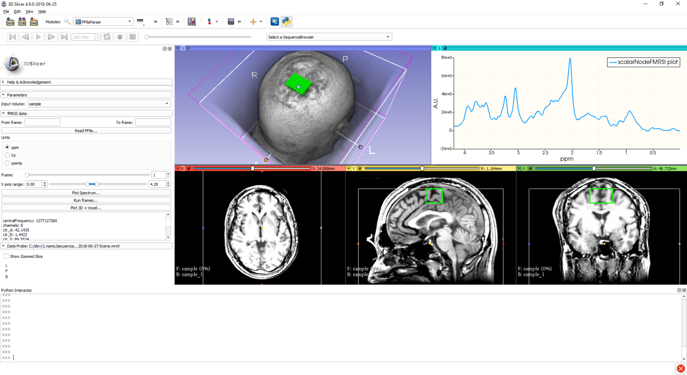
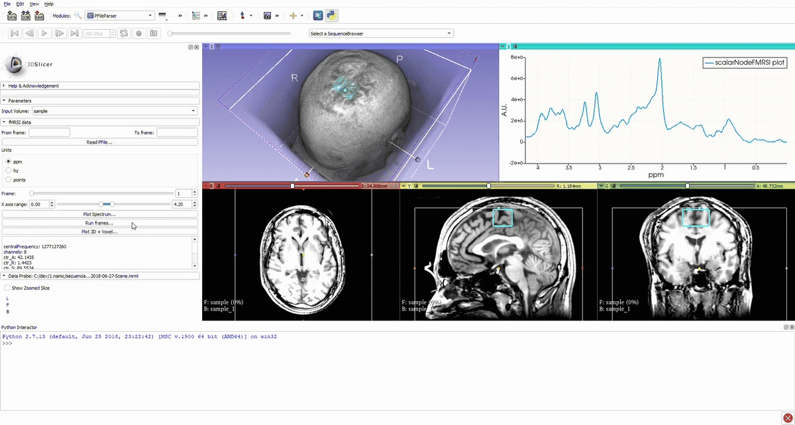
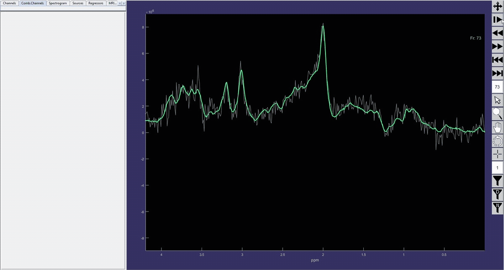

Back to [Projects List](../../README.md#ProjectsList)

# Implementing 1H Time resolved Functional Magnetic Resonance Spectroscopy with quantification of broad metabolite spectrum in 3D Slicer

## Key Investigators

- Francisco Marcano Serrano (ULL - MACbioIDi)
- José Luis González Mora (ULL - MACbioIDi)
- Juan Ruiz-Alzola (ULPGC - GTMA - MACbioIDi)

## Project Description

The aim of this project is to implement signal separation algorithms to process single voxel or chemical shift imaging time sequences. A sequence is compose of frames with a period of NEX+TR sec each. The output of the processing is an estimated sequence of spectra with increased signal-to-noise ratio (SNR). SNR-improved sequence could be used to extract the chemical kinetic information of metabolites might be found in the original sequence in ideal absence of noise, and improve quantification of low-concentration metabolites in each frame.
Quantification of processed sequence is performed by third-party software.
Algorithms have previous been coded in Matlab, and it is proposed their translation to 3D Slicer numeric and scientific library framework.
It is also encouraged to implement secure communication routines to interact with quantification software from 3D Slicer application.

## Objectives

1. Define scope for module implementation.
1. Study the possibility of integration with previous spectroscopy slicer modules (SIVIC).
1. Enhance signal quality of selected MRSI dataset reducing physiological artifacts and noise using the BSS approach.
1. Study the implementation of a mechanism for data exchanging between BSS/time-resolve module and quantification service located in an external server.

## Approach and Plan

1. Study the possibilities of 3DSlicer for implementing the algorithms.

## Progress and Next Steps
1. Have been implemented algorithms for reading, parsing, spectrum reconstruction and visualization for single voxel GE PFiles
1. Study for supporting other input formats, still in progress
1. Voxel color map under development, as sequence of models. Multivoxel, CSI not supported yet.
1. Studying the possibility of implementing signal processing algorithms as external modules (CLI), and remote processing through  QProcess / SCP mechanisms.

## Illustrations
Voxel location and average spectrum.

Simulation of the voxel value (molecule concentration) changing in time (sequence).

Denoised spectrum sequence (Matlab)

