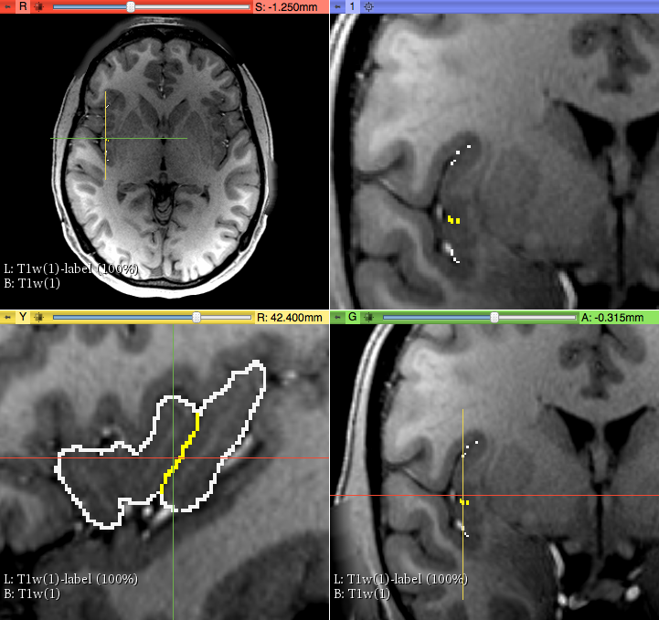

Back to [Projects List](../../README.md#ProjectsList)

# Insula segmentation with 3D Slicer

## Key Investigators

- Filippo Cicali (Mass General Hospital and Harvard Medical School - USA)
- Nikolaos Makris (Mass General Hospital, Brigham and Women's Hospital and Harvard Medical School - USA)

# Project Description

To parcellate accurately the Insula into each principal anatomic units. Specifically the anterior (aINS) and the posterior (pINS) lobules.

## Objective

Using a T1 MRI dataset of the Human Connectome Project (HCP) we volumetrically measured the aINS and pINS.
This was achieved using the T1 MRI and the Slicer 3D software in two steps. First, by defining the precise anatomy of the insula by identifying the morphology of the insular sulci which are visible and second, by parcellating the two subunits of the insula, labeling and measuring their volumes them.

1. To segment in each coronal slice the aINS and pINS ROIs in order to measure the number of voxels in each ROI per coronal slice.

1. Select a color for the aINS and for pINS to apply in each coronal slice.

1. 3D modelling.

1. Volume measures.

## Approach and Plan

Interact with developers to investigate the existence of appropriate tools and figure out how to implement them.

1. Document the procedure.

1. Disseminate the procedure to beta testers.

## Progress and Next Steps

Implement a method to accurately parcellate the anatomical structure Insula of Reil using 3D Slicer.

1. Improve the procedure with the new 3D Slicer Segment Editor.

Procedure:

To optimize accuracy, reliability and overall time needed, we studied several combinations of the tools available in the Segment Editor, interacting with the developers.
After several attempts using Segment editor tools 'threshold painting', 'grow from seeds', 'watershed', 'fill between the slices', 'tracing level' the actual results were obtained as follows:

1) On a T1 MRI image, using the Segment Editor module, we used 3 segments (via "add" icon). The first segment was for the background, the second for the whole Insula and the third for the separation between the two subunits of the insula, i.e., aINS and pINS.
To establish accurately the borders of aINS and pINS we traced the Circular sulcus and the Central sulcus of the Insula as follows. First, we used three sagittal images where these sulci were visually well-identifiable.
Consequently, these sulci were detected on coronal sections as a series of dots, which served as our key anatomical landmarks for the segmentation of aINS and pINS. More specifically, the circular sulcus of the insula determined the outer boarder of the insula in its entirety and the the Central sulcus (cesi) determined the for border between anterior and posterior Insula (coronal view).

2) Using the "Tracing level" tool, we identified the optimal separation border between white and grey matter to obtain the external insular cortex ribbon (i.e., between insula and subarachnoid space). Please note that the part segmented in this step, with the first segment selected, will be the background of the insular cortex, first delineated as a "negative" (unfilled area).

3) Using the "Paint" tool we traced the areas outside of the insular cortex, establishing the "negative" of our target structure.

4) Subsequently, we selected the second segment using "Paint" tool, masking editable area on "Outside all segments". Then we filled the area by drawing inside the previously obtained negative of the insular cortex.
We Repeated this process on each coronal slice where Insula was visible (on average 85 slices with MRI slice thickness 0.7mm).

5) After manual completion we created the 3D model clicking the "3D model" icon  and checked it visually.

SEPARATION OF ANTERIOR, POSTERIOR INSULA AND VOLUMETRIC MEASURES

6) We selected the third segment added before.

5) On the 3D model of the parcellated Insula (in 3D view), we then used the 'Scissors' tool using the Central sulcus as the guideline to separate the aINS from the pINS. Subsequently, we checked the precision of the border of aINS and pINS as informed by the central sulcus.

6) To calculate the volumes of and and pINS, we first exported the segments converting them in labels using in Segment Editor the 'Segmentations' function.

7) Finally, we used the 'Quantification' module, 'Label Statistics' to obtain volumetric measures of each label (aINS, pINS).

The entire procedure lasted 6 hours.

# Illustrations

Circular Sulcus (white) and Central Sulcus (yellow) in the parcellation method of anterior and posterior Insula

Parcellation of aINS and pINS - Volumetric measures

3D model of the "Insula of Reil"

 
 

# Background and References

Makris, N., Goldstein, J. M., Kennedy, D., Hodge, S. M., Caviness, V. S., Faraone, S. V., ... & Seidman, L. J. (2006). Decreased volume of left and total anterior insular lobule in schizophrenia. Schizophrenia research, 83(2), 155-171.
<!-- If you developed any software, include link to the source code repository. If possible, also add links to sample data, and to any relevant publications. -->
