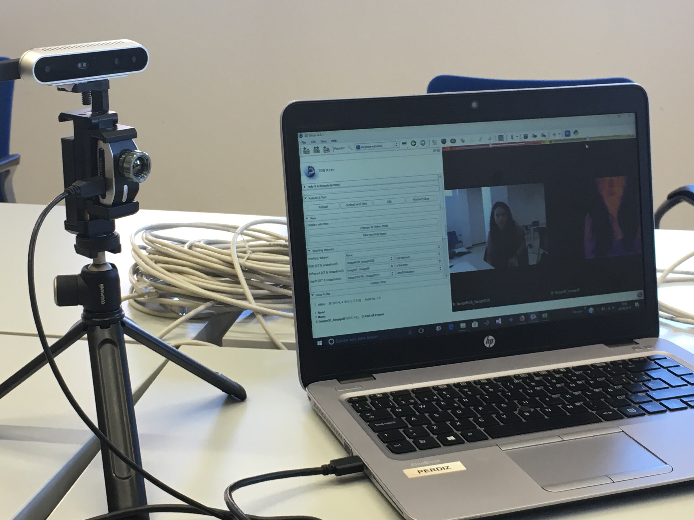
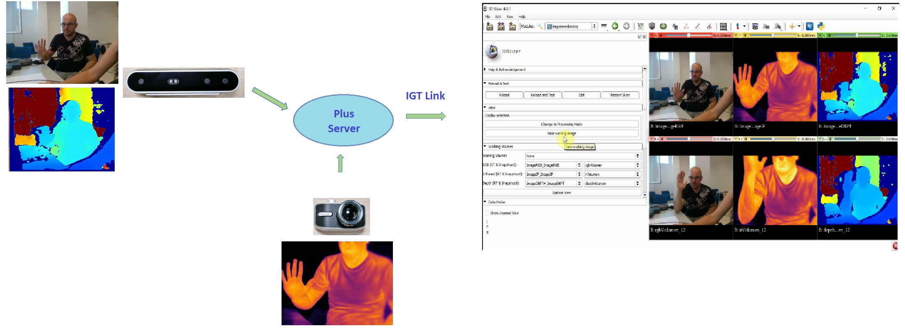

Back to [Projects List](../../README.md#ProjectsList)

# Medical Infrared Imaging with 3DSlicer

## Key Investigators

- Yolanda Martin (IACTEC - MACbioIDi)
-	Abián Hernández-Guedes (ULPGC - GTMA - MACbioIDi)
- Jorge Quintero Nehrkorn (IACTEC - MACbioIDi)
- Enrique Villa (IACTEC - MACbioIDi)
- Natalia Arteaga-Marrero (IACTEC - MACbioIDi)
- José-Carlos Ruiz-Luque (ULPGC - GTMA - MACbioIDi)
- Juan Ruiz-Alzola (ULPGC - GTMA - MACbioIDi)

## Project Description

This project is a next step in the one presented during [27thPW NA-MIC](https://projectweek.na-mic.org/PW27_2018_Boston/Projects/MedicalInfraredImagingwithSlicer/), a research collaboration between the public research institute [IAC](http://www.iac.es/) and the [University of Las Palmas de Gran Canarias(ULPGC)](http://www.ulpgc.es/) in order to use InfraRed (IR) sensors and advanced image processing techniques in 3D Slicer for medical diagnosis.
It is intended mainly for monitoring of foot ulcers in diabetic patients. The infrared cameras have been integrated and connected to 3D Slicer using the PLUS toolkit. In addition, a new medical thermal infrared extension is being developed.

## Objectives

1. Implementation of a new extension for medical thermal infrared images.
2. Development and testing of a new module for foot ulcer assessment based on thermal infrared images.
3. Study other processing approaches to improve efficiency and performance.

## Approach and Plan

1. To finish the initial acquisition, segmentation & registration modules for foot ulcer assessment in Slicer 3D.
2. To discuss and test other segmentation and registration approaches.
3. To develop a new Slicer module for semi-automatic foot ulcer assessment using contralateral temperature comparison.
4. Testing.

## Progress and Next Steps

<b> 1. Progress </b>
- Acquisition module has been finished
- Initial version of the segmentation & registration modules have been developed
- The new Slicer module for semi-automatic foot ulcer assessment is in progress

<b> 2. Next steps </b>
- To finish the module for semi-automatic foot ulcer assessment
- To improve the camera calibration procedure
- To test machine learning approaches for feet segmentation

## Illustrations

<!-- Segmentation Module.-->

<!---->

Temperature Comparisons.

+ (a) Acquisition of the infrared image
+ (b) Segmented feet in the IR image
+ (c) Result when comparing the temperature of the feet.

## Acquisition and automatic registration & segmentation modules

<b> Acquisition set-up </b>

<b> Interconnection </b>

<video src="acquisition_module.mp4" width="700" height="600" controls preload></video>

<b> Acquisition module </b>

<video src="registration.mp4" width="700" height="600" controls preload></video>

<b> Registration module  </b>

<!--<video src="ModuloSegmentacion.mp4" width="700" height="600" controls preload></video>-->

 <b> Demonstration of the segmentation module  </b>

## Background and References

+ [3D Slicer](https://www.slicer.org)
+ [Plus Toolkit documentation](http://perk-software.cs.queensu.ca/plus/doc/nightly/user/index.html)
+ [IACTEC: Medical Technology Program](http://www.iac.es/iactec.php?op1=141&op2=462)
