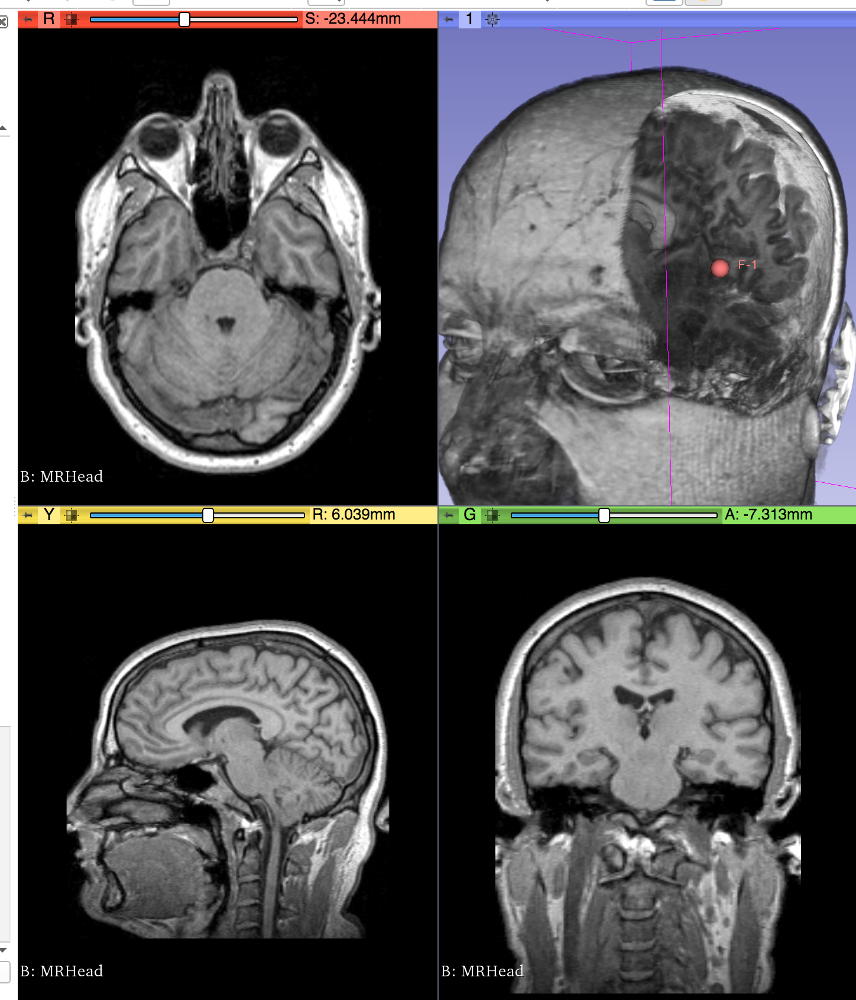
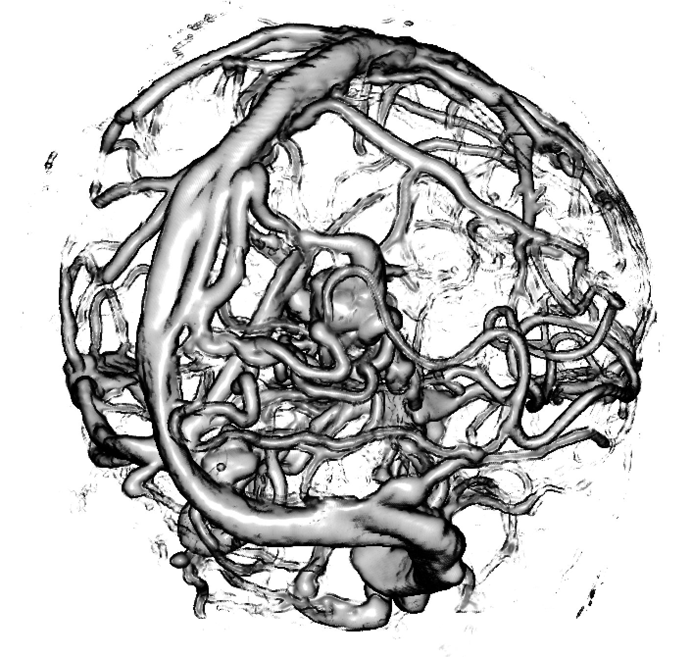
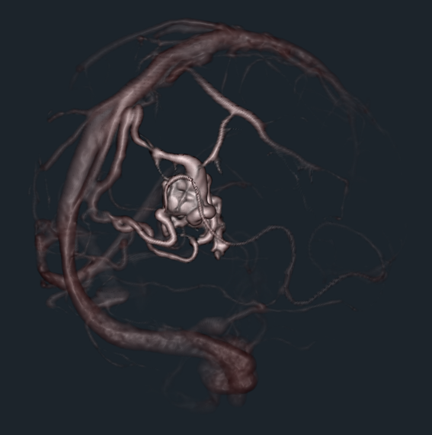
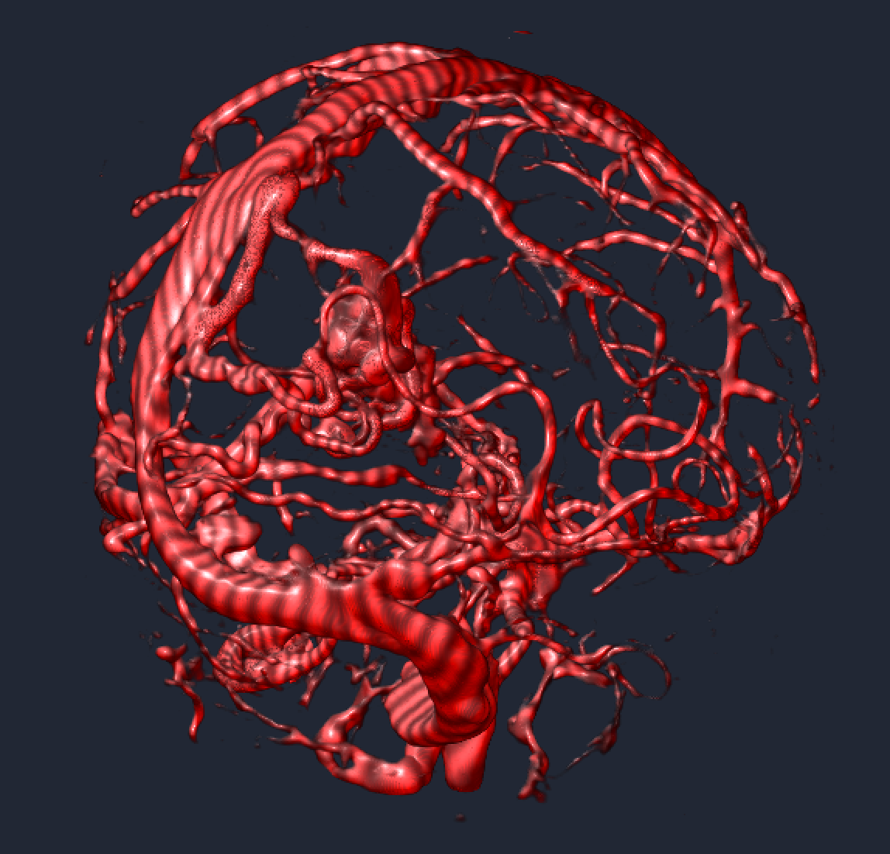

Back to [Projects List](../../README.md#ProjectsList)

# Programmable MultiVolume Rendering Project

## Key Investigators

- Simon Drouin (MNI)
- Csaba Pinter (Queen's)
- Steve Pieper (Isomics)
- Jean-Christophe Fillion-Robin (Kitware)

# Project Description

## Objective

* Review the newly exposed GLSL hooks in VTK as a mechanism to add features to Slicer's Volume Rendering
* Possible features to explore
  * Optimized performance/quality for multiple overlapping volumes
  * Custom clipping or other rendering features
  * Adding nonlinear deformations

## Approach and Plan

* Review what's new since we [discussed this last year](https://na-mic.org/wiki/Project_Week_25/Next_Generation_GPU_Volume_Rendering)
  * New VTK version and classes
  * New Slicer GUI
  * Other GLSL examples that we can draw from
    * IBIS / PRISM
    * STEP
* Document existing functionality in the VTK wiki on [this page](https://www.vtk.org/Wiki/VTK/ProgrammableMultiVolumeRendering) and identify potential builtin variables and functions that could be added to facilitate the creation of new volumetric effects.
* Replicate the examples presented in the PRISM paper using the improved VTK mapper.
* Replicate the US heart rendering of Philips machine with data from Matt Joley.

## Progress and Next Steps
* Provided a proof of concept (python script) for dynamic shader editing in Slicer (see image, video and link to script below)
* Started documenting the new volume rendering functionality of VTK [here](https://docs.google.com/document/d/1TBewDwBLdoAsl2Gm8ERcQXGhyLkr_zrqAtDiQYXRpdA/edit?usp=sharing)
* Suggested improvements:
  * VTK: expose interface for setting custom uniform variables in vtkGPUOpenGLRaycastMapper
  * Slicer: Build an interface to interactively edit shader code, visualize the complete shader and display shader compilation errors.

[Prototyping Repository](https://github.com/pieper/VTKCustomShaders)

### Proof of concept
* [Proof of concept script to paste in python console](https://github.com/pieper/VTKCustomShaders/blob/master/SlicerShader.py)
* [Works with this data](https://github.com/NA-MIC/ProjectWeek/releases/download/ThursdayEvening-2018-06-28/2018-06-28-Scene.mrb)

### Result
[YouTube video of SlicerPRISM in action](https://youtu.be/yiEI_yBMu8k)

[Another video example, with DTI data](https://youtu.be/-LODgIh5W6k)

# Illustrations

| Philips 3D US | Chroma-depth in PRISM | Depth peeling in PRISM |
| --- | --- | --- |
|  |  |  |

| Edge enhancement in PRISM | Decluttering in PRISM | Volume carving in PRISM |
| --- | --- | --- |
|  |  |  |

| Blood flow animation in PRISM |  |  |
| --- | --- | --- |
|  |  |  |

# Background and References

<!--Use this space for information that may help people better understand your project, like links to papers, source code, or data.-->

- [PRISM Paper](http://journals.plos.org/plosone/article?id=10.1371/journal.pone.0193636)
- [STEP multivolume deformable rendering (in WebGL)](https://www.youtube.com/watch?v=8dputUoKBTA)
- [Multiple volume rendering in Slicer 3.6](https://www.slicer.org/wiki/Modules:VolumeRendering-Documentation-3.6)
