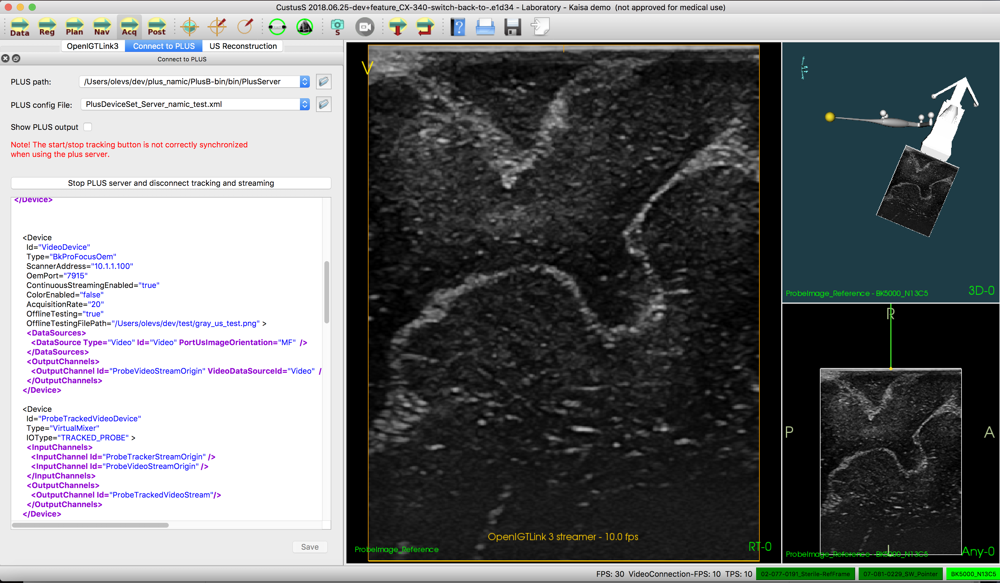
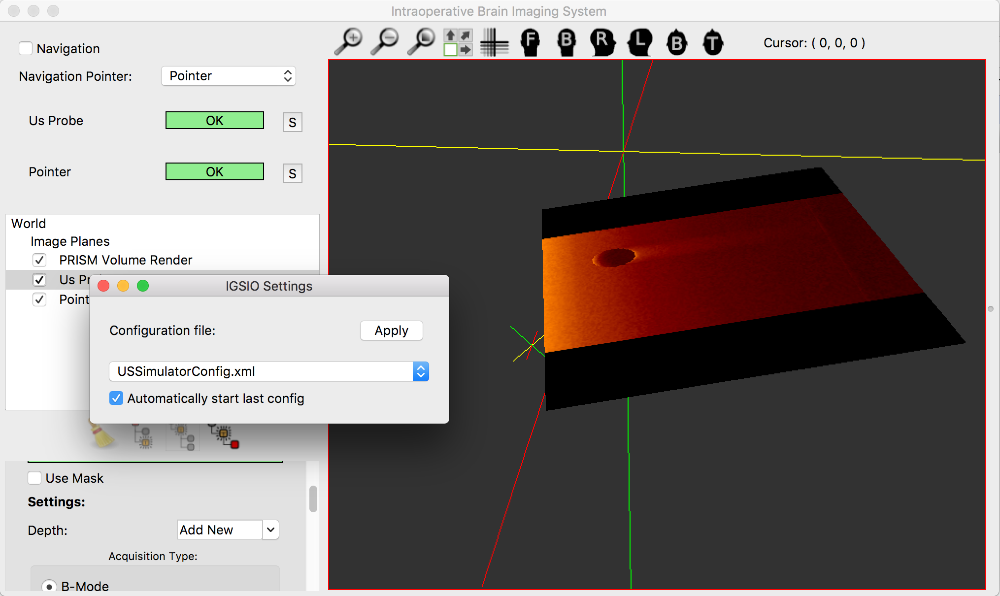
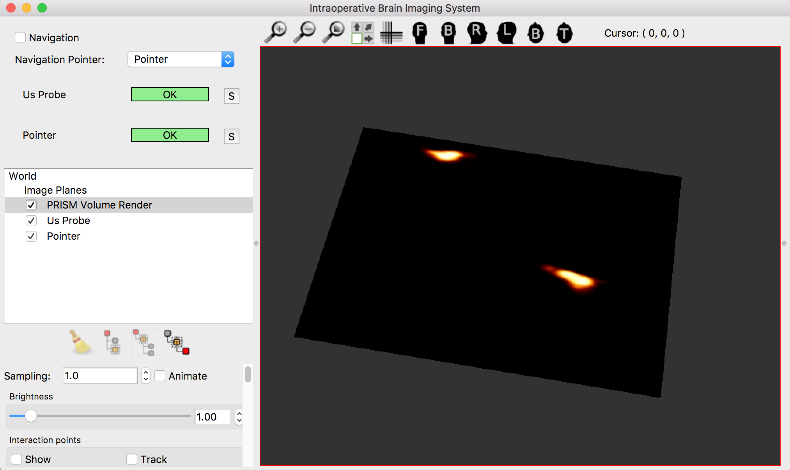

Back to [Projects List](../../README.md#ProjectsList)

# OpenIGTLinkIO Development

## Key Investigators

- [Simon Drouin](http://nist.mni.mcgill.ca/?page_id=369) (Montreal Neurological Institute, Canada)
- [Andras Lasso](http://perk.cs.queensu.ca/users/lasso) (Queen's University, Canada)
- [Csaba Pinter](http://perk.cs.queensu.ca/users/pinter) (Queen's University, Canada)
- [Ole Vegard Solberg](https://www.sintef.no/alle-ansatte/ansatt/?empId=541) (SINTEF, Trondheim, Norway)
- [Geir Arne Tangen](https://www.sintef.no/alle-ansatte/ansatt/?empId=1605) (SINTEF, Trondheim, Norway)

## Participating remotely

- [Adam Rankin](http://www.imaging.robarts.ca/petergrp/node/113) (Robarts Research Institute, Canada)
- [Kyle Sunderland](http://perk.cs.queensu.ca/users/sunderland) (Queen's University, Canada)
- [Mark Asselin](http://perk.cs.queensu.ca/users/asselin) (Queen's University, Canada)
- [Étienne Léger](http://www.ap-lab.ca/people/etienneleger/) (Concordia University)
- [Longquan Chen](https://www.linkedin.com/in/longquan-chen-68672340/) (Brigham and Women's Hospital)
- [Tamas Ungi](http://perk.cs.queensu.ca/users/ungi) (Perk Lab)

# Project Description

## Objective

* [Plus Toolkit](http://www.plustoolkit.org) provides access to numerous hardware devices (imaging devices, tracking devices, navigations systems, sensors, etc.) and makes it available through [OpenIGTLink](http://www.openigtlink.org) protocol
* This group has created a common library, [OpenIGTLinkIO](http://igsio.github.io) that simplifies the integration of Plus (and OpenIGTLink-compatible devices or software) into different programs and :
  * Ensure software interoperability between [Slicer](https://www.slicer.org/), [MITK](http://mitk.org/), [CustusX](https://www.custusx.org/), [Ibis Neuronav](http://ibisneuronav.org/) and potentially other imaging platforms.
  * Share software maintenance workload
  * Make it easy to share new features
  * Add specific features for tracked ultrasound and and augmented reality in surgical navigation

## Approach and Plan

* Complete and improve refactoring of command messages.
* Embed information about images in the image message itself (currently sent as string messages to CustusX, see [PlusDeviceSet_Server_BkProFocusOem.xml](https://github.com/PlusToolkit/PlusLibData/blob/d2dcc2d2b8ad84eea14bd6147dcf289da1e4f405/ConfigFiles/PlusDeviceSet_Server_BkProFocusOem.xml) )
* Fix limited length device names. Troncate long names and put complete name in meta-data.
* Create a command-line example in OpenIGTLinkIO that implements a simple but complete tracked US session:
  * launch a PlusServer with a config that simulates US and includes tracking data
  * Connect to the server
  * Capture a few frames and prints the metadata
  * Changes US acquisition parameters
  * Capture more data
  * Export acquired images before shutting down
* Improve Plus server launcher
* Possible extension: Add functionality for combining streams in the OpenIGTLinkIO client:
  * Let's say you got one or more servers streaming several streams. Some of these streams may have to be combined in the client. It may be possible to add this functionality to OpenIGTLinkIO, so that users of the library don't have to create their own solutions. These combined tools may be similar to the combinations set up in the PLUS config file, but that may not be necssary, as the client may have other preferences, and OpenIGTLinkIO should not rely on the internal structures in PLUS. Examples:
    * PLUS streams ultrasound video, and some tracking hardware streams the positions of all the tools.
    * The setup uses a tool that supplies several positions at the same time.
    * Different hardware may all stream OpenIGTLink/OpenIGTLinkIO messages directly, and PLUS may not be used at all.

## Progress and Next Steps
* Tested the new implementation of command messages (provided remotely by Kyle Sunderland) in both Ibis Neuronav and CustusX.
* Moved the ultrasound meta information tag names from PLUS to igtlio: [igtlioUsSectorDefinitions.h](https://github.com/IGSIO/OpenIGTLinkIO/blob/174dc1da2064265d77093be4eaa3b172334e163b/Converter/igtlioUsSectorDefinitions.h#L5)
* Made PLUS send the ultrasound sector information as meta information instead of string messages.
  * This is currently only implemented in the BK interface. The BK interface can be configured in test mode (where it just sends a still image) to test this functionality.
* Identifyed that there is a bug in PLUS, making it not use OpenIGTLink header version 2: https://github.com/PlusToolkit/PlusLib/issues/374
* Ultrasound meta information being sent by PLUS (When the above bug is fixed). All these values are needed for automatically recreating the ultrasound sector in the client. See [vtkPlusUsDevice.h](https://github.com/PlusToolkit/PlusLib/blob/018aad4b8687e7e8d49eecb62f7d1fae3ef3e7e5/src/PlusDataCollection/vtkPlusUsDevice.h#L88):
  * ProbeType
  * Origin
  * Angles
  * BoundingBox
  * Depths
  * LinearWidth
  * SpacingX
  * SpacingY
* Implemented a proof of concept system (Only in Ibis Neuronav for now) to automatically start and connect to an arbitrary number of Plus servers with the goal to simplify operation in the OR.

<!--Describe progress and next steps in a few bullet points as you are making progress.-->
## Future work
* Define a standard for Plus to timestamp every data item send it in the metadata.
* vtkPlusDevice should include a container for metadata to be send. This way, each device type can register data that it sends with every message. Currently, this is done with FrameFields in vtkPlusUSDevice, but it should be generalized to all device types. The list of available properties is now defined in the new OpenIGTLinkIO igtlioUsSectorDefinitions. This should be moved to a more generic file that contains properties for all device types.
* Create a handshaking protocol in OpenIGTLink that gives the users of the library information about the capabilities of both the client and the server. Like:
  * Max OpenIGTLink version
  * Max OpenIGTLink header version
  * Any special dialects
* Initial suggestion: Create a deviceNameLong field in the OpenIGTLink meta information field that provides the device name in a format that is not truncated. This is really a hack to fix a bug introduced by Plus. At the moment Plus don't follow the OpenIGTLink standard by not making sure that the deviceName is unique?
  * A better solution would probably be that Plus makes sure that deviceName is unique. Additional information should be added as meta data instead (transform pipeline etc.).
* Implement support in OpenIGTLinkIO for combining streams into tools. The information needed for this can be set as meta data information. This recreation of tools combining multiple streams don't necessarily have to mirror the structures in the PLUS config file, and it have to be possible to combine streams from several sources at the same time (also from sources outside PLUS).

# Illustrations

Example image of CustusX using PLUS to receive ultrasound sector parameters as OpenIGTLink meta information from the BK interface in PLUS, by using OpenIGTLinkIO for the client in CustusX. The example is just streaming a random ultrasound image, so it don't match the ultrasound probe used in the example.

| Switching configuration | After switching configuration |
| --- | --- |
|  |  |

# Background and References

<!--Use this space for information that may help people better understand your project, like links to papers, source code, or data.-->

- [Source code](https://github.com/IGSIO/OpenIGTLinkIO)
- [IGSIO web page](http://igsio.github.io/)
