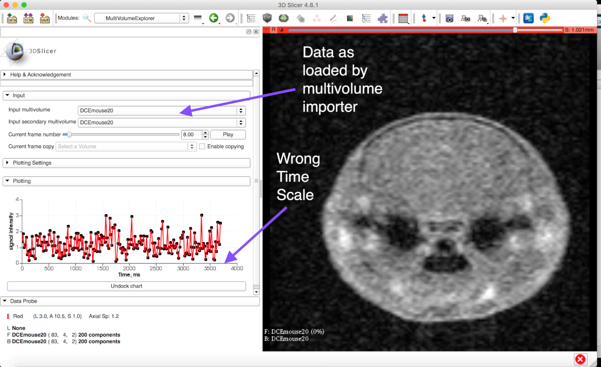
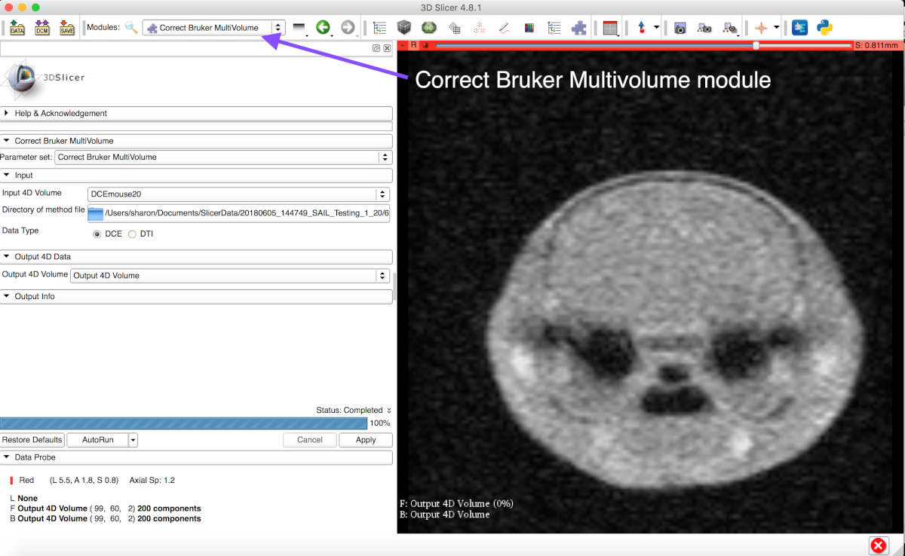
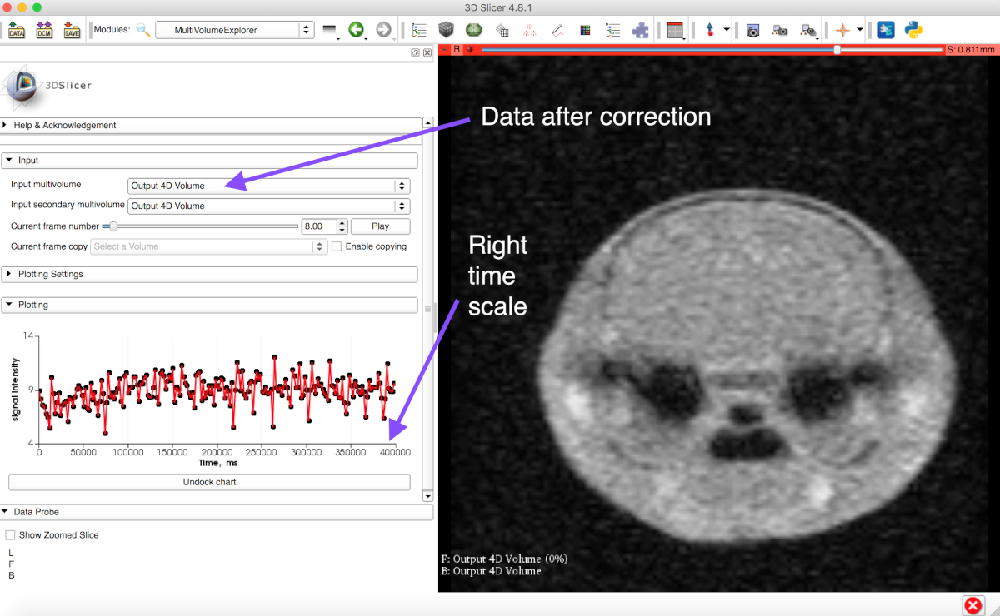

Back to [Projects List](../../README.md#ProjectsList)

# Improve/Test multivolume preclinical MRI data import (DCE, DTI).

## Key Investigators

-	Sharon Peled (Brigham and Women’s, USA)
-	Andras Lasso (Queen’s University, Canada)
-	Lauren O’Donnell (Brigham and Women’s, USA)

# Project Description

Multivolume DICOM data from Bruker preclinical MRI scanners (Paravision version 6) is incorrectly read into Slicer. Specifically, dynamic MRI DICOM frametime data and DTI gradient data needs to be fixed.

## Objective

1. Modify the multivolume importer to correctly display and represent preclinical DCE MRI DICOM data, or make a new module.
1. Modify the DTI loader, or make a new module.
1. Test import of other multivolume data, e.g. ASL and T1 mapping data - if there is a problem, fix it.

## Approach and Plan

1. Collect examples of preclinical data.
1. The first correction for DCE is to make sure the frame time in DCE MRI is not merely copied from the 'RepetitionTime' field in the DICOM files. Instead, this should be multiplied by the number of phase encoding steps.
1. As a prototype, implement a Matlab Bridge module "LoadBruker" that correctly loads all the various Bruker data sets.
1. Implement the fixes in Python, either as one module for Bruker MRI data, or within the existing data loading modules, multivolumeimporter and DWIconvert.

## Progress and Next Steps

Progress
- Various preclinical data sets were assembled: [download](https://www.dropbox.com/sh/5qo2kay9w7bi92t/AADvQtsKR3SJBS2HlReN1q-Ma?dl=0)
- Matlab Bridge module 'Correct Bruker' was written and fixed DCE imported data  - see screenshots below.

Next Steps
- Identify the Slicer format of DTI data and add the correction for DTI data to the Matlab Bridge 'Correct Bruker' module.
- Convert the 'Correct Bruker' module to Python (see Project list) OR incorporate the corrections in existing modules.

# Illustrations

<!-- # Background and References -->

<!--Use this space for information that may help people better understand your project, like links to papers, source code, or data.-->
