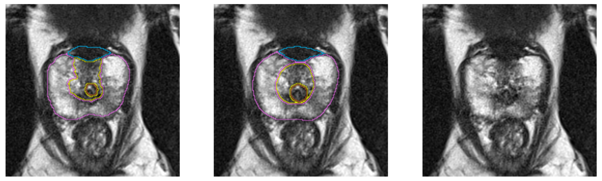
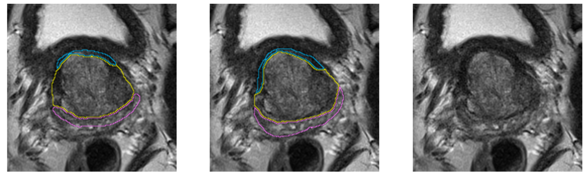
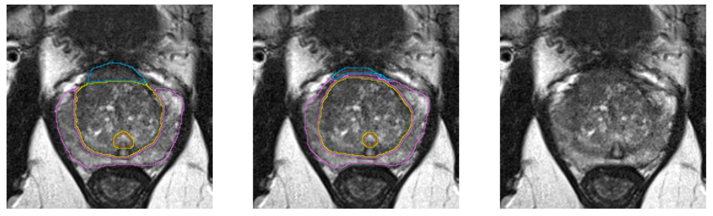

Back to [Projects List](../../README.md#ProjectsList)

# Multi-Label segmentation of anatomic prostate zones in MRI

## Key Investigators

- Anneke Meyer (University of Magdeburg, Germany)
- Marko Rak (University of Magdeburg, Germany)
- Andrey Fedorov (BWH, HMS)
- Christian Hansen (University of Magdeburg, Germany)

# Project Description

The goal of this project is to evaluate and extend variants of a volumetric CNN for multi-label segmentation of prostate zones in MR images. The prostate zones are essential for lesion classification and therapy planning. After successful segmentation, a sector map could be extracted that is used for PI-RADS reporting. This has the potential to automate and better standardize prostate lesion location reporting. This project is a continuation of the project that we started in last Winter Project Week. We already have results, but especially in one zone, the algorithm does not work very well and is not stable.

## Objective

1. Results have to get better and become more stable to be reliable.

## Approach and Plan

1. Extend data augmentation (translation and scaling).
1. Explore network extensions (deeper network, more filters).
1. Add more regulatrizers to prevent overfitting and evaluate their effect on the outcome.
1. Initialize a new approach: Generative Adverserial Network?

## Progress and Next Steps
1. split up data into training and validation sets so that they have more equally distributed anatomy characteristics -> did not improve output much
1. almost finished data augmentation framework
1. learned more about pelvic anatomy from Babacar

Next Steps:
1. Finish data augmentation framework
1. Find a way to stabilize outcomes for AFS (more regularizer, data augmentation) and then start to make the network deeper

# Illustrations

<!--Add pictures and links to videos that demonstrate what has been accomplished.-->

# Background and References
- Our paper about prostate segmentation: [http://isgwww.cs.uni-magdeburg.de/cas/pub/2018_Meyer_ISBI_multi_plane_prostate_segmentation.pdf](http://isgwww.cs.uni-magdeburg.de/cas/pub/2018_Meyer_ISBI_multi_plane_prostate_segmentation.pdf)
- PiRADs v2: [https://www.acr.org/-/media/ACR/Files/RADS/Pi-RADS/PIRADS-V2.pdf](https://www.acr.org/-/media/ACR/Files/RADS/Pi-RADS/PIRADS-V2.pdf)
