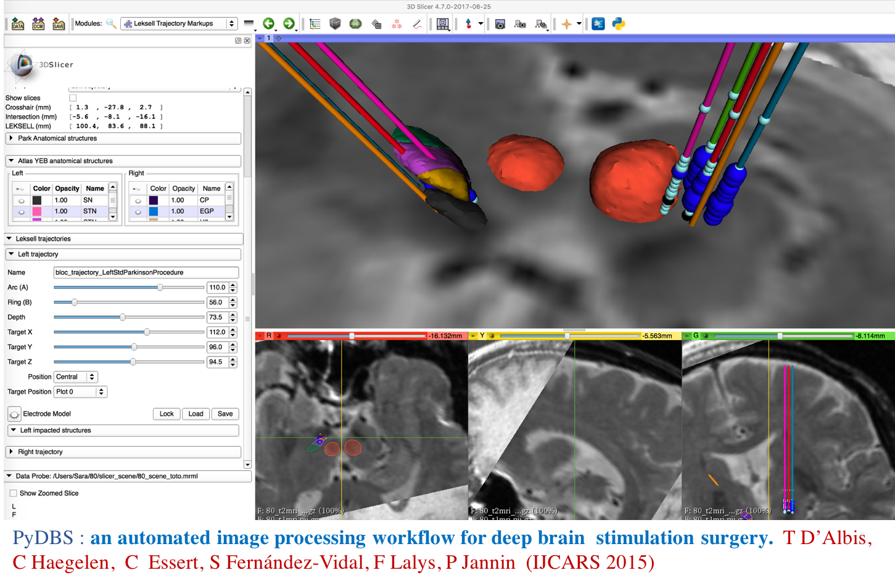
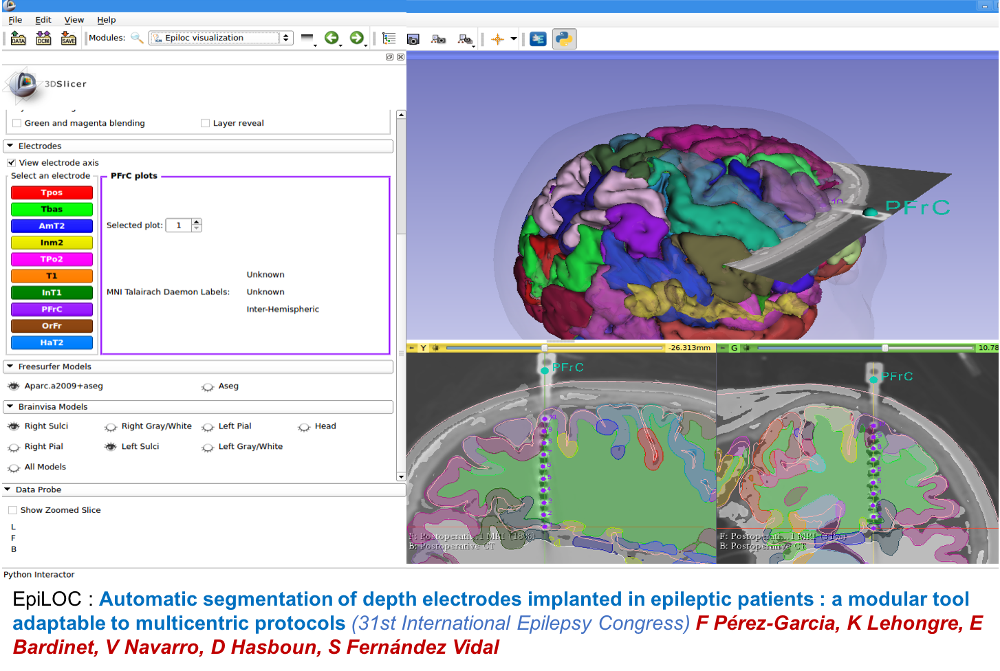

Back to [Projects List](../../README.md#ProjectsList)

# Stereotactic tools for DBS and intraEEG exploration procedures

## Key Investigators

- Sara Fdez Vidal (ICM)
- Jordan Cornillault (ICM)
- Eric Bardinet (ICM)

# Project Description

To improve and update the Slicer plug-ins we have developped for pyDBS and EpiLOC toolboxes.

## Objective

1. PyDBS PostOperative Report Plug-in. pyDBS is use mostly to localize the electrodes implanted in some regions of the Basal Ganglia, to tune the stimulation with regard to the surounded anatomy. We process a big amount of data coming from multicentric research projects and for clinicians. We provide to our users a quantitative and qualitative report but also a visual report for each subject processed, with some almost-standar views. 
2. EpiPlan slicer Plug-in. We have developed a prototype to help the neurologists and anatomists of our center to plan the surgical procedure to perform intracranial EEG exploration of certain epileptic patients. We want to enhance the plug-in by adding new features and making the graphical interface and user interface interactions more robust
3. MrTrix Tracking on PyDBS. 

## Approach and Plan
1. Get feedback from slicer team
2. Get help for new features implementation
2. Design of news GUIs and plug-ins architetures, adding a logic for the oldest ones

## Progress and Next Steps

<!--Describe progress and next steps in a few bullet points as you are making progress.-->

# Illustrations

PyDBS Intra Operative plug-in.

Epiloc PostOperative Visualization plug-in.

# Background and References

<!--Use this space for information that may help people better understand your project, like links to papers, source code, or data.-->

- Source code: https://github.com/YourUser/YourRepository
- Documentation: https://link.to.docs
- Test data: https://link.to.test.data
