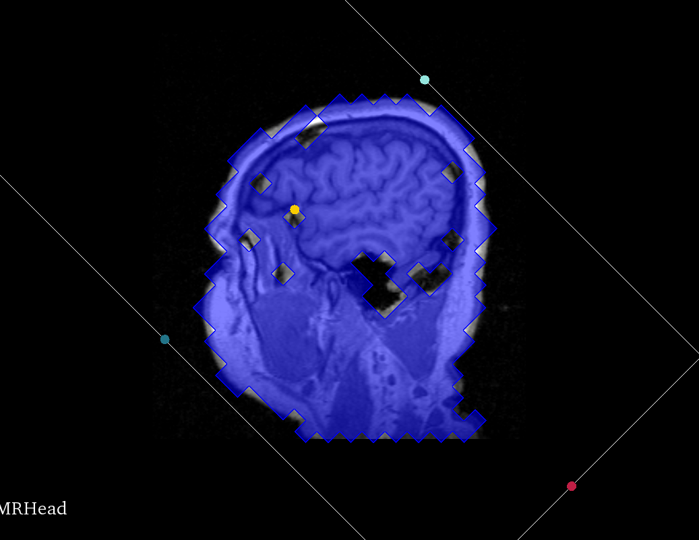

Back to [Projects List](../../README.md#ProjectsList)

# Segmentation geometry widget

## Key Investigators

- [Csaba Pinter](http://perk.cs.queensu.ca/users/pinter) (Queen's University, Canada)
- Andras Lasso (Queen's University, Canada)

# Project Description

## Objective

* Control over the geometry of the labelmap edited within the segmentation in Segment Editor is important, but so far the only possibility to specify it was by selecting the master volume before adding the first segment. This caused a lot of confusion.
* If we had a widget to specify labelmap geometry from existing nodes and some advanced settings, then it would facilitate using finer segmentations without the Crop Volumes workaround, editing on oblique planes, and other cases of using special geometries.

## Approach and Plan

* Implement a widget that can specify geometry of segmentation labelmap
  * Volume input: Select volume node or non-empty segmentation node with labelmap master. Spacing and directions come from the volume
    * Oversampling: option to specify multiplier for spacing. For example an oversampling of 2 means that every voxel of the input is divided into two along each axes (into 8 voxels)
    * Isotropic spacing: option to make voxels cubic shape. The minimum spacing is applied on each axis
  * Non-volume input: Parent transform specifies directions, bounding box specifies extent, spacing is set by the user manually
    * Segmentation node with closed surface master
    * Model node
    * ROI node
* Add button to Segment Editor module in the row of the master volume. When pressed, a dialog containing the widget is opened, and when OK'd, then the labelmaps are resampled
* Replace reference image geometry button in segmentation conversion parameters dialog. It only saves the referfene image geometry conversion parameter, and doesn't do actual resampling. This means that it's only applied when explicitly converting to labelmap from other representation - as expected from how the advanced conversion parameters are set.

## Progress and Next Steps

<!--Describe progress and next steps in a few bullet points as you are making progress.-->

* Widget implemented, [PR issued](https://github.com/Slicer/Slicer/pull/975)

# Illustrations
Geometry widget with volume type input:

Geometry widget with non-volume type input:

MRHead threshold resampled with oblique ROI into low resolution:

<!--Add pictures and links to videos that demonstrate what has been accomplished.-->

# Background and References

<!--Use this space for information that may help people better understand your project, like links to papers, source code, or data.-->

- [Segment Editor documentation](http://slicer.readthedocs.io/en/latest/user_guide/module_segmenteditor.html)
<!--
- [Segmentation training material on Slicer wiki](https://www.slicer.org/wiki/Documentation/Nightly/Training#Slicer4_Image_Segmentation)
- [Slicer Segmentation Recipes](https://github.com/lassoan/SlicerSegmentationRecipes)
-->
