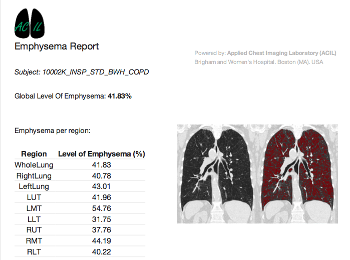
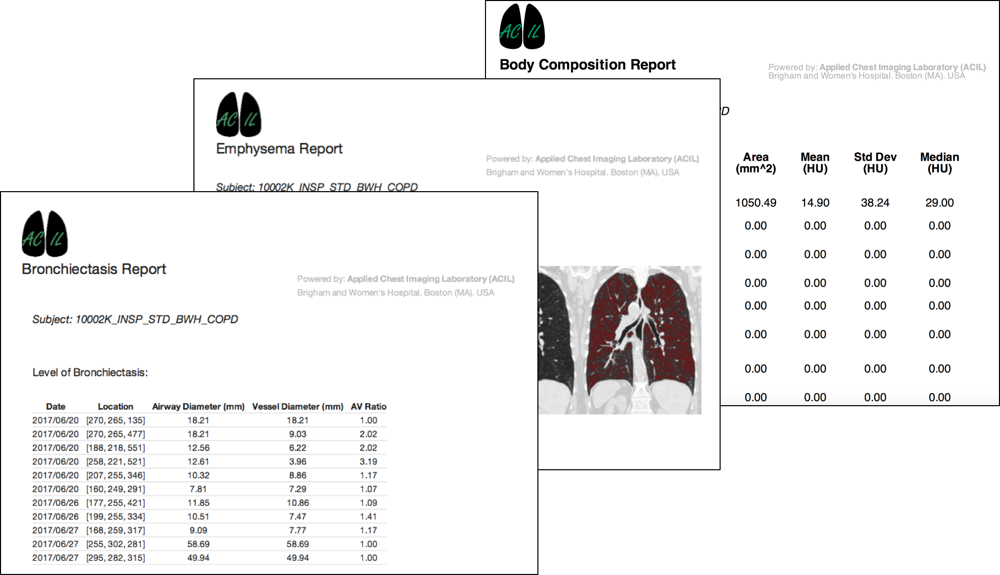
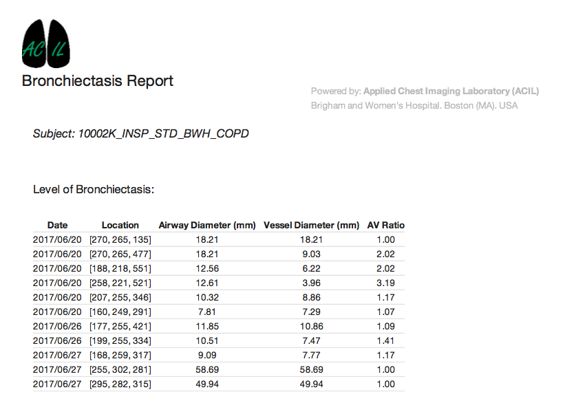

Back to [Projects List](../../README.md#ProjectsList)

# SlicerCIP Quantitative Reports Tool

## Key Investigators

- Pietro Nardelli (Brigham and Women's Hospital, Harvard Medical School, USA)
- Jorge Onieva Onieva (Brigham and Women's Hospital, Harvard Medical School, USA)
- Raúl San José Estépar (Brigham and Women's Hospital, Harvard Medical School, USA)

# Project Description

The goal of this project is to create a new tool for SlicerCIP that allows the creation of a PDF report to summarize and illustrate quantitive analysis.

SlicerCIP is an extension to Slicer that integrates:

- CIP functionality as a Toolkit exposing of the CLIs.
- Slicer specific modules to provide user-friendly chest CT quantitative solutions.
- Visualization of scale-space particles and labelmaps
- Integrated workflows to end-to-end clinical evaluation

Slicer CIP has been conceived as a workstation for radiologists, but is also suitable for any kind of researchers working on lung, heart or vascular diseases.

## Objective

1. Extend and generalize last year report tool to be used in all SlicerCIP modules.

## Approach and Plan

1. Implement a general HTML template for quantitative analysis report
2. Implement a new module that fills the HTML with images and data
3. Add in each SlicerCIP moule a link to the quantitative analysis report

## Progress and Next Steps

<!--Describe progress and next steps in a few bullet points as you are making progress.-->
1. General HTML template generated
2. Each SlicerCIP module have now a link to create a personalized quantitative analysis report

# Illustrations

<!--Add pictures and links to videos that demonstrate what has been accomplished.-->

<!---->

<!---->

<!---->

# Background and References

<!--Use this space for information that may help people better understand your project, like links to papers, source code, or data.-->

- Source code: https://github.com/acil-bwh/SlicerCIP
- Artery-Vein Classification using Deep-Learning: Nardelli P, Jimenez-Carretero D, Bermejo-Pelaez D, Washko GR, Rahaghi FN, Ledesma-Carbayo MJ, Estépar RS. Pulmonary Artery-Vein Classification in CT Images Using Deep Learning. IEEE Transactions on Medical Imaging.
