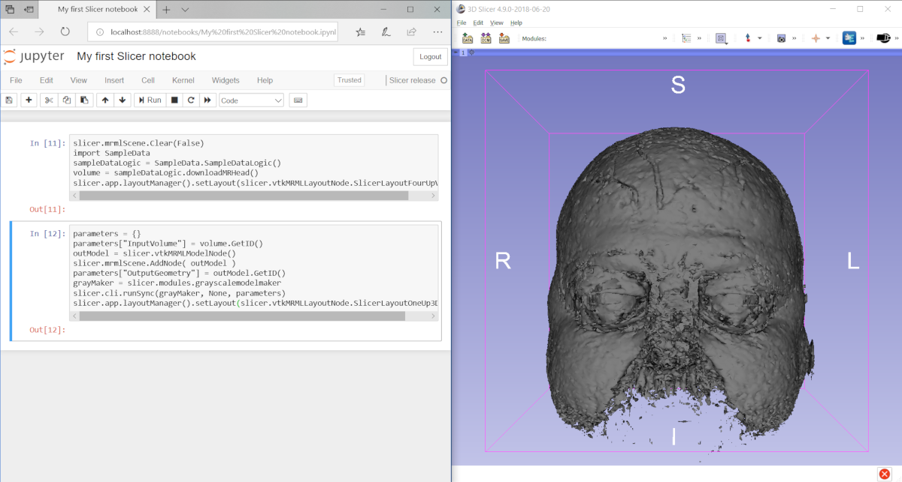
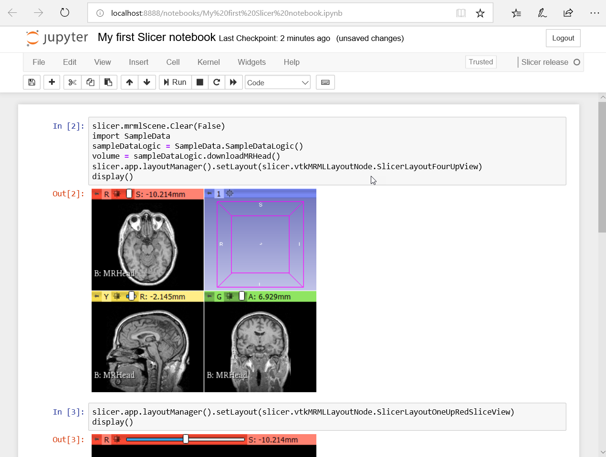

Back to [Projects List](../../README.md#ProjectsList)

# Use Slicer from Jupyter notebook

## Key Investigators

- [Jean-Christophe Fillion-Robin](https://www.kitware.com/jean-christophe-fillion-robin/) (Kitware Inc., USA)
- [Andras Lasso](https://github.com/lassoan) (Queen's University, Canada)

# Project Description

[Jupyter notebook](https://en.wikipedia.org/wiki/IPython) is an interactive shell for executing scripts and viewing execution results.

## Objective

Notebook user interface (frontend) is separated from the code execution engine (kernel). The objective is to create a Slicer extension, which Jupyter notebooks can connect to and access all Slicer features.

## Approach and Plan

1. Implement extension that includes a simple kernel that can execute Python commands using Slicer's built-in Python interpreter.
1. Implement returning of console output to the notebook.
1. Implement returning of viewer content to the notebook.
1. Publish extension on extension manager.

## Progress and Next Steps

1. Created [SlicerJupyter](https://github.com/Slicer/SlicerJupyter) extension, which uses [xeus](https://github.com/QuantStack/xeus) as Jupyter kernel implementation
1. Implemented command execution
1. Implemented preliminary version of ``display()`` function to show viewer content in the notebook.
1. Publish extension on extension manager.

Future plans:
- It will be possible to publish and run Slicer notebooks using [binder](https://mybinder.org/)

# Illustrations

# Background and References

- [SlicerJupyter extension](https://github.com/Slicer/SlicerJupyter)
- https://en.wikipedia.org/wiki/Project_Jupyter
- [Notebook format description](http://nbformat.readthedocs.io/en/latest/format_description.html)
