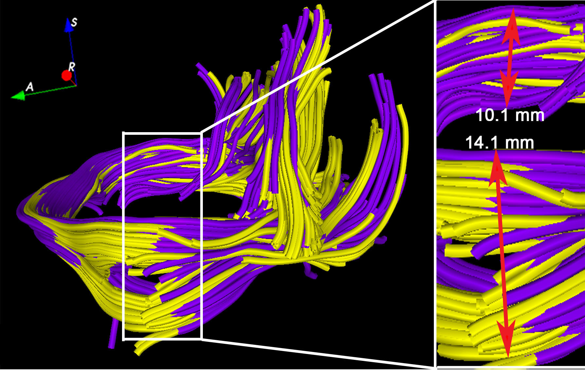
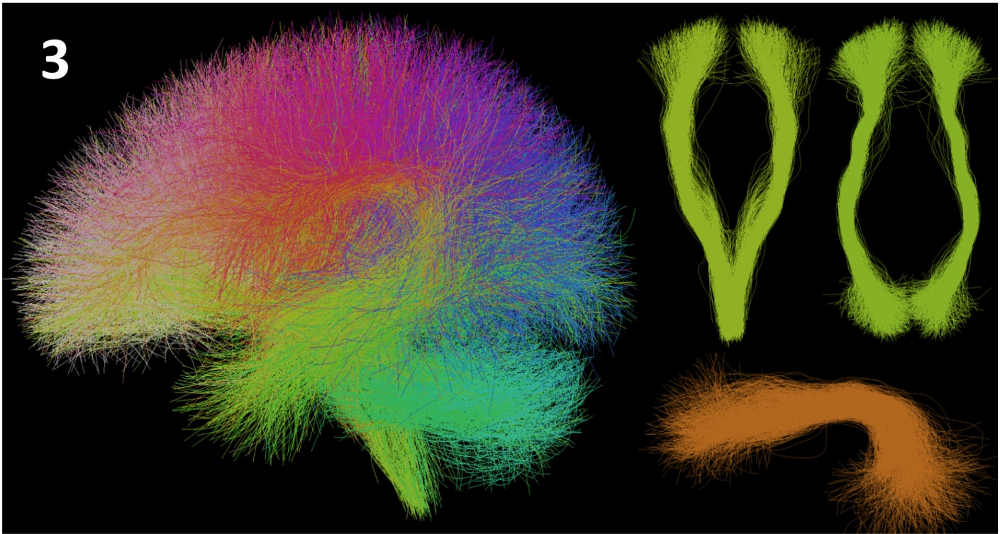

Back to [Projects List](../../README.md#ProjectsList)

### Longitudinal analysis of white matter connectivity changes prompted by concussions

## Key Investigators

- Andrei Irimia (University of Southern California)
- Lauren O'Donnell (Harvard Medical School)

# Project Description

Concussions (also known as mild traumatic brain injuries, or mTBIs) have relatively high incidence in the elderly and increase the risk for neurodegenerative disorders. The effects of concussions upon the human connectome and upon local white matter are poorly understood. This project will explore the potential of Slicer tools to assist the study of white matter (WM) degradation after concussions using diffusion tensor imaging (DTI).

## Objective

1. Objective A. Assess the range of existing Slicer functionality for longitudinal DTI analysis
1. Objective B. Formulate strategies for using Slicer tools to quantify white matter (WM) changes after concussions
1. Objective C. Explore avenues for collaboration on concussion imaging research between BWM and USC

## Approach and Plan

The two PIs held preliminary discussions to identify Slicer modules and other software which can be used to automatically trace white matter fasciculi in dMRI volumes acquired from patients with concussions. It was agreed that the methodologies developed by the O'Donnell research group could have substantial potential for the longitudinal analysis being undertaken by the Irimia Laboratory at USC. One direction of particular interest involves the application of streamline analysis and atlas-based fiber labeling to identify perilesional fibers whose integrity could be affected by the breakdown of the blood-brain barrier (BBB).

## Progress and Next Steps

The PIs agreed to perform a feasibility assessment in order to determine the best strategies and data analysis workflows which can be employed to further our quantitative understanding of BBB breakdown after mTBI. In the future this may include cooperation on reproducibility studies spearheaded at HMS and translational/clinical inference studies on neurovascular pathology being conducted at USC. Conversations with C-F Westin and Tina Kapur were also helpful in identifying additional tools and analysis pipelines which are available in Slicer and which can be leveraged to improve our understanding of post-traumatic connectome changes associated with micro-hemorrhagic vasculopathies.

# Illustrations

<!--Add pictures and links to videos that demonstrate what has been accomplished.-->

# Background and References

More information on research being conducted in the Irimia Laboratory at USC can be found at [www.andrei-irimia.com].

More information about the white matter atlas and clustering from Dr. O'Donnell's group can be found at [http://dmri.slicer.org/atlases/]

<!-- - Documentation: https://link.to.docs -->
