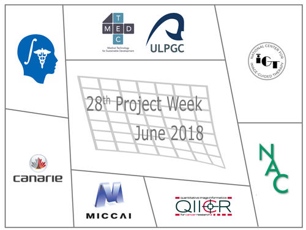

## Welcome to the web page for the 28th Project Week!
The 28th NA-MIC Project Week will be held during the week of June 25-29, 2018 at [Universidad de Las Palmas de Gran Canaria](https://www.ulpgc.es/).

Please read about our experience in running these events since 2005: [Increasing the Impact of Medical Image Computing Using
Community-Based Open-Access Hackathons: the NA-MIC and 3D Slicer Experience](http://www.spl.harvard.edu/publications/item/view/3004).

## Logistics

To receive information about this and future events please join the [Project Week Mailing List](https://public.kitware.com/mailman/listinfo/na-mic-project-week) (for continuity and permanence across Project Weeks) AND participate in the [Project Week forum on github](https://github.com/orgs/NA-MIC/teams/pw27/discussions) (for questions dedicated to this event).

- **Dates:** June 25-29, 2018.
- **Location:** [Universidad de Las Palmas de Gran Canaria](https://www.google.com/maps/place/University+of+Las+Palmas+de+Gran+Canaria/@28.0990225,-16.5409312,8z/data=!4m5!3m4!1s0xc409514173e77eb:0xbda0edfa5e221aaa!8m2!3d28.0990178!4d-15.4203257)
- **REGISTRATION:** [Register here](https://www.fulp.es/na-mic-summer-event-2018). Registration Fee: €300.
- **Hotel:** [Marriott Iberia](http://achotels.marriott.com/hotels/ac-hotel-iberia-las-palmas), [Parque](http://hotelparqueenlaspalmas.com/en/). Deadline to book at preferential rates is March 30, 2018.

## Local Organizing Committee
 
- Host: Juan Ruiz-Alzola, PhD, Professor of Imaging Technologies at [Universidad de Las Palmas de Gran Canaria](http://www.ulpgc.es), Director of Medical and Audiovisual Technology Group (GTMA for Grupo de Tecnología Médica y Audiovisual), Research Institute in Biomedical and Health Sciences (IUIBS for Instituto Universitario de Investigación Biomédica y Sanitaria), Research Affiliate at the Canary Islands Instiute of Astrophysics.

- [Information About the venue](https://medtec4susdev.github.io/ProjectDemoProgressing/)

- Email Local Organzing Committee: [Juan Ruiz Alzola](mailto:juan.ruiz@ulpgc.es?cc=tkapur@bwh.harvard.edu&subject=ProjectWeek28), [Maria Dolores Afonso Suarez](mailto:marilola.afonso@ulpgc.es?cc=tkapur@bwh.harvard.edu&subject=ProjectWeek28), [Asmaa Skareb](mailto:asmaa.skareb@ulpgc.es?cc=tkapur@bwh.harvard.edu&subject=ProjectWeek28)

## Frequently Asked Questions

* [What?](../README.md#what)
* [When, where, how much?](../README.md#when-where-how-much)
* [How does it work?](../README.md#how-does-it-work)
* [Who can attend?](../README.md#who-can-attend)
* [Who should attend?](../README.md#who-should-attend)
* [What else?](../README.md#what-else)
* [Who to contact?](../README.md#who-to-contact)

## Preparatory Videoconferences

- Google Hangouts: To join the videoconference, click [here](https://meet.google.com/wzh-syuy-otj) on Tuesdays, 10am Boston time, starting April 24, 2018 
- Conference call notes: To access these, click [here](PreparatoryMeetingsNotes.md).

## Program
<iframe src="https://calendar.google.com/calendar/embed?src=kitware.com_sb07i171olac9aavh46ir495c4%40group.calendar.google.com&ctz=America%2FNew_York&dates=20180625%2F20180629&hours=0800%2F2000&mode=WEEK" style="border: 0" width="800" height="600" frameborder="0" scrolling="no"></iframe>
How to add this calendar to your own?

## Projects
These will be decided based on the discussions in the preparatory videoconferences

## Registrants

Do not add your name to this list - it is maintained by the organizers based on your paid registration.

<!-- ORGANIZERS: please edit REGISTRANTS.md -->

1. Sharon Peled, (@speled)(speled@bwh.harvard.edu) - Brigham and Women's Hospital and Harvard Medical School - USA
1. Davide Punzo, (punzodavide@hotmail.it) - Kapteyn Astronomical Institute, University of Groningen - Netherlands
1. Csaba Pinter, (@cpinter)(csaba.pinter@queensu.ca) - Queen’s University - Canada 
1. Filip Szczepankiewicz, (filip.szczepankiewicz@gmail.com) - Brigham and Women's Hospital and Harvard Medical School - USA
1. Tina Kapur, (@tkapur)(tkapur@bwh.harvard.edu) Brigham and Women's Hospital and Harvard Medical School - USA
1. Mohamed El Moctar Septy (@msepty)(moksepty@yahoo.fr) Université de Nouakchott Al Aasriya. Faculté de Médecine - Mauritania
1. Ahmedou Moulaye Idriss (amdriss6@gmail.com) Centre Hospitalier National Nouackchott - Mauritania
1. M Alexandra Fernandes Rodrigues (malexa.rodrigues@gmail.com) - Faculdade de Medicina da Universidade Eduardo Mondlane - Mozambique
1. Joseane Alexandre Da Rosa de Pina Ferreira (joseane.ferreira@han.gov.cv) - Hospital Agostinho Neto de Praia - Cabo Verde
1. Artemisa Mendes Moreno (artemisa.moreno@docente.unicv.edu.cv) - Faculdade de Ciências e Tecnologia. Universidade de Cabo Verde - Cabo Verde
1. Cheikh Tidiane Diop (chtdiop81@gmail.com) - Centre Hospitalier National Fann Dakar - Senegal
1. Oumar Kane (droumarkane@gmail.com) - Centre Hospitalier National Fann Dakar - Senegal 
1. Babacar Diao (babacardiao104uro@yahoo.fr) - Ecole Militaire de Santé Dakar - Senegal
1. Juan Ruiz Alzola (@jruizalz)(juan.ruiz@ulpgc.es) - Instituto de Astrofísica de Canarias/University of Las Palmas de Gran Canaria - Spain
1. Jose Carlos Ruiz Luque (carlos.luque@ulpgc.es) - University of Las Palmas de Gran Canaria - Spain
1. Nayra Pumar Carreras (nayra.pumar@ulpgc.es) - University of Las Palmas de Gran Canaria - Spain
1. Guillermo Valentín Socorro Marrero (@gvsocorro)(guillermo.socorro@ulpgc.es) - University of Las Palmas de Gran Canaria - Spain
1. Abián Hernández Guedes (@SolidusAbi)(abian.hernandez@ulpgc.es) - University of Las Palmas de Gran Canaria - Spain
1. Xerach Suárez Moreno (xerach.suarez@ulpgc.es) - University of Las Palmas de Gran Canaria - Spain
1. Maria Dolores Afonso Suárez  (@MarilolaMACbioIDi)(marilola.afonso@ulpgc.es) - University of Las Palmas de Gran Canaria - Spain
