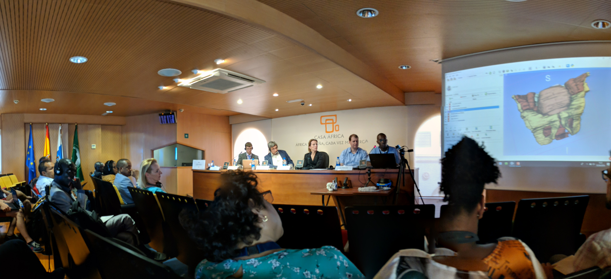


## Welcome to the web page for the 28th Project Week!
The 28th NA-MIC Project Week will be held during the week of June 25-29, 2018 at [Universidad de Las Palmas de Gran Canaria](https://www.ulpgc.es/).

Please read about our experience in running these events since 2005: [Increasing the Impact of Medical Image Computing Using
Community-Based Open-Access Hackathons: the NA-MIC and 3D Slicer Experience](http://www.spl.harvard.edu/publications/item/view/3004).

## Photo Album
The 28th NA-MIC PW [Event album](https://drive.google.com/drive/folders/1Gh2L26K96d3jzpT7LReaPWAbc1Ao815p?usp=sharing).

## 28 PW Summer NA-MIC in [the media](PW28InTheMedia.md)

## Logistics

To receive information about this and future events please join the [Project Week Mailing List](https://public.kitware.com/mailman/listinfo/na-mic-project-week) (for continuity and permanence across Project Weeks) AND participate in the [Project Week forum](https://discourse.slicer.org/c/community/project-week).

- **Dates:** June 25-29, 2018.
- **Location:**
  - Hosted by: [Universidad de Las Palmas de Gran Canaria](https://www.google.com/maps/place/University+of+Las+Palmas+de+Gran+Canaria/@28.0990225,-16.5409312,8z/data=!4m5!3m4!1s0xc409514173e77eb:0xbda0edfa5e221aaa!8m2!3d28.0990178!4d-15.4203257)
  - [3D View/Map of venue location](https://bit.ly/2Hkm6Mi)
- **REGISTRATION:** [Register here](https://www.fulp.es/na-mic-summer-event-2018). Registration Fee: €300.
- **Hotel:** [Marriott Iberia](http://achotels.marriott.com/hotels/ac-hotel-iberia-las-palmas), [Parque](http://hotelparqueenlaspalmas.com/en/). Deadline to book at preferential rates is March 30, 2018.

- Transports from the airport to the city (Las Palmas de Gran Canaria):
  - Taxi (line at the airport)
  - [Bus -line 60-](https://www.guaguasglobal.com/en/lineas-horarios/linea/)
    - [Airport-San Telmo bus station](https://www.google.es/maps/dir/Aeropuerto+de+Gran+Canaria,+Autopista+GC-1,+s%2Fn,+35230,+Las+Palmas/Estacion+De+Guaguas+SAN+TELMO,+Av.+Rafael+Cabrera,+30,+35002+Las+Palmas+de+Gran+Canaria,+Las+Palmas/@28.0183155,-15.5470931,11z/data=!4m17!4m16!1m5!1m1!1s0xc40a266c3662d1d:0x824bcf7e159f85d4!2m2!1d-15.3877066!2d27.9331848!1m5!1m1!1s0xc4095850670520b:0x5eef5b2e4c79e9e3!2m2!1d-15.415777!2d28.1092527!2m2!7e2!8j1529431200!3e3)
    - [Paths-distances: San Telmo bus station - Hotels](https://raw.githubusercontent.com/NA-MIC/ProjectWeek/master/PW28_2018_GranCanaria/Station-Hotels.png)

## Local Organizing Committee

- Host: Juan Ruiz-Alzola, PhD, Professor of Imaging Technologies at [Universidad de Las Palmas de Gran Canaria](http://www.ulpgc.es), Director of Medical and Audiovisual Technology Group (GTMA for Grupo de Tecnología Médica y Audiovisual), Research Institute in Biomedical and Health Sciences (IUIBS for Instituto Universitario de Investigación Biomédica y Sanitaria), Research Affiliate at the Canary Islands Instiute of Astrophysics.

- Email Local Organzing Committee: [Juan Ruiz Alzola](mailto:juan.ruiz@ulpgc.es?cc=tkapur@bwh.harvard.edu&subject=ProjectWeek28), [Maria Dolores Afonso Suarez](mailto:marilola.afonso@ulpgc.es?cc=tkapur@bwh.harvard.edu&subject=ProjectWeek28), [Asmaa Skareb](mailto:asmaa.skareb@ulpgc.es?cc=tkapur@bwh.harvard.edu&subject=ProjectWeek28)

- [Information about the Venue](https://medtec4susdev.github.io/ProjectDemoProgressing/)

## **VENUE LOCATION**

    [3D View/Map of venue location 25th June](https://www.google.com/maps/place/AC+Hotel+Iberia+Las+Palmas/@28.1112024,-15.4139154,240a,35y,279.49h,55.22t/data=!3m1!1e3!4m7!3m6!1s0x0:0xd874c662b7a1c59a!5m1!1s2018-06-30!8m2!3d28.1120498!4d-15.4172581)

    [3D View/Map of venue location 26th-29th June](https://bit.ly/2Hkm6Mi)

## INFOPACK

- [Infopack](https://github.com/NA-MIC/ProjectWeek/blob/master/PW28_2018_GranCanaria/Infopack%20-%20NAMIC%20SUMMER%20EVENT%202018.pdf)

## Frequently Asked Questions

* [What?](../README.md#what)
* [When, where, how much?](../README.md#when-where-how-much)

* [How does it work?](../README.md#how-does-it-work)
* [Who can attend?](../README.md#who-can-attend)
* [Who should attend?](../README.md#who-should-attend)
* [What else?](../README.md#what-else)
* [Who to contact?](../README.md#who-to-contact)

## Preparatory Videoconferences

- Zoom video conference: To join the videoconference, click [here](https://zoom.us/j/920891732) on Tuesdays, 10am Boston time, starting April 24, 2018
- Conference call notes: To access these, click [here](PreparatoryMeetingsNotes.md).

## Program
<iframe src="https://calendar.google.com/calendar/embed?src=kitware.com_sb07i171olac9aavh46ir495c4%40group.calendar.google.com&ctz=Atlantic%2FCanary&dates=20180625%2F20180629&hours=0800%2F2000&mode=WEEK" style="border: 0" width="800" height="600" frameborder="0" scrolling="no"></iframe>
How to add this calendar to your own?

## Projects [(How to add a new project?)](Projects/README.md)

## Projects

Segmentation

1. [Using 3D Slicer Segment Editor](Projects/SegmentEditor/README.md) (Csaba Pinter, Till Best, Nikos Makris, Filippo Cicali)
1. [Gynecological Brachytherapy Needle Segmentation Deployment](Projects/NeedleSegmentationDeployment/README.md) (Paolo Zafino, Tina Kapur, Maria Francesca Spadea)
1. [Multi-Label segmentation of anatomic prostate zones in MRI](Projects/ProstateZoneSegmentation/README.md) (Anneke Meyer, Marko Rak, Christian Hansen)
1. [Segmentation geometry widget](Projects/SegmentationGeometryWidget/README.md) (Csaba Pinter, Andras Lasso)

Visualization and Interoperability
1. [Programmable Multi Volume Rendering in Slicer](Projects/MultiVolumeRendering/README.md) (Simon Drouin, Csaba Pinter, Steve Pieper, Jean-Christophe Fillion-Robin)
1. [OpenIGTLinkIO Development](Projects/OpenIGTLinkIODevelopment/README.md) (Simon Drouin, Csaba Pinter, Andras Lasso, Ole Vegard Solberg, Geir Arne Tangen)
1. [Add 3D views linking capabilities](Projects/3DViewsLinking/README.md) (Davide Punzo, Andras Lasso, Steve Pieper, Jean-Christophe Fillion-Robin, Simon Drouin)
1. [DICOMweb related projects: OHIFViewer, Siemens teamplay, ctkDICOMweb, using secure DICOMweb](Projects/DICOMweb/README.md) (Michael Kelm, Steve Pieper, Erik Ziegler, Marco Nolden, Jonas Scherer, Tina Kapur)
1. [Raw Image Read and Display](Projects/RawImageGuess/README.md) (Attila Nagy, Csaba Pinter)
1. [Improve/Test multivolume preclinical MRI data import (DCE, DTI, ASL, T1 mapping](Projects/PreclinicalDataImport/README.md) (Sharon Peled, Andras Lasso, Lauren O'Donnell)
1. [Conversion of Matlab Bridge modules to integrated 3DSlicer modules](Projects/MatlabToPython/README.md) (Sharon Peled, Andras Lasso)

Application to Large Studies in Chest, Brain
1. [SlicerCIP Quantitative Reports Tool](Projects/SlicerCIPQuantitativeReportsTool/README.md) (Pietro Nardelli, Jorge Onieva Onieva,Raúl San José Estépar)
1. [CIP Python3](Projects/CIP_Python3/README.md) (Jorge Onieva, Pietro Nardelli, Raúl San José Estépar)
1. [CIP Deep Learning](Projects/CIP_DeepLearning/README.md) (Jorge Onieva, Pietro Nardelli, Raúl San José Estépar)
1. [Longitudinal analysis of white matter connectivity changes prompted by concussions](Projects/TBI/README.md) (Andrei Irimia, Lauren O'Donnell)
1. [Stereotaxy PYDBS and EPILOC Toolboxes](Projects/STIM_ICM_Project/README.md) (Sara Fernandez Vidal, Jordan Cornillaut and Eric Bardinet)

New Applications and Customizations of 3D Slicer

1. [Evaluation of projects: simulator of bone sliding, augmented reality system to be used in surgeries, software for orthognatic planning](Projects/EvaluationOfProjects/README.md) (Donato Monopoli, Javier González, Juan Ruiz-Alzola)
1. [Slicer Ecosystems Education for Newcomers & Developing Countries](Projects/3DSlicerTrainingPrograms/README.md) (GTMA Group, Juan Ruiz-Alzola)
1. [Atlas development for education](Projects/AtlasDevelopmentForEducation/README.md) (Babacar Diao, Ahmedou Moulaye Idriss, Mohamed Septy, Alexandra Fernandes Rodrigues, Cheick Tidiane, Nayra Pumar, Xerach Suárez, Juan Ruiz-Alzola)
1. [Custom GUI for an US simulator training system](Projects/CustomGUIForUSSimulator/README.md) (José Carlos Ruiz-Luque, Guillermo Valentín Socorro-Marrero, Juan Ruiz-Alzola)
1. [Medical Infrared Imaging with Slicer](Projects/MedicalInfraredImagingWithSlicer/README.md) (Yolanda Martin-Hernando, Abián Hernández, Jorge Quintero Nehrkorn, Enrique Villa, José-Carlos Ruiz-Luque, Natalia Arteaga-Marrero, Juan Ruiz-Alzola)
1. [3DSlicer models for serious games](Projects/3DSlicerModelsForSeriousGames/README.md) (Sergi Bermudez i Badia, Yuri Almedia, Artemisa Moreno, Abián Hernández, María Dolores Afonso-Suárez, Juan Ruiz-Alzola)
1. [Implementing 1H Time resolved Functional Magnetic Resonance Spectroscopy with quantification of broad metabolite spectrum in 3D Slicer](Projects/Implementing1HTimeResolvedFunctionalMagneticResonanceSpectroscopy/README.md) (Francisco-José Marcano-Serrano, José Luis González Mora, Juan Ruiz-Alzola)
1. [4D MRI via retrospectiv stacking of 2D Slices](Projects/4D_MRI_via_retrospectiv_stacking/README.md)(Gino Gulamhussene, Marko Rak)

Infrastructure

1. [Slicer-based Jupyter notebooks](Projects/SlicerJupyter/README.md) (Jean-Christophe Fillion-Robin, Andras Lasso)
1. [Documenting Slicer using readthedocs](Projects/DocumentingSlicerUsingReadTheDocs/README.md) (Jean-Christophe Fillion-Robin, Andras Lasso)
1. [Slicer 5 roadmap](Projects/Slicer5Roadmap/README.md) (Jean-Christophe Fillion-Robin, Andras Lasso, Steve Pieper, Csaba Pinter, Andrey Fedorov, Everyone)

Other

1. [Integrating Free WaveForm sequence with DICOM](Projects/FWFintegration/README.md) (F. Szczepankiewicz, C-F. Westin)
1. [Insula segmentation using 3D Slicer](Projects/Insula_segmentation_with_3DSlicer/README.md) (Filippo Cicali, Nikos Makris)
1. [Intelligent and Adaptive Minimally Invasive Surgery Simulation](Projects/AdaptiveMIS) (Tina Vajsbaher, Csaba Pinter, Andras Lasso, Gino Gulamhussene, Juan Ruiz-Alzola, Miguel Angel Rodriguez Florido, Javier González Fernández, Donato Monopoli)
1. [Uncertainty Estimation for Feature Based Registration](Projects/RegistrationUncertainty) (Sandy Wells)

## Registrants

Do not add your name to this list - it is maintained by the organizers based on your paid registration.  Please [register here](https://www.fulp.es/na-mic-summer-event-2018).

<!-- ORGANIZERS: please edit REGISTRANTS.md -->

1. Sharon Peled, (@speled)(speled@bwh.harvard.edu) - Brigham and Women's Hospital and Harvard Medical School - USA
1. Davide Punzo, (@punzo)(punzodavide@hotmail.it) - Kapteyn Astronomical Institute, University of Groningen - Netherlands
1. Csaba Pinter, (@cpinter)(csaba.pinter@queensu.ca) - Queen’s University - Canada
1. Filip Szczepankiewicz, (filip.szczepankiewicz@gmail.com) - Brigham and Women's Hospital and Harvard Medical School - USA
1. Tina Kapur, (@tkapur)(tkapur@bwh.harvard.edu) - Brigham and Women's Hospital and Harvard Medical School - USA
1. Mohamed El Moctar Septy (@msepty)(moksepty@yahoo.fr) - Faculté de Médecine, Université de Nouakchott Al Aasriya - Mauritania
1. Ahmedou Moulaye Idriss (amdriss6@gmail.com) - Centre Hospitalier National Nouackchott - Mauritania
1. M Alexandra Fernandes Rodrigues (malexa.rodrigues@gmail.com) - Faculdade de Medicina da Universidade Eduardo Mondlane - Mozambique
1. Joseane Alexandre Da Rosa de Pina Ferreira (joseane.ferreira@han.gov.cv) - Hospital Agostinho Neto de Praia - Cabo Verde
1. Artemisa Mendes Moreno (artemisa.moreno@docente.unicv.edu.cv) - Faculdade de Ciências e Tecnologia, Universidade de Cabo Verde - Cabo Verde
1. Cheikh Tidiane Diop (chtdiop81@gmail.com) - Centre Hospitalier National Fann Dakar - Senegal
1. Oumar Kane (droumarkane@gmail.com) - Centre Hospitalier National Fann Dakar - Senegal
1. Babacar Diao (babacardiao104uro@yahoo.fr) - Ecole Militaire de Santé Dakar - Senegal
1. Juan Ruiz Alzola (@jruizalz)(juan.ruiz@ulpgc.es) - University of Las Palmas de Gran Canaria / Instituto de Astrofísica de Canarias - Spain
1. Jose Carlos Ruiz Luque (carlos.luque@ulpgc.es) - University of Las Palmas de Gran Canaria - Spain
1. Nayra Pumar Carreras (nayra.pumar@ulpgc.es) - University of Las Palmas de Gran Canaria - Spain
1. Guillermo Valentín Socorro Marrero (@gvsocorro)(guillermo.socorro@ulpgc.es) - University of Las Palmas de Gran Canaria - Spain
1. Abián Hernández Guedes (@SolidusAbi)(abian.hernandez@ulpgc.es) - University of Las Palmas de Gran Canaria - Spain
1. Xerach Suárez Moreno (xerach.suarez@ulpgc.es) - University of Las Palmas de Gran Canaria - Spain
1. Maria Dolores Afonso Suárez (@MarilolaMACbioIDi)(marilola.afonso@ulpgc.es) - University of Las Palmas de Gran Canaria - Spain
1. Steven Pieper (@pieper)(pieper@isomics.com) - Isomics, Inc. - USA
1. Attila Nagy (nagy.attila@med.u-szeged.hu) - Faculty of Medicine, University of Szeged - Hungary
1. Andras Lasso (@lassoan)(lasso@queensu.ca) - Queen’s University - Canada
1. Filippo Cicali (FCICALI@mgh.harvard.edu) - Mass General Hospital and Harvard Medical School - USA
1. Nikolaos Makris (nikos@bwh.harvard.edu) - Brigham and Women's Hospital and Harvard Medical School - USA
1. Jorge Onieva (@jonieva)(jorge.onieva@gmail.com) - Brigham and Women's Hospital and Harvard Medical School - USA
1. Paolo Zaffino (@pzaffino)(p.zaffino@unicz.it) - Magna Graecia University - Italy
1. Raúl San José (@rjosest)(rsanjose@bwh.harvard.edu) - Brigham and Women's Hospital and Harvard Medical School - USA
1. Erik Ziegler (erik@radicalimaging.com) - Open Health Imaging Foundation- France
1. Lauren O'Donnell (@ljod)(odonnell@bwh.harvard.edu) - Brigham and Women's Hospital and Harvard Medical School - USA
1. Simon Drouin (drouin.simon@gmail.com) - Montreal Neurological Institute - Canada
1. Pietro Nardelli (pnardelli@bwh.harvard.edu) - Brigham and Women's Hospital and Harvard Medical School - USA
1. Francisco José Marcano Serrano (fmarcano@ull.edu.es) - Universidad de la Laguna - Spain
1. Jean-Christophe Fillion-Robin (@jcfr)(jchris.fillionr@kitware.com) - Kitware Inc. - USA
1. Andrei Irimia (irimia@usc.edu) - University of Southern California - USA
1. Ole Vegard Solberg (OleVegard.Solberg@sintef.no) - SINTEF - Norway
1. Geir Arne Tangen (Geir.A.Tangen@sintef.no) - SINTEF - Norway
1. Yolanda Martín Hernando (yolanda.martin@iac.es) - Instituto de Astrofísica de Canarias - Spain
1. Enrique Villa Benito (evilla@iac.es) - Instituto de Astrofísica de Canarias - Spain
1. Natalia Arteaga Marrero (narteaga@iac.es) - Instituto de Astrofísica de Canarias - Spain
1. Michael Halle (@mhalle)(mhalle@bwh.harvard.edu) - Brigham and Women's Hospital and Harvard Medical School - USA
1. Yuri Ameida (yuri.almeida@m-iti.org) Madeira Madeira Interactive Technologies Institute - Portugal
1. Marco Nolden (M.Nolden@Dkfz-Heidelberg.de) - German Cancer Research Center (DKFZ) - Germany
1. Carl-Fredrik Westin (westin@bwh.harvard.edu) - Brigham and Women's Hospital and Harvard Medical School - USA
1. Marko Rak (rak@isg.cs.ovgu.de) - University of Magdeburg - Germany
1. Andrei Irimia (irimia@usc.edu) - University of Southern California - USA
1. Anneke Meyer (anneke@isg.cs.uni-magdeburg.de) - University of Magdeburg - Germany
1. Tina Vajsbaher (tina.vajsbaher@gmail.com) - University of Bremen - Germany
1. Gino Gulamhussene (gino@isg.cs.ovgu.de) - Institute for Simulation and Graphics OvGU University Magdeburg - Germany
1. Sara Fernández Vidal (sara.fdezvidal@gmail.com) - ICM Institute - France
1. Eric Bardinet (eric.bardinet@upmc.fr) - ICM Institute - France
1. José Luis González-Mora (jlgonzal@ull.edu.es) - University of La Laguna - Spain
1. Jordan Cornillault (jordan.cornillault@gmail.com)  - ICM Institute - France
1. Donato Monopoli (dmonopoli@itccanarias.org) - Intituto Tecnológico de Canarias - Spain
1. Javier González Fernández (jgonzalez@itccanarias.org) - Intituto Tecnológico de Canarias - Spain
1. Michael Kelm (michael.kelm@siemens-healthineers.com) - Siemens Healthcare GmbH - Germany
1. William Wells (sw@bwh.harvard.edu)  - Brigham and Women's Hospital and Harvard Medical School - USA
1. Jonas Scherer (jonas.scherer@dkfz.de) - German Cancer Research Center (DKFZ) - Germany

## Statistics

58 Registrants, from around 20 different nationalities, from 25 institutions, from 14 countries, from 3 continents  :-)

Working in 31 joint projects from 6 different categories

